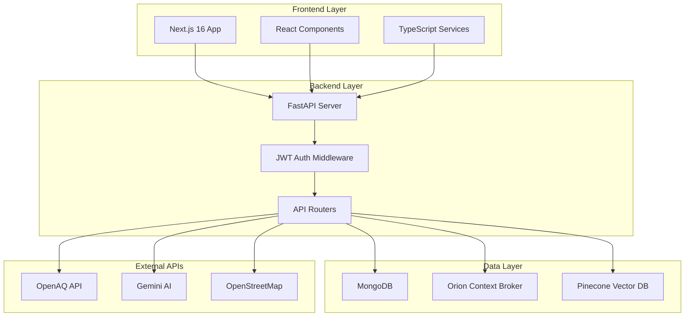
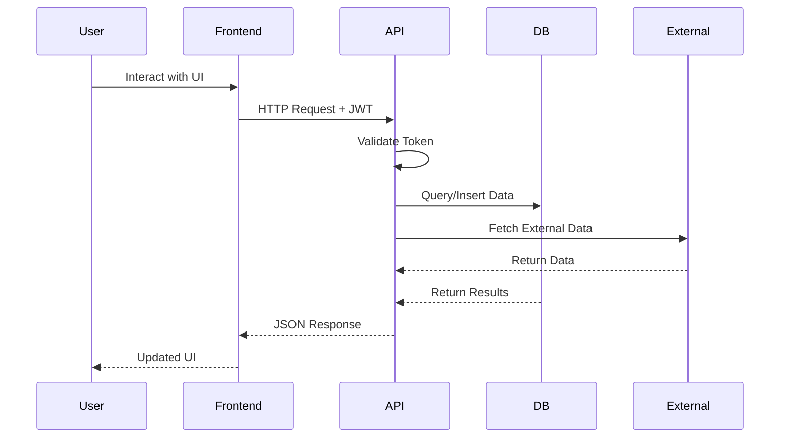

# UrbanReflex

<div align="center">

[](https://fastapi.tiangolo.com/)
[](https://nextjs.org/)
[](https://www.python.org/)
[](https://www.typescriptlang.org/)
[](https://www.mongodb.com/)
[](https://www.docker.com/)
[](https://www.etsi.org/deliver/etsi_gs/CIM/001_099/009/01.08.01_60/gs_CIM009v010801p.pdf)
[](LICENSE)
[](https://github.com/minhe51805/UrbanReflex/pulls)

**🏙️ Enterprise-Grade Smart City Platform for Air Quality Monitoring & Urban Infrastructure Management**

[🚀 Quick Setup](#-quick-setup) • [🏗️ Architecture](#️-system-architecture) • [🔧 Development](#-development-workflow) • [📊 Data Flow](#-data-flow) • [🛠️ Contributing](#️-contributing) • [📋 Roadmap](#-roadmap)

</div>

---

## 🎯 Overview

**UrbanReflex** is a full-stack smart city platform designed for **developers and urban planners**. Built with modern microservices architecture, NGSI-LD compliance, and scalable data processing for real-time urban infrastructure management.

### 🎪 For Developers & Contributors

This README focuses on **development workflow**, **system architecture**, and **contribution guidelines**. For end-user documentation, see our [User Guide](./docs/USER_GUIDE.md).

### 🔥 Key Technical Features

- 🚀 **Microservices Architecture** - FastAPI backend + Next.js frontend
- 🗄️ **Multi-Database Support** - MongoDB (primary) + Orion Context Broker (NGSI-LD)
- 🤖 **AI-Powered Services** - Gemini AI integration with vector search (Pinecone)
- 🔒 **Enterprise Security** - JWT authentication, role-based access, API rate limiting
- 📊 **Real-time Data Processing** - Async data pipelines with background tasks
- 🐳 **Container-Ready** - Full Docker Compose development environment

---

## 🚀 Quick Setup

### Prerequisites

```bash
# Required
Python 3.10+          # Backend development
Node.js 18+            # Frontend development
Docker & Docker Compose # Container orchestration
uv package manager     # Fast Python dependency management

# Optional
MongoDB Compass        # Database GUI
Postman/Thunder Client # API testing
```

### 🏃‍♂️ One-Command Development Setup

```bash
# Clone repository
git clone https://github.com/minhe51805/UrbanReflex.git
cd UrbanReflex

# Setup development environment (uses justfile)
just setup

# Start all services
just dev
```

### 🛠️ Manual Setup (Alternative)

<details>
<summary>Click to expand manual setup instructions</summary>

```bash
# 1. Install dependencies
uv sync                              # Backend dependencies
cd website && npm install && cd ..   # Frontend dependencies

# 2. Setup environment variables
cp .env.example .env
# Edit .env with your API keys

# 3. Start services
docker-compose up -d mongodb orion   # Start databases
uvicorn app.app:app --reload         # Start backend (port 8000)
cd website && npm run dev            # Start frontend (port 3000)
```

</details>

### 🔧 Environment Variables

```bash
# .env file
DATABASE_URL="mongodb://localhost:27017/urbanreflex"
JWT_SECRET_KEY="your-secret-key"
OPENAQ_API_KEY="your-openaq-key"           # Optional: Falls back to mock data
GEMINI_API_KEY="your-gemini-key"           # Optional: AI features disabled without this
PINECONE_API_KEY="your-pinecone-key"       # Optional: Vector search disabled without this
ORION_BROKER_URL="http://localhost:1026"   # NGSI-LD Context Broker
```

---

## 🏗️ System Architecture

### 📊 High-Level Architecture



### 🔀 Data Flow



### 🏢 Project Structure

```
UrbanReflex/
├── app/                     # 🐍 FastAPI Backend
│   ├── app.py              # Main application & CORS setup
│   ├── dependencies.py     # Dependency injection & auth
│   ├── routers/            # API endpoints
│   │   ├── auth.py         # Authentication & JWT
│   │   ├── chatbot.py      # AI-powered chatbot
│   │   ├── citizen_reports.py # Citizen reporting system
│   │   └── users.py        # User management
│   ├── models/             # Database models
│   ├── schemas/            # Pydantic schemas
│   ├── utils/              # Utility functions
│   └── ai_service/         # AI & ML services
├── website/                 # 🌐 Next.js Frontend
│   ├── app/                # App Router pages
│   ├── components/         # React components
│   ├── lib/                # Utilities & API clients
│   └── types/              # TypeScript definitions
├── config/                  # 🔧 Configuration
├── scripts/                 # 🤖 Automation scripts
├── open_data/              # 📂 Open datasets
├── docs/                   # 📚 Documentation
├── docker-compose.yml      # 🐳 Service orchestration
├── justfile                # ⚡ Task automation
└── pyproject.toml          # 📦 Python dependencies
```

---

## 🔧 Development Workflow

### 🌿 Branch Strategy

```bash
main        # 🚀 Production releases
develop     # 🧪 Development integration (current branch)
feature/*   # 🔨 Feature branches
hotfix/*    # 🚨 Critical fixes
```

### 🛠️ Available Commands (justfile)

```bash
# Development
just dev            # Start all services in development mode
just backend-dev    # Start only FastAPI backend
just frontend-dev   # Start only Next.js frontend
just install        # Install all dependencies

# Database
just db-start       # Start MongoDB + Orion
just db-stop        # Stop databases
just db-reset       # Reset databases

# Utilities
just setup          # Complete development environment setup
just clean          # Clean build artifacts
just format         # Format code (black, prettier)
just lint           # Run linters
just test           # Run test suites
```

### 🧪 Testing Strategy

```bash
# Backend tests
cd app && pytest tests/

# Frontend tests
cd website && npm run test

# E2E tests
cd website && npm run test:e2e

# API tests (with Postman collection)
newman run docs/postman/UrbanReflex.postman_collection.json
```

### 🔍 Code Quality Tools

- **Backend**: `black` (formatting), `flake8` (linting), `mypy` (type checking)
- **Frontend**: `prettier` (formatting), `eslint` (linting), TypeScript compiler
- **Pre-commit hooks**: Automated formatting and linting on commit

---

## 📚 Documentation

### 📖 For Developers

- **[📋 API Documentation](./docs/API_REFERENCE.md)** - Complete REST API reference
- **[🏗️ System Architecture](./docs/ARCHITECTURE.md)** - Deep dive into technical architecture
- **[🔧 Development Setup](./docs/DEVELOPMENT_SETUP.md)** - Detailed development environment guide
- **[🧪 Testing Guide](./docs/TESTING.md)** - Unit, integration, and E2E testing strategies
- **[🚀 Deployment Guide](./docs/DEPLOYMENT.md)** - Production deployment instructions
- **[🔒 Security Guidelines](./docs/SECURITY.md)** - Security best practices and policies

### 📊 Data & Integration

- **[🌐 NGSI-LD Integration](./docs/NGSI_LD_GUIDE.md)** - Smart city data standards implementation
- **[📊 Data Models](./docs/DATA_MODEL.md)** - Database schemas and data structures
- **[🤖 AI Services](./docs/AI_INTEGRATION.md)** - Gemini AI and vector search integration
- **[📡 External APIs](./docs/EXTERNAL_APIS.md)** - Third-party API integration guide

### 🎯 Quick References

- **[⚡ Commands Cheatsheet](./docs/COMMANDS.md)** - justfile and npm command reference
- **[🔧 Environment Setup](./docs/ENV_SETUP.md)** - Environment variables configuration
- **[🐛 Troubleshooting](./docs/TROUBLESHOOTING.md)** - Common issues and solutions

---

## 🚀 Tech Stack Deep Dive

### 🔧 Backend Architecture

```python
# FastAPI with async support
FastAPI + Uvicorn          # ASGI server with async capabilities
Pydantic v2               # Data validation and serialization
Motor                     # Async MongoDB driver
Python-JOSE               # JWT token handling
Passlib                   # Password hashing
```

### 🎨 Frontend Architecture

```typescript
// Modern React ecosystem
Next.js 16                // App Router + Server Components
React 19                  // Latest React features
TypeScript 5              // Type safety
Tailwind CSS 3.4          // Utility-first styling
Framer Motion            // Smooth animations
```

### 🗄️ Data Layer

```yaml
# Multi-database architecture
MongoDB: # Primary database
  - User data
  - Citizen reports
  - Chat history
  - Application state

Orion Context Broker: # NGSI-LD compliant
  - Smart city entities
  - Real-time urban data
  - IoT device integration

Pinecone: # Vector database
  - AI embeddings
  - Semantic search
  - Content recommendations
```

### 🤖 AI & ML Integration

```python
# AI Services Architecture
Gemini AI                 # Text generation and analysis
Embed Anything           # Text embeddings generation
Pinecone Vector DB       # Vector storage and retrieval
FAISS                    # Local vector operations
Sentence Transformers    # Text similarity and clustering
```

---

## 🚦 Getting Started for Contributors

### 1️⃣ Fork & Clone

```bash
# Fork the repository on GitHub, then:
git clone https://github.com/YOUR_USERNAME/UrbanReflex.git
cd UrbanReflex
git remote add upstream https://github.com/minhe51805/UrbanReflex.git
```

### 2️⃣ Setup Development Environment

```bash
# Quick setup (recommended)
just setup

# Or manual setup
uv sync                              # Backend dependencies
cd website && npm install && cd ..   # Frontend dependencies
cp .env.example .env                 # Configure environment
```

### 3️⃣ Create Feature Branch

```bash
git checkout develop
git pull upstream develop
git checkout -b feature/your-feature-name
```

### 4️⃣ Development Process

```bash
# Start development servers
just dev

# Make changes, then test
just test
just lint
just format

# Commit changes
git add .
git commit -m "feat: add new feature"
git push origin feature/your-feature-name
```

### 5️⃣ Submit Pull Request

1. 🌐 Go to [GitHub Pull Requests](https://github.com/minhe51805/UrbanReflex/pulls)
2. 📝 Click "New Pull Request"
3. 🎯 Target `develop` branch
4. 📋 Fill out the PR template
5. 🏷️ Add relevant labels
6. 👥 Request review from maintainers

---

## 🔄 CI/CD Pipeline

### 🧪 Automated Testing

```yaml
# GitHub Actions workflow
- Code quality checks (ESLint, Black, MyPy)
- Unit tests (pytest, Jest)
- Integration tests
- Security scanning
- Docker image builds
- Deployment to staging
```

### 📦 Release Process

```bash
# Release workflow
develop → staging → main → production

# Version management
just version patch|minor|major    # Bump version
git tag v1.2.3                   # Create release tag
git push origin v1.2.3           # Trigger deployment
```

---

## 🛠️ Contributing

We ❤️ contributions! Whether you're fixing bugs, adding features, or improving documentation, your help makes UrbanReflex better.

### 🚀 Quick Contribution Links

[](https://github.com/minhe51805/UrbanReflex/issues/new?template=bug_report.md)
[](https://github.com/minhe51805/UrbanReflex/issues/new?template=feature_request.md)
[](https://github.com/minhe51805/UrbanReflex/discussions)

### 📋 Contribution Guidelines

- 📖 Read our [Contributing Guide](./CONTRIBUTING.md)
- 🤝 Follow the [Code of Conduct](./CODE_OF_CONDUCT.md)
- 🏷️ Use [Conventional Commits](https://www.conventionalcommits.org/)
- ✅ Ensure all tests pass before submitting
- 📝 Update documentation for new features

### 👥 Types of Contributions

- 🐛 **Bug fixes** - Help us squash those pesky bugs
- ✨ **New features** - Implement cool new functionality
- 📚 **Documentation** - Improve guides and API docs
- 🧪 **Testing** - Add test coverage for untested code
- 🎨 **UI/UX** - Enhance user interface and experience
- 🔧 **DevOps** - Improve development and deployment processes

---

## 📋 Roadmap

### 🎯 Current Sprint (v1.1.0)

- [ ] 🤖 **Enhanced AI Features**

  - Advanced natural language query processing
  - Predictive analytics for air quality trends
  - Smart recommendations for urban planning

- [ ] 📊 **Real-time Analytics Dashboard**

  - Live data visualization improvements
  - Custom dashboard builder for administrators
  - Export functionality for reports and charts

- [ ] 🔧 **Developer Experience**
  - GraphQL API endpoint addition
  - SDK/client libraries (Python, JavaScript, Go)
  - Webhook support for real-time notifications

### 🚀 Next Quarter (v1.2.0)

- [ ] 🌐 **Multi-tenancy Support**

  - Organization-based data isolation
  - White-label deployment options
  - Advanced role and permission management

- [ ] 🏗️ **Infrastructure Improvements**

  - Kubernetes deployment manifests
  - Horizontal scaling optimizations
  - Advanced caching strategies

- [ ] 📱 **Mobile Applications**
  - React Native mobile app
  - Push notifications for alerts
  - Offline data synchronization

### 💭 Future Vision (v2.0+)

- 🧠 **Machine Learning Pipeline** - Automated anomaly detection
- 🌍 **Global Deployment** - Multi-region support
- 🔌 **IoT Integration** - Direct sensor data ingestion
- 🚀 **Edge Computing** - Local data processing capabilities

---

## 📞 Support & Community

### 🆘 Getting Help

- 📖 **Documentation**: Start with our comprehensive [docs](./docs/)
- 💬 **Discussions**: Join our [GitHub Discussions](https://github.com/minhe51805/UrbanReflex/discussions)
- 🐛 **Bug Reports**: Create detailed [issue reports](https://github.com/minhe51805/UrbanReflex/issues)
- 💌 **Direct Contact**: Reach out to maintainers via email

### 🌟 Show Your Support

If this project helps you, please consider:

- ⭐ **Star the repository** on GitHub
- 🐦 **Share on social media** with `#UrbanReflex`
- 📝 **Write a blog post** about your experience
- 💸 **Sponsor the project** via GitHub Sponsors

### 🏆 Contributors

Thanks to all our amazing contributors! Your efforts make this project possible.

<a href="https://github.com/minhe51805/UrbanReflex/graphs/contributors">
  
</a>

---

## 📄 License & Legal

### 📋 License

This project is licensed under the **Apache License 2.0** - see the [LICENSE](LICENSE) file for details.

**Key points:**

- ✅ Commercial use allowed
- ✅ Modification allowed
- ✅ Distribution allowed
- ✅ Patent use allowed
- ⚠️ Includes patent grant
- ⚠️ Includes copyright notice requirement

### 🔒 Security Policy

For security vulnerabilities, please see our [Security Policy](./SECURITY.md).

### 🏛️ Open Source Compliance

UrbanReflex is committed to open source best practices:

- 📊 **Transparent development** - All development happens in public
- 🤝 **Community driven** - Major decisions involve community input
- 📖 **Comprehensive documentation** - Always up-to-date guides and references
- 🧪 **Test coverage** - Maintained high test coverage standards

---

## 🏫 Support & Organization

<p align="center">
    <a href="https://hutech.edu.vn/" target="_blank">
        
    </a>
    <a href="https://vfossa.vn/" target="_blank">
        
    </a>
    <a href="https://www.olp.vn/" target="_blank">
        
    </a>
</p>

---

<div align="center">

**Built with ❤️ for the open source community**

[🏠 Website](https://urbanreflex.dev) • [📚 Documentation](./docs/) • [💬 Community](https://github.com/minhe51805/UrbanReflex/discussions) • [🐛 Issues](https://github.com/minhe51805/UrbanReflex/issues) • [🔧 Pull Requests](https://github.com/minhe51805/UrbanReflex/pulls)

</div>
