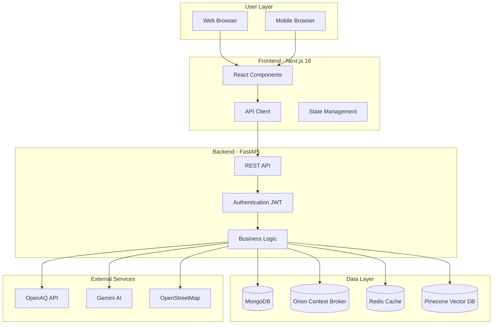

<p align="center">
	
</p>

<h1 align="center">UrbanReflex</h1>

<p align="center">
	A smart city platform for air quality monitoring and urban infrastructure management
</p>

<p align="center">
  <a href="https://urbanreflex-882wzswzf-ttas-projects-6148b983.vercel.app/" rel="dofollow" target="blank"><strong>Explore the docs »</strong></a>
	<br/>
	<br/>
	<a href="https://github.com/minhe51805/UrbanReflex/issues/new?assignees=&labels=&projects=&template=bug_report.md&title=%F0%9F%90%9B+Bug+Report%3A+">🐛 Report Bug</a>
	|
	<a href="https://github.com/minhe51805/UrbanReflex/issues/new?assignees=&labels=&projects=&template=feature_request.md&title=%F0%9F%9A%80+Feature%3A+">✈️ Request Feature</a>
	|
	<a href="https://github.com/minhe51805/UrbanReflex/discussions">💬 Join Discussion</a>
	|
	<a href="./docs/">📚 Documentation</a>
</p>

<p align="center">
	<a href="https://github.com/minhe51805/UrbanReflex/issues" target="blank">
		
	</a>
	<a href="https://github.com/minhe51805/UrbanReflex/blob/main/LICENSE" target="blank">
		
	</a>
	<a href="https://github.com/minhe51805/UrbanReflex/releases" target="blank">
		
	</a>
	<a href="https://fastapi.tiangolo.com/" target="blank">
		
	</a>
	<a href="https://nextjs.org/" target="blank">
		
	</a>
	<a href="https://www.etsi.org/deliver/etsi_gs/CIM/001_099/009/01.08.01_60/gs_CIM009v010801p.pdf" target="blank">
		
	</a>
</p>


---

## Features

- 🌍 Real-time Air Quality Monitoring from 10,000+ global stations
- 📝 Citizen-Powered Infrastructure Issue Reporting
- 🤖 AI-Powered Chatbot with Natural Language Processing
- 🏛️ NGSI-LD Compliant Smart City Data Models
- 📊 Interactive Dashboards and Analytics
- 🔐 Role-Based Access Control

## Table of Contents

<details>
<summary>Expand contents</summary>

- [What is UrbanReflex?](#what-is-urbanreflex)
- [Key Features](#-key-features)
- [Getting Started](#-getting-started)
	- [Prerequisites](#️-prerequisites)
		- [Infrastructure](#infrastructure)
		- [Services & API Keys](#services--api-keys)
	- [Setup](#-setup)
	- [Running](#-running)
	- [Testing](#-testing)
	- [Demo Credentials](#-demo-credentials)
- [Technology Stack](#️-technology-stack)
- [System Architecture](#-system-architecture)
- [Project Structure](#-project-structure)
- [Project Status](#-project-status)
- [Use Cases](#-use-cases)
- [Contributing](#-contributing)
- [Support and Organization](#support-and-organization)
- [License](#-license)

</details>

# What is UrbanReflex?

<p align="justify">
UrbanReflex is an open-source smart city platform designed to address critical urban challenges through integrated data-driven solutions. The platform combines real-time environmental monitoring with citizen engagement tools to enable transparent, efficient urban management.
</p>

<blockquote>
	<p align="justify">
		<b>UrbanReflex</b> is a smart city platform for air quality monitoring and urban infrastructure management. The application integrates with <b>10,000+ global air quality stations</b>, provides <b>AI-powered insights</b> using Google Gemini, and enables <b>citizen reporting</b> for infrastructure issues. Built with <b>FastAPI</b> and <b>Next.js</b>, the platform is <b>NGSI-LD compliant</b> for interoperability with FIWARE smart city ecosystems.
	</p>
</blockquote>

If you want to find out more about the competition, please visit the [Vietnam OLP website](https://www.olp.vn/).

---

## ✨ Key Features

### Air Quality Intelligence

- **Global Station Network**: Real-time AQI data from 10,000+ monitoring stations worldwide
- **Interactive Visualization**: Map-based interface with clustering algorithms and heatmap overlays
- **Health Advisory System**: Personalized recommendations based on current pollution levels
- **Historical Analysis**: Time-series trend analysis with interactive chart visualizations
- **Geographic Search**: Location-based queries for any city or region

### Citizen Engagement Platform

- **Issue Reporting**: Submit infrastructure problems (streetlights, potholes, waste management)
- **Multimedia Support**: Photo uploads with automatic geolocation metadata
- **Status Tracking**: Real-time updates on report resolution progress
- **Community Prioritization**: Voting mechanism for issue prioritization
- **Severity Classification**: Automated categorization (Low, Medium, High, Critical)

### AI-Powered Intelligence

- **Natural Language Interface**: Conversational chatbot for air quality queries (Gemini AI)
- **Semantic Search**: Vector similarity search for report matching (Pinecone)
- **Automated Classification**: Machine learning-based report categorization
- **Predictive Analytics**: Air quality forecasting (planned for v1.1)

### Smart City Infrastructure

- **NGSI-LD Standard Compliance**: ETSI-compliant data models for interoperability
- **Orion Context Broker**: Real-time context information management
- **IoT Device Integration**: Monitoring capabilities for urban sensors and devices
- **Open Data Export**: Standardized formats (GeoJSON, NDJSON) for research and analysis

### Role-Based Access Control

- **Citizen Role**: Report submission, air quality viewing, chatbot access
- **City Official Role**: Report management, task assignment, analytics dashboard
- **Administrator Role**: System administration, user management, data export
- **Developer Access**: RESTful API with comprehensive OpenAPI documentation

---

## 🚀 Getting Started

### 🛠️ Prerequisites

#### Infrastructure

<ul>
	<li align="justify">
		<b><a href="https://www.docker.com/" target="_blank">Docker Desktop</a></b> (Windows/macOS) or <b><a href="https://docs.docker.com/engine/install/" target="_blank">Docker Engine</a></b> (Linux) - Container platform for running services
	</li>
	<li align="justify">
		<b><a href="https://www.docker.com/products/docker-compose" target="_blank">Docker Compose</a></b> - Multi-container orchestration tool (usually included with Docker Desktop)
	</li>
	<li align="justify">
		<b><a href="https://nodejs.org/en/" target="_blank">Node.js</a></b> (v18 or higher) - JavaScript runtime for frontend development
	</li>
	<li align="justify">
		<b><a href="https://www.python.org/" target="_blank">Python</a></b> (v3.10 or higher) - Python runtime for backend development
	</li>
	<li align="justify">
		<b><a href="https://www.mongodb.com/try/download/community" target="_blank">MongoDB</a></b> (optional) - Document database (can use Docker container)
	</li>
	<li align="justify">
		<b><a href="https://redis.io/download" target="_blank">Redis</a></b> (optional) - In-memory cache (can use Docker container)
	</li>
</ul>

#### Services & API Keys

<ul>
	<li align="justify">
		<b><a href="https://makersuite.google.com/app/apikey" target="_blank">Google Gemini API Key</a></b> - Required for AI chatbot functionality
	</li>
	<li align="justify">
		<b><a href="https://www.pinecone.io/" target="_blank">Pinecone API Key</a></b> - Required for vector database and semantic search
	</li>
	<li align="justify">
		<b><a href="https://openaq.org/" target="_blank">OpenAQ API</a></b> - Public API for air quality data (no key required)
	</li>
</ul>

### 🧑‍💻 Setup

First, clone the repository to your local machine:

```bash
git clone https://github.com/minhe51805/UrbanReflex.git
cd UrbanReflex
```

#### Environment Configuration

Create a `.env` file in the root directory:

```bash
# Backend Configuration
MONGODB_URL=mongodb://localhost:27017/urbanreflex
REDIS_URL=redis://localhost:6379
SECRET_KEY=your-secret-key-here
ALGORITHM=HS256
ACCESS_TOKEN_EXPIRE_MINUTES=30

# AI Services
GEMINI_API_KEY=your-gemini-api-key
PINECONE_API_KEY=your-pinecone-api-key
PINECONE_ENVIRONMENT=your-pinecone-environment
PINECONE_INDEX_NAME=urbanreflex

# External APIs
OPENAQ_API_URL=https://api.openaq.org/v2

# Orion Context Broker
ORION_URL=http://localhost:1026
ORION_SERVICE=openiot
ORION_SERVICE_PATH=/

# Frontend
NEXT_PUBLIC_API_URL=http://localhost:8000
```

### 🚀 Running

#### Option 1: Docker Compose (Recommended)

Start all services with Docker Compose:

```bash
# Start all services
docker-compose up -d

# View logs
docker-compose logs -f

# Stop all services
docker-compose down

# Stop and remove volumes
docker-compose down -v
```

Wait approximately 2 minutes for service initialization, then access:
- **Frontend**: http://localhost:3000
- **API Docs**: http://localhost:8000/docs
- **API ReDoc**: http://localhost:8000/redoc

#### Option 2: Development Mode

Run services individually for development:

**Backend (FastAPI):**

```bash
cd app
python -m venv venv
source venv/bin/activate  # On Windows: venv\Scripts\activate
pip install -r requirements.txt
uvicorn main:app --reload --host 0.0.0.0 --port 8000
```

**Frontend (Next.js):**

```bash
cd website
npm install
npm run dev
```

**MongoDB (if not using Docker):**

```bash
# Using Docker
docker run -d -p 27017:27017 --name mongodb mongo:latest

# Or install MongoDB locally and run
mongod
```

**Redis (if not using Docker):**

```bash
# Using Docker
docker run -d -p 6379:6379 --name redis redis:latest

# Or install Redis locally and run
redis-server
```

**Orion Context Broker (if not using Docker):**

```bash
# Using Docker
docker run -d -p 1026:1026 --name orion fiware/orion:latest
```

### 🧪 Testing

Run tests for the backend:

```bash
cd app
pytest tests/ -v
```

Run tests for the frontend:

```bash
cd website
npm test
```

### 📝 Demo Credentials

After starting the services, you can use these demo accounts:

```bash
Admin Account:
Email: admin@urbanreflex.dev
Password: Admin@123456

Citizen Account:
Email: citizen@urbanreflex.dev
Password: Citizen@123456
```

> [!IMPORTANT]
> 
> <p align="justify">
> Make sure to set up your environment variables (especially API keys) before running the services. The application requires Gemini API and Pinecone API keys for full functionality.
> </p>

---

## 🛠️ Technology Stack

### Backend Architecture

```
FastAPI + Python 3.10+     → High-performance asynchronous API framework
MongoDB                    → Document database for users and reports
Orion Context Broker       → NGSI-LD compliant context information management
Redis                      → In-memory caching and session management
Gemini AI                  → Natural language processing and AI insights
Pinecone                   → Vector database for semantic similarity search
```

### Frontend Architecture

```
Next.js 16                 → React framework with App Router architecture
TypeScript                 → Type-safe development environment
Tailwind CSS               → Utility-first CSS framework
MapLibre GL                → WebGL-based mapping with clustering support
Chart.js                   → Data visualization library
Framer Motion              → Animation library for smooth transitions
```

### Infrastructure

```
Docker Compose             → Multi-container orchestration
Nginx                      → Reverse proxy for production deployment
GitHub Actions             → Continuous integration and deployment
```

### External Service Integrations

```
OpenAQ API                 → Global air quality data aggregation
OpenStreetMap              → Geocoding and point-of-interest data
Google Gemini API          → AI-powered conversational interface
Pinecone Cloud             → Managed vector database service
```

---

## 📊 System Architecture



---

## 📦 Project Structure

```
UrbanReflex/
├── app/                    # FastAPI backend application
│   ├── routers/           # API endpoint definitions (auth, chatbot, reports, users)
│   ├── models/            # Database models and schemas
│   ├── schemas/           # Pydantic validation schemas
│   ├── ai_service/        # Gemini AI and Pinecone integration
│   └── utils/             # Utility functions and helpers
├── website/               # Next.js 16 frontend application
│   ├── app/              # App Router pages and routes
│   ├── components/       # Reusable React components
│   ├── lib/              # API clients and utility functions
│   └── types/            # TypeScript type definitions
├── docs/                  # Project documentation
│   ├── API_REFERENCE.md  # Complete API documentation
│   ├── ARCHITECTURE.md   # System architecture details
│   └── USER_GUIDE.md     # End-user manual
├── scripts/               # Data collection and seeding scripts
├── open_data/            # Open datasets (GeoJSON, NDJSON formats)
├── docker-compose.yml    # Container orchestration configuration
└── LICENSE               # Apache 2.0 license file
```

---

## 📈 Project Status

**Current Version**: v0.1.0 (Beta)  
**Development Status**: Feature complete, in testing phase  
**Target Competition**: Vietnam Open Source Software Competition 2025

### Completed Features

- Air quality monitoring integration (10,000+ stations)
- Citizen reporting system with photo uploads
- AI chatbot with Gemini integration
- Administrative dashboard with analytics
- NGSI-LD compliance (Orion Context Broker integration)
- JWT authentication with role-based access control
- Docker Compose deployment configuration
- Comprehensive API documentation

### Planned Enhancements

- Real-time push notifications (v1.1)
- Native mobile applications (iOS/Android)
- Email and SMS alert system for critical issues
- Machine learning models for predictive analytics
- Multi-language support (Vietnamese, English)
- Kubernetes deployment manifests

---

## 🌟 Use Cases

### For Citizens

- Monitor air quality conditions before outdoor activities
- Report infrastructure issues with photo documentation
- Track resolution status of submitted reports
- Access AI-powered health recommendations

### For City Officials

- Real-time monitoring of citizen-reported issues
- Data-driven prioritization of maintenance tasks
- Analysis of pollution patterns across districts
- Export capabilities for urban planning reports

### For Developers

- Access to open air quality data via REST API
- Integration with NGSI-LD compliant smart city systems
- Custom dashboard development using provided APIs
- Contribution to open-source smart city initiatives

---

## Contributing

### 📖 Contributing Guidelines

<p align="justify">
We are excited that you are interested in contributing to this project! Before submitting your contribution, please make sure to take a moment and read through the following guidelines:
</p>

<p align="justify">
Read through our <a href="./CONTRIBUTING.md">contributing guidelines</a> to learn about our submission process, coding rules, and more.
</p>

### 💁 Want to Help?

<p align="justify">
Want to report a bug, contribute some code, or improve the documentation? Excellent! Read up on our guidelines for <a href="./CONTRIBUTING.md">contributing</a> and then check out one of our issues labeled as <kbd><a href="https://github.com/minhe51805/UrbanReflex/labels/help%20wanted">help wanted</a></kbd> or <kbd><a href="https://github.com/minhe51805/UrbanReflex/labels/good%20first%20issue">good first issue</a></kbd>.
</p>

---

## Support and Organization

<p align="center">
	<a href="https://hutech.edu.vn/" target="_blank">
		
	</a>
	&nbsp;&nbsp;&nbsp;
	<a href="https://vfossa.vn/" target="_blank">
		
	</a>
	&nbsp;&nbsp;&nbsp;
	<a href="https://www.olp.vn/" target="_blank">
		
	</a>
</p>

<p align="justify">
UrbanReflex is developed by students and open-source contributors passionate about smart cities and environmental technology. The project is supported by HUTECH University, VFOSSA (Vietnam Free and Open Source Software Association), and Vietnam OLP (Open Source Software Competition).
</p>

---

## License

<p align="justify">
This project is licensed under the terms of the <a href="./LICENSE">Apache License 2.0</a>.
</p>


