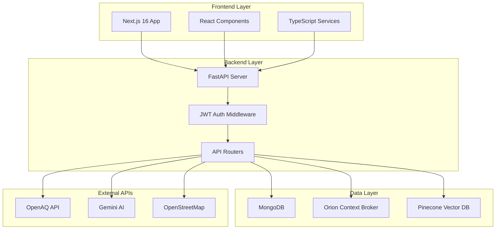
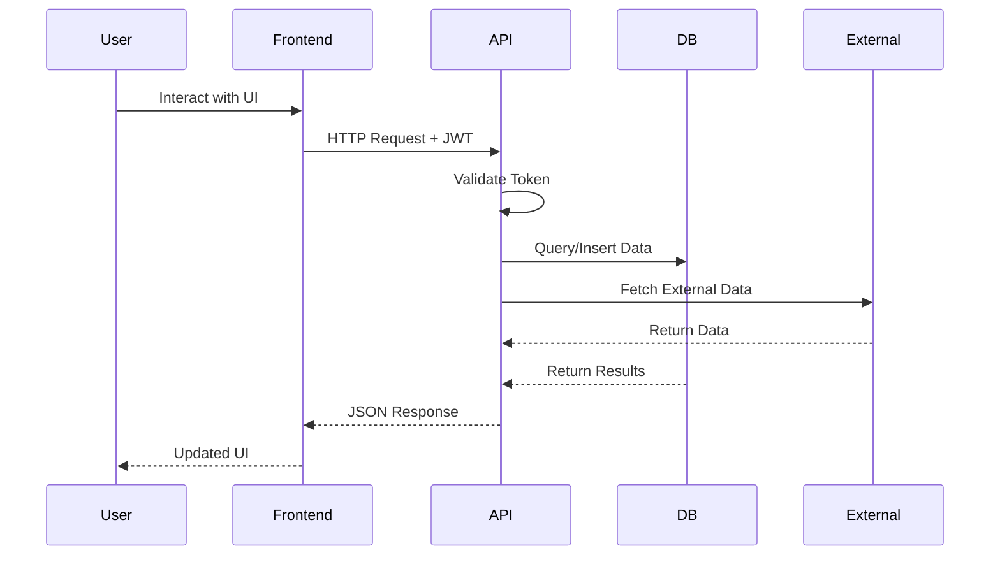

# UrbanReflex v0.1.0

<div align="center">

[](https://github.com/minhe51805/UrbanReflex/releases/tag/v0.1.0)
[](https://github.com/minhe51805/UrbanReflex/releases)
[](https://fastapi.tiangolo.com/)
[](https://nextjs.org/)
[](LICENSE)
[](https://github.com/minhe51805/UrbanReflex)

**🏙️ Smart City Platform - Air Quality Monitoring & Urban Infrastructure Management**

**Beta Release for Testing & Demonstration**

[🚀 Quick Demo](#-quick-demo-setup) • [✨ Features](#-features-in-this-release) • [📊 Demo Credentials](#-demo-credentials) • [🐛 Known Issues](#-known-limitations) • [📝 Changelog](#-changelog)

</div>

---

## 📋 Release Information

- **Version**: `0.1.0` (Beta)
- **Release Date**: December 4, 2025
- **Status**: Testing & Demonstration
- **Target Audience**: Testers, Mentors, Internal Demo
- **Stability**: Beta - Feature Complete, Testing in Progress

---

## 🎯 What's in This Release

This is the **initial beta release** of UrbanReflex, featuring core functionality for smart city data management and air quality monitoring. This version is ready for testing and demonstration purposes.

### ✅ Completed Features

#### 🌍 Air Quality Monitoring

- ✅ Real-time AQI data integration with OpenAQ API
- ✅ Interactive map with 10,000+ global monitoring stations
- ✅ Location-based air quality search and filtering
- ✅ Historical data charts and trends
- ✅ Health recommendations based on AQI levels
- ✅ Mock data fallback for development/testing

#### 🏙️ Smart City Infrastructure

- ✅ NGSI-LD compliant data model implementation
- ✅ Orion Context Broker integration
- ✅ Road segment data visualization
- ✅ Streetlight monitoring and status tracking
- ✅ Weather data correlation with air quality
- ✅ Point of Interest (POI) management

#### 👥 User Management

- ✅ User registration and authentication (JWT)
- ✅ Role-based access control (Citizen, Admin, City Official)
- ✅ API key generation and management
- ✅ User profile management
- ✅ Session management

#### 📝 Citizen Reporting System

- ✅ Submit infrastructure issues (streetlights, roads, waste)
- ✅ Photo upload with automatic location tagging
- ✅ Report status tracking (Open, In Progress, Resolved, Closed)
- ✅ Priority assignment (Low, Medium, High, Critical)
- ✅ Community voting on reports
- ✅ Admin dashboard for report management

#### 🤖 AI Features

- ✅ Gemini AI-powered chatbot for air quality queries
- ✅ Natural language processing for user questions
- ✅ Context-aware responses with data citations
- ✅ Vector search for semantic report search (Pinecone)
- ✅ Intelligent report classification

#### 🎨 User Interface

- ✅ Responsive web application (Mobile-first design)
- ✅ Interactive MapLibre GL map with clustering
- ✅ Real-time data visualization with Chart.js
- ✅ Modern UI with Tailwind CSS and Framer Motion
- ✅ Dark mode support
- ✅ Multi-language support foundation

---

## 🚀 Quick Demo Setup

### Prerequisites

```bash
# Required
✅ Docker Desktop (Windows/Mac) or Docker Engine (Linux)
✅ Docker Compose v2.0+
✅ 8GB RAM minimum
✅ 10GB free disk space
```

### 🏃‍♂️ One-Command Demo Launch

```bash
# 1. Clone this release
git clone -b release/0.1.0 https://github.com/minhe51805/UrbanReflex.git
cd UrbanReflex

# 2. Start all services with Docker Compose
docker-compose up -d

# 3. Wait for services to initialize (~2 minutes)
# Monitor startup progress
docker-compose logs -f

# 4. Access the application
# Frontend: http://localhost:3000
# Backend API: http://localhost:8000
# API Docs: http://localhost:8000/docs
```

### 🔧 Environment Configuration

The release includes pre-configured environment files:

```bash
# No configuration needed for demo!
# Default credentials and mock data are pre-loaded

# Optional: To use real external APIs, edit:
.env.production  # Backend configuration
website/.env.production  # Frontend configuration
```

### ✅ Verify Installation

```bash
# Check all services are running
docker-compose ps

# Expected output:
# mongodb    - Up (port 27017)
# orion      - Up (port 1026)
# redis      - Up (port 6379)
# backend    - Up (port 8000)
# frontend   - Up (port 3000)

# Health check
curl http://localhost:8000/health
# Expected: {"status": "healthy"}
```

---

## 📊 Demo Credentials

### 🔐 Pre-configured Test Accounts

```bash
# Admin Account (Full Access)
Email: admin@urbanreflex.dev
Password: Admin@123456
Role: Administrator
Permissions: Full system access, user management, report management

# City Official Account (Report Management)
Email: official@urbanreflex.dev
Password: Official@123456
Role: City Official
Permissions: Manage citizen reports, view analytics

# Citizen Account (Standard User)
Email: citizen@urbanreflex.dev
Password: Citizen@123456
Role: Citizen
Permissions: Submit reports, view data, use chatbot

# Developer Account (API Access)
Email: developer@urbanreflex.dev
Password: Developer@123456
API Key: dev_pk_1234567890abcdef
Permissions: Full API access
```

### 🌐 Demo URLs

```
Frontend Application: http://localhost:3000
Backend API: http://localhost:8000
API Documentation: http://localhost:8000/docs
API Redoc: http://localhost:8000/redoc
MongoDB Express: http://localhost:8081 (admin/pass)
Orion Context Broker: http://localhost:1026/version
```

---

## 🎪 Demo Scenarios

### Scenario 1: Air Quality Monitoring

```
1. Visit http://localhost:3000
2. View global air quality map
3. Search for "Ho Chi Minh City"
4. Click on a station marker
5. View detailed AQI data and charts
6. Check health recommendations
```

### Scenario 2: Citizen Reporting

```
1. Login as citizen@urbanreflex.dev
2. Click "Report Issue" button
3. Fill in issue details:
   - Title: "Broken streetlight on Main Street"
   - Category: Streetlight
   - Priority: Medium
4. Upload photo (optional)
5. Click map to set location
6. Submit report
7. Track report status in dashboard
```

### Scenario 3: Admin Dashboard

```
1. Login as admin@urbanreflex.dev
2. Navigate to Admin Dashboard
3. View all citizen reports
4. Filter by status/priority/category
5. Assign report to city official
6. Update report status
7. Add resolution notes
8. View analytics and statistics
```

### Scenario 4: AI Chatbot

```
1. Click chatbot icon (bottom right)
2. Ask: "What's the air quality in Hanoi today?"
3. Chatbot provides real-time AQI data
4. Ask: "How does this affect my health?"
5. Receive personalized recommendations
6. Ask: "Show me historical trends"
7. Get data visualization links
```

### Scenario 5: API Integration

```bash
# Get JWT token
curl -X POST "http://localhost:8000/auth/login" \
  -H "Content-Type: application/json" \
  -d '{"email":"developer@urbanreflex.dev","password":"Developer@123456"}'

# Use token to access API
curl "http://localhost:8000/api/v1/aqi/stations?limit=10" \
  -H "Authorization: Bearer <your_token>"

# Create citizen report via API
curl -X POST "http://localhost:8000/api/v1/citizen-reports" \
  -H "Authorization: Bearer <your_token>" \
  -H "Content-Type: application/json" \
  -d '{
    "title": "Pothole on Highway 1",
    "description": "Large pothole causing traffic issues",
    "category": "road",
    "priority": "high",
    "location": {"latitude": 10.7769, "longitude": 106.6951}
  }'
```

---

## 🐛 Known Limitations

### ⚠️ Current Limitations (v0.1.0)

1. **Performance**

   - Map clustering limited to 1000 markers for performance
   - Large dataset queries may be slow (>10,000 records)
   - First load time can be 5-10 seconds

2. **Features**

   - Real-time notifications not yet implemented
   - Email notifications disabled in beta
   - SMS alerts not available
   - Mobile app not included
   - Offline mode not supported

3. **Data**

   - Mock data used when external APIs unavailable
   - Historical data limited to 30 days in demo
   - Vector search requires API keys (optional)
   - Some international locations have limited data

4. **Infrastructure**

   - No auto-scaling configured
   - Single-instance deployment only
   - No backup/restore functionality
   - Limited monitoring/logging

5. **Browser Compatibility**
   - Optimized for Chrome/Edge/Firefox (latest versions)
   - Safari may have minor UI issues
   - IE11 not supported

### 🔧 Workarounds

- **Slow loading**: Reduce map zoom level, use filters
- **Missing data**: Enable mock data in settings
- **API errors**: Check `.env` file configuration
- **Docker issues**: Restart with `docker-compose restart`

---

## 📝 Changelog

### Version 0.1.0 (2025-12-04) - Initial Beta Release

#### ✨ New Features

- Complete air quality monitoring system
- NGSI-LD compliant smart city data model
- Citizen reporting with photo uploads
- AI-powered chatbot with Gemini integration
- Admin dashboard with analytics
- JWT authentication and role-based access
- Interactive map with clustering
- Real-time data visualization

#### 🔧 Infrastructure

- Docker Compose orchestration
- MongoDB for primary data storage
- Orion Context Broker for NGSI-LD
- Redis for caching and sessions
- FastAPI backend with async support
- Next.js 16 frontend with App Router

#### 📚 Documentation

- Complete API documentation
- Developer setup guides
- User manual
- Architecture documentation
- Testing guidelines

#### 🐛 Known Issues

- Map performance with >1000 markers
- Email notifications not implemented
- Mobile responsiveness needs improvement
- Some API rate limits not enforced

---

## 🧪 Testing Guidelines

### For Testers

```bash
# Test Checklist
✅ User registration and login
✅ Create/Edit/Delete citizen reports
✅ Upload photos to reports
✅ Search air quality by location
✅ View historical data charts
✅ Test chatbot responses
✅ Admin dashboard functionality
✅ API endpoint testing
✅ Mobile responsiveness
✅ Cross-browser compatibility

# Performance Testing
- Load test with 100 concurrent users
- Test with 1000+ map markers
- Test large file uploads (>5MB)
- Test slow network conditions

# Security Testing
- Test authentication flows
- Test authorization (role access)
- Test API rate limiting
- Test input validation
- Test XSS/CSRF protection
```

### Reporting Issues

Found a bug? Please report it:

1. Go to [GitHub Issues](https://github.com/minhe51805/UrbanReflex/issues)
2. Use the **Bug Report** template
3. Include:
   - Version: v0.1.0
   - Steps to reproduce
   - Expected vs actual behavior
   - Screenshots if applicable
   - Browser/OS information

---

## 🔄 Migration from Future Versions

This is the initial release. For future versions:

```bash
# Backup your data before upgrading
docker-compose exec mongodb mongodump --out /backup

# Pull new version
git fetch origin
git checkout release/0.2.0

# Run migration scripts
docker-compose down
docker-compose up -d
python scripts/migrate_v0.1_to_v0.2.py

# Restore data if needed
docker-compose exec mongodb mongorestore /backup
```

---

## 📞 Support for This Release

### 🆘 Getting Help

- 📖 **Documentation**: [./docs/](./docs/)
- 💬 **Discussions**: [GitHub Discussions](https://github.com/minhe51805/UrbanReflex/discussions)
- 🐛 **Bug Reports**: [GitHub Issues](https://github.com/minhe51805/UrbanReflex/issues)
- 📧 **Email**: support@urbanreflex.dev

### 🔍 Troubleshooting

Common issues with this release:

```bash
# Services won't start
docker-compose down -v
docker-compose up -d --build

# Database connection errors
docker-compose restart mongodb
docker-compose logs mongodb

# Frontend build errors
docker-compose exec frontend npm install
docker-compose restart frontend

# Port conflicts
# Edit docker-compose.yml ports section
# Change to available ports
```

---

## 🏫 Support & Organization

<p align="center">
    <a href="https://hutech.edu.vn/" target="_blank">
        
    </a>
    <a href="https://vfossa.vn/" target="_blank">
        
    </a>
    <a href="https://www.olp.vn/" target="_blank">
        
    </a>
</p>

---

## 📄 License

This project is licensed under the **Apache License 2.0** - see the [LICENSE](LICENSE) file for details.

---

<div align="center">

**UrbanReflex v0.1.0 - Beta Release**

Built with ❤️ for Vietnam Open Source Software Competition

[🏠 Homepage](https://urbanreflex.dev) • [📚 Documentation](./docs/) • [🐛 Report Bug](https://github.com/minhe51805/UrbanReflex/issues) • [💬 Discussions](https://github.com/minhe51805/UrbanReflex/discussions)

**⚠️ This is a beta release for testing purposes. Not recommended for production use.**

</div>

## 🚀 Quick Setup

### Prerequisites

```bash
# Required
Python 3.10+          # Backend development
Node.js 18+            # Frontend development
Docker & Docker Compose # Container orchestration
uv package manager     # Fast Python dependency management

# Optional
MongoDB Compass        # Database GUI
Postman/Thunder Client # API testing
```

### 🏃‍♂️ One-Command Development Setup

```bash
# Clone repository
git clone https://github.com/minhe51805/UrbanReflex.git
cd UrbanReflex

# Setup development environment (uses justfile)
just setup

# Start all services
just dev
```

### 🛠️ Manual Setup (Alternative)

<details>
<summary>Click to expand manual setup instructions</summary>

```bash
# 1. Install dependencies
uv sync                              # Backend dependencies
cd website && npm install && cd ..   # Frontend dependencies

# 2. Setup environment variables
cp .env.example .env
# Edit .env with your API keys

# 3. Start services
docker-compose up -d mongodb orion   # Start databases
uvicorn app.app:app --reload         # Start backend (port 8000)
cd website && npm run dev            # Start frontend (port 3000)
```

</details>

### 🔧 Environment Variables

```bash
# .env file
DATABASE_URL="mongodb://localhost:27017/urbanreflex"
JWT_SECRET_KEY="your-secret-key"
OPENAQ_API_KEY="your-openaq-key"           # Optional: Falls back to mock data
GEMINI_API_KEY="your-gemini-key"           # Optional: AI features disabled without this
PINECONE_API_KEY="your-pinecone-key"       # Optional: Vector search disabled without this
ORION_BROKER_URL="http://localhost:1026"   # NGSI-LD Context Broker
```

---

## 🏗️ System Architecture

### 📊 High-Level Architecture



### 🔀 Data Flow



### 🏢 Project Structure

```
UrbanReflex/
├── app/                     # 🐍 FastAPI Backend
│   ├── app.py              # Main application & CORS setup
│   ├── dependencies.py     # Dependency injection & auth
│   ├── routers/            # API endpoints
│   │   ├── auth.py         # Authentication & JWT
│   │   ├── chatbot.py      # AI-powered chatbot
│   │   ├── citizen_reports.py # Citizen reporting system
│   │   └── users.py        # User management
│   ├── models/             # Database models
│   ├── schemas/            # Pydantic schemas
│   ├── utils/              # Utility functions
│   └── ai_service/         # AI & ML services
├── website/                 # 🌐 Next.js Frontend
│   ├── app/                # App Router pages
│   ├── components/         # React components
│   ├── lib/                # Utilities & API clients
│   └── types/              # TypeScript definitions
├── config/                  # 🔧 Configuration
├── scripts/                 # 🤖 Automation scripts
├── open_data/              # 📂 Open datasets
├── docs/                   # 📚 Documentation
├── docker-compose.yml      # 🐳 Service orchestration
├── justfile                # ⚡ Task automation
└── pyproject.toml          # 📦 Python dependencies
```

---

## 🔧 Development Workflow

### 🌿 Branch Strategy

```bash
main        # 🚀 Production releases
develop     # 🧪 Development integration (current branch)
feature/*   # 🔨 Feature branches
hotfix/*    # 🚨 Critical fixes
```

### 🛠️ Available Commands (justfile)

```bash
# Development
just dev            # Start all services in development mode
just backend-dev    # Start only FastAPI backend
just frontend-dev   # Start only Next.js frontend
just install        # Install all dependencies

# Database
just db-start       # Start MongoDB + Orion
just db-stop        # Stop databases
just db-reset       # Reset databases

# Utilities
just setup          # Complete development environment setup
just clean          # Clean build artifacts
just format         # Format code (black, prettier)
just lint           # Run linters
just test           # Run test suites
```

### 🧪 Testing Strategy

```bash
# Backend tests
cd app && pytest tests/

# Frontend tests
cd website && npm run test

# E2E tests
cd website && npm run test:e2e

# API tests (with Postman collection)
newman run docs/postman/UrbanReflex.postman_collection.json
```

### 🔍 Code Quality Tools

- **Backend**: `black` (formatting), `flake8` (linting), `mypy` (type checking)
- **Frontend**: `prettier` (formatting), `eslint` (linting), TypeScript compiler
- **Pre-commit hooks**: Automated formatting and linting on commit

---

## 📚 Documentation

### 📖 For Developers

- **[📋 API Documentation](./docs/API_REFERENCE.md)** - Complete REST API reference
- **[🏗️ System Architecture](./docs/ARCHITECTURE.md)** - Deep dive into technical architecture
- **[🔧 Development Setup](./docs/DEVELOPMENT_SETUP.md)** - Detailed development environment guide
- **[🧪 Testing Guide](./docs/TESTING.md)** - Unit, integration, and E2E testing strategies
- **[🚀 Deployment Guide](./docs/DEPLOYMENT.md)** - Production deployment instructions
- **[🔒 Security Guidelines](./docs/SECURITY.md)** - Security best practices and policies

### 📊 Data & Integration

- **[🌐 NGSI-LD Integration](./docs/NGSI_LD_GUIDE.md)** - Smart city data standards implementation
- **[📊 Data Models](./docs/DATA_MODEL.md)** - Database schemas and data structures
- **[🤖 AI Services](./docs/AI_INTEGRATION.md)** - Gemini AI and vector search integration
- **[📡 External APIs](./docs/EXTERNAL_APIS.md)** - Third-party API integration guide

### 🎯 Quick References

- **[⚡ Commands Cheatsheet](./docs/COMMANDS.md)** - justfile and npm command reference
- **[🔧 Environment Setup](./docs/ENV_SETUP.md)** - Environment variables configuration
- **[🐛 Troubleshooting](./docs/TROUBLESHOOTING.md)** - Common issues and solutions

---

## 🚀 Tech Stack Deep Dive

### 🔧 Backend Architecture

```python
# FastAPI with async support
FastAPI + Uvicorn          # ASGI server with async capabilities
Pydantic v2               # Data validation and serialization
Motor                     # Async MongoDB driver
Python-JOSE               # JWT token handling
Passlib                   # Password hashing
```

### 🎨 Frontend Architecture

```typescript
// Modern React ecosystem
Next.js 16                // App Router + Server Components
React 19                  // Latest React features
TypeScript 5              // Type safety
Tailwind CSS 3.4          // Utility-first styling
Framer Motion            // Smooth animations
```

### 🗄️ Data Layer

```yaml
# Multi-database architecture
MongoDB: # Primary database
  - User data
  - Citizen reports
  - Chat history
  - Application state

Orion Context Broker: # NGSI-LD compliant
  - Smart city entities
  - Real-time urban data
  - IoT device integration

Pinecone: # Vector database
  - AI embeddings
  - Semantic search
  - Content recommendations
```

### 🤖 AI & ML Integration

```python
# AI Services Architecture
Gemini AI                 # Text generation and analysis
Embed Anything           # Text embeddings generation
Pinecone Vector DB       # Vector storage and retrieval
FAISS                    # Local vector operations
Sentence Transformers    # Text similarity and clustering
```

---

## 🚦 Getting Started for Contributors

### 1️⃣ Fork & Clone

```bash
# Fork the repository on GitHub, then:
git clone https://github.com/YOUR_USERNAME/UrbanReflex.git
cd UrbanReflex
git remote add upstream https://github.com/minhe51805/UrbanReflex.git
```

### 2️⃣ Setup Development Environment

```bash
# Quick setup (recommended)
just setup

# Or manual setup
uv sync                              # Backend dependencies
cd website && npm install && cd ..   # Frontend dependencies
cp .env.example .env                 # Configure environment
```

### 3️⃣ Create Feature Branch

```bash
git checkout develop
git pull upstream develop
git checkout -b feature/your-feature-name
```

### 4️⃣ Development Process

```bash
# Start development servers
just dev

# Make changes, then test
just test
just lint
just format

# Commit changes
git add .
git commit -m "feat: add new feature"
git push origin feature/your-feature-name
```

### 5️⃣ Submit Pull Request

1. 🌐 Go to [GitHub Pull Requests](https://github.com/minhe51805/UrbanReflex/pulls)
2. 📝 Click "New Pull Request"
3. 🎯 Target `develop` branch
4. 📋 Fill out the PR template
5. 🏷️ Add relevant labels
6. 👥 Request review from maintainers

---

## 🔄 CI/CD Pipeline

### 🧪 Automated Testing

```yaml
# GitHub Actions workflow
- Code quality checks (ESLint, Black, MyPy)
- Unit tests (pytest, Jest)
- Integration tests
- Security scanning
- Docker image builds
- Deployment to staging
```

### 📦 Release Process

```bash
# Release workflow
develop → staging → main → production

# Version management
just version patch|minor|major    # Bump version
git tag v1.2.3                   # Create release tag
git push origin v1.2.3           # Trigger deployment
```

---

## 🛠️ Contributing

We ❤️ contributions! Whether you're fixing bugs, adding features, or improving documentation, your help makes UrbanReflex better.

### 🚀 Quick Contribution Links

[](https://github.com/minhe51805/UrbanReflex/issues/new?template=bug_report.md)
[](https://github.com/minhe51805/UrbanReflex/issues/new?template=feature_request.md)
[](https://github.com/minhe51805/UrbanReflex/discussions)

### 📋 Contribution Guidelines

- 📖 Read our [Contributing Guide](./CONTRIBUTING.md)
- 🤝 Follow the [Code of Conduct](./CODE_OF_CONDUCT.md)
- 🏷️ Use [Conventional Commits](https://www.conventionalcommits.org/)
- ✅ Ensure all tests pass before submitting
- 📝 Update documentation for new features

### 👥 Types of Contributions

- 🐛 **Bug fixes** - Help us squash those pesky bugs
- ✨ **New features** - Implement cool new functionality
- 📚 **Documentation** - Improve guides and API docs
- 🧪 **Testing** - Add test coverage for untested code
- 🎨 **UI/UX** - Enhance user interface and experience
- 🔧 **DevOps** - Improve development and deployment processes

---

## 📋 Roadmap

### 🎯 Current Sprint (v1.1.0)

- [ ] 🤖 **Enhanced AI Features**

  - Advanced natural language query processing
  - Predictive analytics for air quality trends
  - Smart recommendations for urban planning

- [ ] 📊 **Real-time Analytics Dashboard**

  - Live data visualization improvements
  - Custom dashboard builder for administrators
  - Export functionality for reports and charts

- [ ] 🔧 **Developer Experience**
  - GraphQL API endpoint addition
  - SDK/client libraries (Python, JavaScript, Go)
  - Webhook support for real-time notifications

### 🚀 Next Quarter (v1.2.0)

- [ ] 🌐 **Multi-tenancy Support**

  - Organization-based data isolation
  - White-label deployment options
  - Advanced role and permission management

- [ ] 🏗️ **Infrastructure Improvements**

  - Kubernetes deployment manifests
  - Horizontal scaling optimizations
  - Advanced caching strategies

- [ ] 📱 **Mobile Applications**
  - React Native mobile app
  - Push notifications for alerts
  - Offline data synchronization

### 💭 Future Vision (v2.0+)

- 🧠 **Machine Learning Pipeline** - Automated anomaly detection
- 🌍 **Global Deployment** - Multi-region support
- 🔌 **IoT Integration** - Direct sensor data ingestion
- 🚀 **Edge Computing** - Local data processing capabilities

---

## 📞 Support & Community

### 🆘 Getting Help

- 📖 **Documentation**: Start with our comprehensive [docs](./docs/)
- 💬 **Discussions**: Join our [GitHub Discussions](https://github.com/minhe51805/UrbanReflex/discussions)
- 🐛 **Bug Reports**: Create detailed [issue reports](https://github.com/minhe51805/UrbanReflex/issues)
- 💌 **Direct Contact**: Reach out to maintainers via email

### 🌟 Show Your Support

If this project helps you, please consider:

- ⭐ **Star the repository** on GitHub
- 🐦 **Share on social media** with `#UrbanReflex`
- 📝 **Write a blog post** about your experience
- 💸 **Sponsor the project** via GitHub Sponsors

### 🏆 Contributors

Thanks to all our amazing contributors! Your efforts make this project possible.

<a href="https://github.com/minhe51805/UrbanReflex/graphs/contributors">
  
</a>

---

## 📄 License & Legal

### 📋 License

This project is licensed under the **Apache License 2.0** - see the [LICENSE](LICENSE) file for details.

**Key points:**

- ✅ Commercial use allowed
- ✅ Modification allowed
- ✅ Distribution allowed
- ✅ Patent use allowed
- ⚠️ Includes patent grant
- ⚠️ Includes copyright notice requirement

### 🔒 Security Policy

For security vulnerabilities, please see our [Security Policy](./SECURITY.md).

### 🏛️ Open Source Compliance

UrbanReflex is committed to open source best practices:

- 📊 **Transparent development** - All development happens in public
- 🤝 **Community driven** - Major decisions involve community input
- 📖 **Comprehensive documentation** - Always up-to-date guides and references
- 🧪 **Test coverage** - Maintained high test coverage standards

---

## 🏫 Support & Organization

<p align="center">
    <a href="https://hutech.edu.vn/" target="_blank">
        
    </a>
    <a href="https://vfossa.vn/" target="_blank">
        
    </a>
    <a href="https://www.olp.vn/" target="_blank">
        
    </a>
</p>

---

<div align="center">

**Built with ❤️ for the open source community**

[🏠 Website](https://urbanreflex.dev) • [📚 Documentation](./docs/) • [💬 Community](https://github.com/minhe51805/UrbanReflex/discussions) • [🐛 Issues](https://github.com/minhe51805/UrbanReflex/issues) • [🔧 Pull Requests](https://github.com/minhe51805/UrbanReflex/pulls)

</div>
