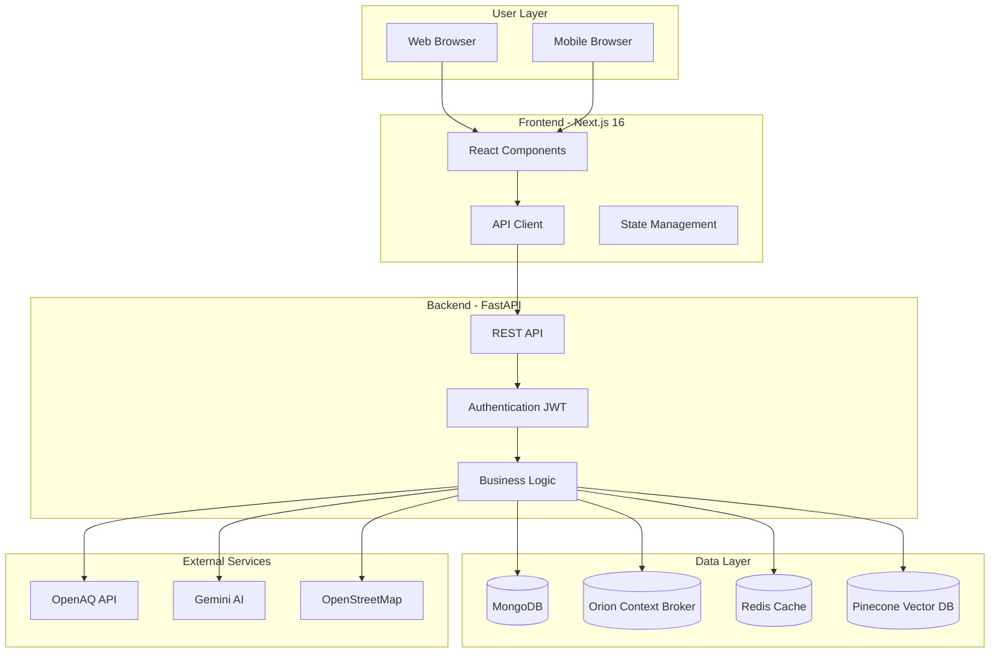

<p align="center">
	
</p>

<h1 align="center">UrbanReflex</h1>

<p align="center">
	A smart city intelligence platform that bridges fragmented urban data sources into a unified NGSI-LD ecosystem, empowering communities and city managers with real-time infrastructure insights and open data access
</p>


<p align="center">
  <a href="https://urbanreflex-882wzswzf-ttas-projects-6148b983.vercel.app/" rel="dofollow" target="blank"><strong>Explore the docs »</strong></a>
	<br/>
	<br/>
	<a href="https://github.com/minhe51805/UrbanReflex/issues/new?assignees=&labels=&projects=&template=bug_report.md&title=%F0%9F%90%9B+Bug+Report%3A+">🐛 Report Bug</a>
	|
	<a href="https://github.com/minhe51805/UrbanReflex/issues/new?assignees=&labels=&projects=&template=feature_request.md&title=%F0%9F%9A%80+Feature%3A+">✈️ Request Feature</a>
	|
	<a href="https://github.com/minhe51805/UrbanReflex/discussions">💬 Join Discussion</a>
	|
	<a href="./docs/">📚 Documentation</a>
</p>

<p align="center">
	<a href="https://github.com/minhe51805/UrbanReflex/issues" target="blank">
		
	</a>
	<a href="https://github.com/minhe51805/UrbanReflex/blob/main/LICENSE" target="blank">
		
	</a>
	<a href="https://github.com/minhe51805/UrbanReflex/releases" target="blank">
		
	</a>
	<a href="https://fastapi.tiangolo.com/" target="blank">
		
	</a>
	<a href="https://nextjs.org/" target="blank">
		
	</a>
	<a href="https://www.etsi.org/deliver/etsi_gs/CIM/001_099/009/01.08.01_60/gs_CIM009v010801p.pdf" target="blank">
		
	</a>
</p>


---

## Features

- 🌍 Real-time Air Quality Monitoring from 10,000+ global stations
- 📝 Citizen-Powered Infrastructure Issue Reporting
- 🤖 AI-Powered Chatbot with Natural Language Processing
- 🏛️ NGSI-LD Compliant Smart City Data Models
- 📊 Interactive Dashboards and Analytics
- 🔐 Role-Based Access Control

## Table of Contents

<details>
<summary>Expand contents</summary>

- [What is UrbanReflex?](#what-is-urbanreflex)
- [Key Features](#-key-features)
- [Getting Started](#-getting-started)
	- [Prerequisites](#️-prerequisites)
		- [Infrastructure](#infrastructure)
		- [Services & API Keys](#services--api-keys)
	- [Setup](#-setup)
	- [Running](#-running)
	- [Testing](#-testing)
	- [Demo Credentials](#-demo-credentials)
- [Technology Stack](#️-technology-stack)
- [System Architecture](#-system-architecture)
- [Project Structure](#-project-structure)
- [Project Status](#-project-status)
- [Use Cases](#-use-cases)
- [Contributing](#-contributing)
- [Support and Organization](#support-and-organization)
- [License](#-license)

</details>

# What is UrbanReflex?

<p align="justify">
UrbanReflex is an open-source smart city platform that addresses modern urban challenges through integrated, data-driven solutions. It combines real-time environmental monitoring with citizen engagement features to enable transparent, efficient, and responsive urban governance.
</p>

<blockquote>
	<p align="justify">
		Built on NGSI-LD standards, the platform unifies infrastructure data, air quality monitoring, and citizen reports into actionable intelligence. With open data accessibility, AI-powered analytics, and real-time insights, UrbanReflex empowers communities and city managers to make informed decisions that support sustainable development and promote transparent urban governance.
	</p>
</blockquote>

---

## ✨ Key Features

### **Air Quality Intelligence**
- Real-time AQI from 10,000+ global monitoring stations  
- Interactive map with heatmaps and clustering  
- Health advisories based on pollution levels  
- Historical trend analysis with charts  
- Location-based search for any city or region  

### **Citizen Engagement**
- Report urban issues (streetlights, potholes, waste, etc.)  
- Photo uploads with automatic geolocation  
- Real-time status tracking for issue resolution  
- Community voting for prioritization  
- Automated severity classification  

### **AI Intelligence**
- Natural language chatbot powered by Gemini  
- Semantic vector search using Pinecone  
- Automatic report classification  
- Predictive analytics and hotspot forecasting (planned v1.1)  

### **Smart City Infrastructure**
- NGSI-LD compliant data models (ETSI standard)  
- Orion-LD for real-time context management  
- IoT sensor integration for urban monitoring  
- Open data export (GeoJSON, NDJSON)  

### **Role-Based Access Control**
- **Citizen**: submit reports, view air quality, access chatbot  
- **City Official**: manage reports, assign tasks, analytics dashboard  
- **Admin**: system and user management  
- **Developer**: REST API with full OpenAPI documentation  


---

## 🚀 Getting Started

## 🛠️ Prerequisites

### Infrastructure Requirements

- **Docker Desktop** (Windows/macOS) or **Docker Engine** (Linux) — container platform used to run UrbanReflex services in isolated, reproducible environments.  
- **Docker Compose** — orchestrates backend, frontend, and supporting services.  
- **Node.js (v18+)** — required for building and running the Next.js frontend.  
- **Python (v3.10+)** — runtime for the FastAPI backend and AI service modules.  
- **MongoDB** (optional) — document database for storing user data and report information.  
- **Redis** (optional) — in‑memory cache used for session handling and performance optimization.

### Services & API Keys

- **Google Gemini API Key** — powers AI chatbot interactions and automated classification.  
- **Pinecone API Key** — enables vector search and semantic similarity indexing.  
- **OpenAQ API** — source of global air quality data (no key required).

---

## 🚀 Quick Setup

### Prerequisites

**Runtimes**
- [Python 3.10+](https://www.python.org/downloads/)
- [Node.js 18+](https://nodejs.org/en/download)

**Containers**
- [Docker](https://www.docker.com/)
- [Docker Compose](https://docs.docker.com/compose/)

**Developer Tooling**
- [uv](https://docs.astral.sh/uv/getting-started/features/)
- [Just](https://just.systems/)

**Databases (Optional)**
- [MongoDB](https://www.mongodb.com/try/download/community)
- [Redis](https://redis.io/download)

**API & External Services**
- [Google Gemini API Key](https://makersuite.google.com/app/apikey)
- [Pinecone API Key](https://www.pinecone.io/)
- [OpenAQ API](https://openaq.org/)
---

## 🏃‍♂️ One‑Command Development Setup

UrbanReflex supports a streamlined workflow via a `justfile`:

```bash
# Clone repository
git clone https://github.com/minhe51805/UrbanReflex.git
cd UrbanReflex

# Setup development environment
just setup

# Start all services
just dev
```

---

## 🛠️ Manual Setup (Alternative)

```bash
# 1. Install dependencies
uv sync                              # Backend dependencies
cd website && npm install && cd ..   # Frontend dependencies

# 2. Setup environment variables
cp .env.example .env
# Edit .env with your API keys

# 3. Start services
docker-compose up -d mongodb orion   # Start databases
uvicorn app.app:app --reload         # Backend (port 8000)
cd website && npm run dev            # Frontend (port 3000)
```

---

## 🔧 Environment Variables

```bash
# .env file
DATABASE_URL="mongodb://localhost:27017/urbanreflex"
JWT_SECRET_KEY="your-secret-key"
OPENAQ_API_KEY="your-openaq-key"           
GEMINI_API_KEY="your-gemini-key"          
PINECONE_API_KEY="your-pinecone-key"      
ORION_BROKER_URL="http://localhost:1026"   
```

---

## 🛠️ Technology Stack

### Backend Architecture

```
FastAPI + Python 3.10+     → High-performance asynchronous API framework
MongoDB                    → Document database for users and reports
Orion Context Broker       → NGSI-LD compliant context management
Redis                      → In-memory caching and state management
Gemini AI                  → Natural language understanding and analytics
Pinecone                   → Vector search for semantic similarity
```

### Frontend Architecture

```
Next.js 16                 → Modern React framework with App Router
TypeScript                 → Strongly typed development
Tailwind CSS               → Utility-first styling
MapLibre GL                → WebGL-based interactive mapping
Chart.js                   → Data visualization
Framer Motion              → Smooth UI animations
```

### Infrastructure

```
Docker Compose             → Multi-service orchestration
Nginx                      → Reverse proxy for production setup
GitHub Actions             → CI/CD automation
```

### External Integrations

```
OpenAQ API                 → Global air quality data provider
OpenStreetMap              → Geolocation and POI data
Google Gemini API          → AI conversational capabilities
Pinecone Cloud             → Managed vector database
```
---

## 📊 System Architecture



---

## 📦 Project Structure

```
UrbanReflex/
├── app/                    # FastAPI backend application
│   ├── routers/           # API endpoint definitions (auth, chatbot, reports, users)
│   ├── models/            # Database models and schemas
│   ├── schemas/           # Pydantic validation schemas
│   ├── ai_service/        # Gemini AI and Pinecone integration
│   └── utils/             # Utility functions and helpers
├── website/               # Next.js 16 frontend application
│   ├── app/              # App Router pages and routes
│   ├── components/       # Reusable React components
│   ├── lib/              # API clients and utility functions
│   └── types/            # TypeScript type definitions
├── docs/                  # Project documentation
│   ├── API_REFERENCE.md  # Complete API documentation
│   ├── ARCHITECTURE.md   # System architecture details
│   └── USER_GUIDE.md     # End-user manual
├── scripts/               # Data collection and seeding scripts
├── open_data/            # Open datasets (GeoJSON, NDJSON formats)
├── docker-compose.yml    # Container orchestration configuration
└── LICENSE               # Apache 2.0 license file
```

---

## 📈 Project Status

**Current Version**: v0.1.0 (Beta)  
**Development Status**: Feature complete, in testing phase  
**Target Competition**: Vietnam Open Source Software Competition 2025

### Completed Features

- Air quality monitoring integration (10,000+ stations)
- Citizen reporting system with photo uploads
- AI chatbot with Gemini integration
- Administrative dashboard with analytics
- NGSI-LD compliance (Orion Context Broker integration)
- JWT authentication with role-based access control
- Docker Compose deployment configuration
- Comprehensive API documentation

### Planned Enhancements

- Real-time push notifications (v1.1)
- Native mobile applications (iOS/Android)
- Email and SMS alert system for critical issues
- Machine learning models for predictive analytics
- Multi-language support (Vietnamese, English)
- Kubernetes deployment manifests

---

## 🌟 Use Cases

### For Citizens

- Monitor air quality conditions before outdoor activities
- Report infrastructure issues with photo documentation
- Track resolution status of submitted reports
- Access AI-powered health recommendations

### For City Officials

- Real-time monitoring of citizen-reported issues
- Data-driven prioritization of maintenance tasks
- Analysis of pollution patterns across districts
- Export capabilities for urban planning reports

### For Developers

- Access to open air quality data via REST API
- Integration with NGSI-LD compliant smart city systems
- Custom dashboard development using provided APIs
- Contribution to open-source smart city initiatives

---

## Contributing

### 📖 Contributing Guidelines

<p align="justify">
We are excited that you are interested in contributing to this project! Before submitting your contribution, please make sure to take a moment and read through the following guidelines:
</p>

<p align="justify">
Read through our <a href="./CONTRIBUTING.md">contributing guidelines</a> to learn about our submission process, coding rules, and more.
</p>

### 💁 Want to Help?

<p align="justify">
Want to report a bug, contribute some code, or improve the documentation? Excellent! Read up on our guidelines for <a href="./CONTRIBUTING.md">contributing</a> and then check out one of our issues labeled as <kbd><a href="https://github.com/minhe51805/UrbanReflex/labels/help%20wanted">help wanted</a></kbd> or <kbd><a href="https://github.com/minhe51805/UrbanReflex/labels/good%20first%20issue">good first issue</a></kbd>.
</p>

---

## Support and Organization

<p align="center">
	<a href="https://hutech.edu.vn/" target="_blank">
		
	</a>
	&nbsp;&nbsp;&nbsp;
	<a href="https://vfossa.vn/" target="_blank">
		
	</a>
	&nbsp;&nbsp;&nbsp;
	<a href="https://www.olp.vn/" target="_blank">
		
	</a>
</p>

---

## License

<p align="justify">
This project is licensed under the terms of the <a href="./LICENSE">Apache License 2.0</a>.
</p>


