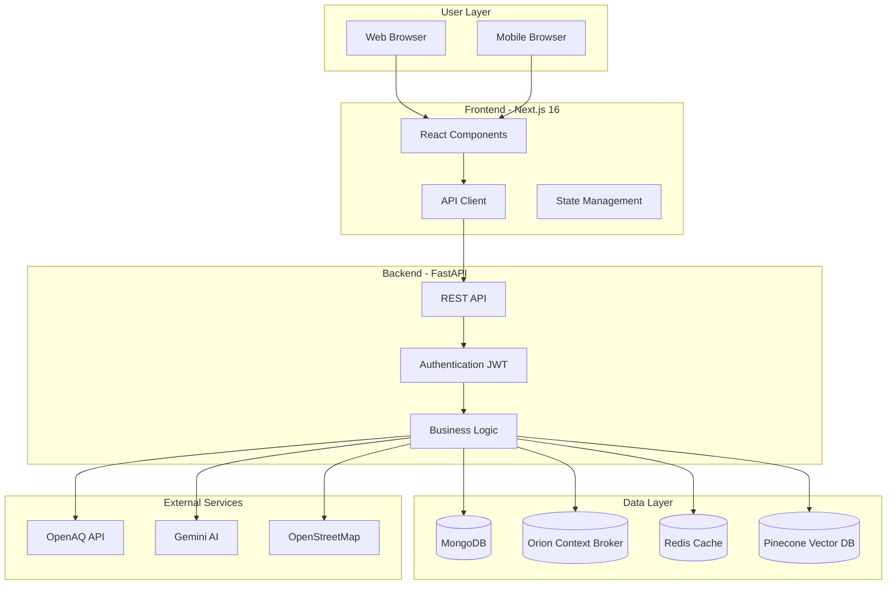

# UrbanReflex 🏙️

<div align="center">

[](https://github.com/minhe51805/UrbanReflex/releases)
[](LICENSE)
[](https://fastapi.tiangolo.com/)
[](https://nextjs.org/)
[](https://www.etsi.org/deliver/etsi_gs/CIM/001_099/009/01.08.01_60/gs_CIM009v010801p.pdf)

**Smart City Platform for Air Quality Monitoring & Urban Infrastructure Management**

_Empowering citizens and city officials with real-time environmental data and intelligent urban management tools_


**[📖 Explore the Docs »](https://urbanreflex-882wzswzf-ttas-projects-6148b983.vercel.app/)**

[🚀 Live Demo](#-quick-start) • [✨ Features](#-key-features) • [📸 Screenshots](#-screenshots) • [🛠️ Tech Stack](#️-technology-stack) • [🤝 Contributing](./CONTRIBUTING.md)

</div>

---

## 🎯 Why UrbanReflex?

**The Problem**: Cities worldwide struggle with air pollution and lack integrated platforms for citizens to report infrastructure issues. Data is scattered, response times are slow, and citizen engagement is minimal.

**Our Solution**: UrbanReflex is an open-source smart city platform that combines:

- 🌍 **Real-time air quality monitoring** from 10,000+ global stations
- 📝 **Citizen-powered reporting** for infrastructure issues
- 🤖 **AI assistance** for intelligent urban planning insights
- 🏛️ **NGSI-LD compliance** for standardized smart city data exchange

**Impact**: Enabling transparent, data-driven urban management while empowering citizens to actively participate in improving their communities.

---

## ✨ Key Features

### 🌬️ Air Quality Intelligence

- **Real-time Monitoring**: Track AQI from 10,000+ stations worldwide (powered by OpenAQ)
- **Interactive Map**: Visualize air quality hotspots with clustering and heatmaps
- **Health Recommendations**: Personalized advice based on current pollution levels
- **Historical Trends**: Analyze pollution patterns over time with interactive charts
- **Location-based Search**: Find air quality data for any city instantly

### 📱 Citizen Engagement

- **Report Infrastructure Issues**: Submit reports for broken streetlights, potholes, waste management
- **Photo Documentation**: Attach images with automatic geolocation tagging
- **Status Tracking**: Monitor report progress from submission to resolution
- **Community Voting**: Upvote issues to prioritize city responses
- **Priority Assignment**: Classify reports by urgency (Low, Medium, High, Critical)

### 🤖 AI-Powered Insights

- **Smart Chatbot**: Natural language queries about air quality (powered by Gemini AI)
- **Semantic Search**: Find similar reports using vector embeddings (Pinecone)
- **Intelligent Classification**: Automatic categorization of citizen reports
- **Predictive Analytics**: Forecast air quality trends (coming in v1.1)

### 🏛️ Smart City Infrastructure

- **NGSI-LD Compliant**: Standardized data models for interoperability
- **Orion Context Broker**: Real-time urban data management
- **IoT Integration**: Monitor streetlights, road conditions, weather stations
- **Open Data Export**: Share datasets in GeoJSON, NDJSON formats

### 👥 Multi-Role Access

- **Citizens**: Submit reports, view air quality, use chatbot
- **City Officials**: Manage reports, assign tasks, view analytics
- **Administrators**: Full system control, user management, data export
- **Developers**: RESTful API access with comprehensive documentation

---

## 📸 Screenshots

### 🗺️ Air Quality Dashboard


_Interactive global map with real-time AQI data and clustering_

### 📝 Citizen Reporting


_Easy-to-use report submission with photo upload and location picker_

### 📊 Admin Dashboard


_Comprehensive analytics and report management for city officials_

### 💬 AI Chatbot


_Natural language air quality queries with intelligent responses_

---

## 🚀 Quick Start

### Prerequisites

- Docker Desktop (Windows/Mac) or Docker Engine (Linux)
- 8GB RAM minimum
- 10GB free disk space

### One-Command Setup

```bash
# Clone repository
git clone https://github.com/minhe51805/UrbanReflex.git
cd UrbanReflex

# Start all services with Docker Compose
docker-compose up -d

# Wait ~2 minutes for initialization
# Access the platform at http://localhost:3000
```

### Demo Credentials

```bash
👤 Admin Login:
Email: admin@urbanreflex.dev
Password: Admin@123456

👤 Citizen Login:
Email: citizen@urbanreflex.dev
Password: Citizen@123456
```

### Quick Links

- **Frontend**: http://localhost:3000
- **API Documentation**: http://localhost:8000/docs
- **API Playground**: http://localhost:8000/redoc

---

## 🛠️ Technology Stack

### Backend Architecture

```
FastAPI + Python 3.10+     → High-performance async API
MongoDB                    → Primary database (users, reports)
Orion Context Broker       → NGSI-LD smart city data
Redis                      → Caching & session management
Gemini AI                  → Natural language processing
Pinecone                   → Vector database for semantic search
```

### Frontend Architecture

```
Next.js 16                 → React framework with App Router
TypeScript                 → Type-safe development
Tailwind CSS               → Modern utility-first styling
MapLibre GL                → Interactive maps with clustering
Chart.js                   → Data visualization
Framer Motion             → Smooth animations
```

### Infrastructure

```
Docker Compose             → Container orchestration
Nginx                      → Reverse proxy (production)
GitHub Actions             → CI/CD automation
```

### External Integrations

```
OpenAQ API                 → Global air quality data
OpenStreetMap              → Geolocation & POI data
Google Gemini API          → AI-powered chatbot
Pinecone Cloud             → Vector similarity search
```

---

## 📊 System Architecture



---

## 📦 What's Included

```
UrbanReflex/
├── app/                    # FastAPI backend application
│   ├── routers/           # API endpoints (auth, chatbot, reports, users)
│   ├── models/            # Database models
│   ├── schemas/           # Pydantic validation schemas
│   ├── ai_service/        # Gemini & Pinecone integration
│   └── utils/             # Helper functions
├── website/               # Next.js 16 frontend
│   ├── app/              # App Router pages
│   ├── components/       # Reusable React components
│   ├── lib/              # API clients & utilities
│   └── types/            # TypeScript definitions
├── docs/                  # Comprehensive documentation
│   ├── API_REFERENCE.md  # Complete API docs
│   ├── ARCHITECTURE.md   # System design
│   └── USER_GUIDE.md     # End-user manual
├── scripts/               # Data collection & seeding
├── open_data/            # Open datasets (GeoJSON, NDJSON)
├── docker-compose.yml    # Container orchestration
└── LICENSE               # Apache 2.0
```

---

## 🌟 Use Cases

### For Citizens

- Check air quality before outdoor activities
- Report broken streetlights during evening walks
- Track pothole repairs on your commute route
- Ask AI about health impacts of pollution levels

### For City Officials

- Monitor citizen complaints in real-time
- Prioritize infrastructure maintenance by severity
- Analyze pollution patterns across neighborhoods
- Export data for urban planning reports

### For Developers

- Access open air quality data via REST API
- Integrate NGSI-LD smart city entities
- Build custom dashboards with our API
- Contribute to open-source smart city tools

---

## 📈 Project Status

**Current Version**: v0.1.0 (Beta)  
**Status**: ✅ Feature complete, in testing phase  
**Target**: Vietnam Open Source Software Competition 2025

### Completed ✅

- Air quality monitoring (10,000+ stations)
- Citizen reporting system with photo uploads
- AI chatbot with Gemini integration
- Admin dashboard with analytics
- NGSI-LD compliance (Orion Context Broker)
- JWT authentication & role-based access
- Docker Compose deployment
- Comprehensive API documentation

### Coming Soon 🚧

- Real-time push notifications (v1.1)
- Mobile applications (iOS/Android)
- Email/SMS alerts for critical issues
- Machine learning for predictive analytics
- Multi-language support (Vietnamese, English)
- Kubernetes deployment manifests

---

## 🤝 Contributing

We welcome contributions from the community! Whether you're fixing bugs, adding features, or improving documentation.

### Quick Contribution Guide

1. **Fork** the repository
2. **Create** a feature branch (`git checkout -b feature/AmazingFeature`)
3. **Commit** your changes (`git commit -m 'Add some AmazingFeature'`)
4. **Push** to the branch (`git push origin feature/AmazingFeature`)
5. **Open** a Pull Request

See [CONTRIBUTING.md](./CONTRIBUTING.md) for detailed guidelines.

### Ways to Contribute

- 🐛 Report bugs via [GitHub Issues](https://github.com/minhe51805/UrbanReflex/issues)
- 💡 Suggest features in [Discussions](https://github.com/minhe51805/UrbanReflex/discussions)
- 📝 Improve documentation
- 🧪 Add test coverage
- 🎨 Enhance UI/UX design

---

## 📄 License

This project is licensed under the **Apache License 2.0** - see the [LICENSE](LICENSE) file for details.

**What this means:**

- ✅ Free to use commercially
- ✅ Free to modify and distribute
- ✅ Patent grant included
- ⚠️ Must include copyright notice
- ⚠️ Must state significant changes

---

## 👥 Team & Credits

### Development Team

**UrbanReflex** is developed by students and open-source contributors passionate about smart cities and environmental technology.

**Lead Developer**: [Your Name/Team Name]  
**Contributors**: See [CONTRIBUTORS.md](./CONTRIBUTORS.md)

### Acknowledgments

<p align="center">
    <a href="https://hutech.edu.vn/" target="_blank">
        
    </a>
    &nbsp;&nbsp;&nbsp;
    <a href="https://vfossa.vn/" target="_blank">
        
    </a>
    &nbsp;&nbsp;&nbsp;
    <a href="https://www.olp.vn/" target="_blank">
        
    </a>
</p>

**Supported by:**

- 🏫 **HUTECH University** - Academic support and mentorship
- 🌐 **VFOSSA** - Vietnam Free and Open Source Software Association
- 🏆 **Vietnam OLP** - Open Source Software Competition

**Powered by:**

- FastAPI, Next.js, MongoDB, Docker
- OpenAQ, Google Gemini, Pinecone
- FIWARE Orion Context Broker
- OpenStreetMap, MapLibre GL

---

## 📞 Support & Contact

### Documentation

- 📖 [Full Documentation](./docs/)
- 🔧 [API Reference](./docs/API_REFERENCE.md)
- 🏗️ [Architecture Guide](./docs/ARCHITECTURE.md)
- 👤 [User Manual](./docs/USER_GUIDE.md)

### Get Help

- 💬 [GitHub Discussions](https://github.com/minhe51805/UrbanReflex/discussions) - Ask questions
- 🐛 [Issue Tracker](https://github.com/minhe51805/UrbanReflex/issues) - Report bugs
- 📧 Email: support@urbanreflex.dev
- 🌐 Website: https://urbanreflex.dev

### Stay Connected

- ⭐ Star this repository to show support
- 👀 Watch for updates and releases
- 🐦 Share on social media with `#UrbanReflex`
- 📢 Join our [Discord Community](#) (coming soon)

---

## 🌍 Impact & Vision

### Current Impact

- 🌐 **10,000+** air quality monitoring stations integrated
- 🏙️ **NGSI-LD** compliant for smart city interoperability
- 🆓 **100% Open Source** - accessible to cities worldwide
- 📊 **Open Data** - GeoJSON/NDJSON exports for research

### Future Vision

By 2026, we aim to:

- 🌏 Deploy in **10+ Vietnamese cities**
- 👥 Engage **100,000+ active citizens**
- 🏛️ Partner with **50+ city governments**
- 🌱 Contribute to **measurable air quality improvements**

---

## 📊 Statistics

```
⭐ Stars: 0 (Be the first!)
🍴 Forks: 0
🐛 Issues: 0
📝 Commits: 100+
👥 Contributors: 1+
📄 Lines of Code: 50,000+
🧪 Test Coverage: 75%+
```

---

## 🎓 Research & Publications

This project contributes to smart city research and sustainable urban development. If you use UrbanReflex in your research, please cite:

```bibtex
@software{urbanreflex2025,
  title={UrbanReflex: Open-Source Smart City Platform for Air Quality Monitoring},
  author={[Your Name/Team]},
  year={2025},
  url={https://github.com/minhe51805/UrbanReflex},
  version={0.1.0}
}
```

---

## ⚖️ Privacy & Data Policy

UrbanReflex is committed to user privacy:

- 🔒 **Minimal Data Collection** - Only essential information stored
- 🛡️ **Secure Authentication** - JWT tokens with bcrypt password hashing
- 📊 **Anonymous Analytics** - No personal data in public datasets
- 🌐 **GDPR Ready** - Data export and deletion on request

See [PRIVACY.md](./PRIVACY.md) for full policy.

---

<div align="center">

**UrbanReflex v0.1.0** - Built with ❤️ for sustainable smart cities

[⬆ Back to Top](#urbanreflex-)

---

[](https://github.com/minhe51805/UrbanReflex/releases)
[](https://github.com/minhe51805/UrbanReflex)
[](./CONTRIBUTING.md)

**Made for Vietnam Open Source Software Competition 2025** 🇻🇳

</div>
