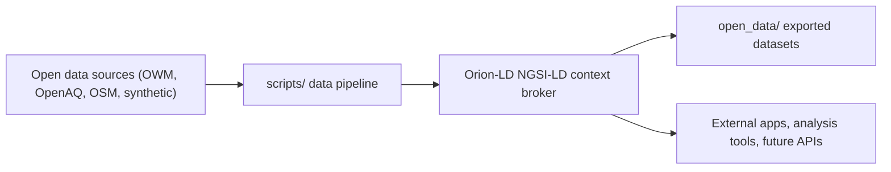

# UrbanReflex - NGSI-LD Data Platform

This branch contains the NGSI-LD data platform for UrbanReflex.  
It focuses on turning each road segment in Ho Chi Minh City into a structured NGSI-LD context that links infrastructure, environment, and civic data.

---

## What this branch provides

This branch implements the NGSI-LD data platform for UrbanReflex, including:

- **Context Broker**: Orion-LD with MongoDB as storage backend
- **Data model**: Based on FiWARE Smart Data Models and SOSA/SSN ontology, supporting six core entity types:
  - `RoadSegment` – backbone entity for roads and corridors
  - `Streetlight` – lighting infrastructure attached to roads
  - `WeatherObserved` – local weather observations
  - `AirQualityObserved` – air quality observations
  - `PointOfInterest` – schools, hospitals, parks and other facilities
  - `CitizenReport` – reports from citizens about infrastructure issues
- **Data pipeline**: Python scripts that fetch data from open sources (OpenWeatherMap, OpenAQ, OpenStreetMap), transform it to NGSI-LD and seed it into Orion-LD
- **Open Data export**: Tools to export NGSI-LD entities into common formats (CSV, NDJSON, GeoJSON) under the `open_data/` directory

This branch focuses on the backend data platform. Frontend UI, AI services and other application layers are handled in other branches.

---

## High-level architecture

The data platform is organised around a simple flow:



- **Sources**: OpenWeatherMap, OpenAQ, OpenStreetMap and synthetic generators  
- **scripts/**: Python tools to fetch, transform and seed NGSI-LD entities  
- **Orion-LD**: Single source of truth for NGSI-LD entities  
- **open_data/**: Snapshot of selected entities in CSV, NDJSON and GeoJSON for reuse

For a step-by-step guide to start the platform and run the pipeline, see `docs/RUNNING_NGSI_LD_PLATFORM.md`.  
For details about the NGSI-LD entities and how they link together, see `docs/DATA_MODEL_AND_ENTITIES.md`.

---

## Quick start (this branch)

1. **Clone and switch to this branch**

```bash
git clone <repository_url>
cd UrbanReflex
git checkout feat/ngsi-ld-data-platform
```

2. **Configure environment**

Copy `.env.example` to `.env` and set the required variables:

```bash
cp .env.example .env
```

Key environment variables:

- `ORION_LD_URL` – URL of your Orion-LD instance (default: `http://localhost:1026` if running locally via Docker)
- `OPENWEATHERMAP_API_KEY` – API key for OpenWeatherMap (required for weather data)
- `OPENAQ_API_KEY` – API key for OpenAQ (required for air quality data)

If you are running Orion-LD on a remote server or different port, update `ORION_LD_URL` accordingly.

3. **Start core services**

```bash
docker compose up -d
```

This starts Orion-LD and MongoDB using the configuration in this branch.

4. **Run the data pipeline**

The exact sequence depends on which entities you want to load.  
Typical pattern (simplified):

```bash
# Example: roads and streetlights
python scripts/fetch_osm_roads.py
python scripts/transform_roads.py
python scripts/seed_data.py --types RoadSegment --mode create
```

See `docs/RUNNING_NGSI_LD_PLATFORM.md` for a complete walkthrough of the available scripts and recommended order.

5. **Export open data snapshot (optional, for sharing)**

```bash
python scripts/export_open_data.py
```

This command generates CSV, NDJSON and GeoJSON files under `open_data/` for the main entity types.

---

## Repository layout (relevant to this branch)

- **`scripts/`** – Core data pipeline scripts organized by function:
  - Fetch scripts (`fetch_*.py`) – download raw data from external APIs
  - Transform scripts (`transform_*.py`) – convert raw data to NGSI-LD entities
  - Seed script (`seed_data.py`) – load entities into Orion-LD
  - Export script (`export_open_data.py`) – generate open data snapshots
  - See `scripts/README.md` for detailed documentation

- **`open_data/`** – Exported datasets derived from NGSI-LD entities in multiple formats (CSV, NDJSON, GeoJSON) for reuse and sharing

- **`schemas/`** – JSON Schemas used for validating and transforming entities according to FiWARE Smart Data Models

- **`config/`** – Shared configuration modules:
  - Connection settings for Orion-LD and external APIs
  - Entity type definitions and constants
  - Helper functions for NGSI-LD operations

- **`examples/`** – Example NGSI-LD entity files for quick inspection and testing

- **`docs/`** – Platform documentation:
  - `RUNNING_NGSI_LD_PLATFORM.md` – step-by-step guide to run the platform
  - `DATA_MODEL_AND_ENTITIES.md` – detailed explanation of entities and relationships

---
