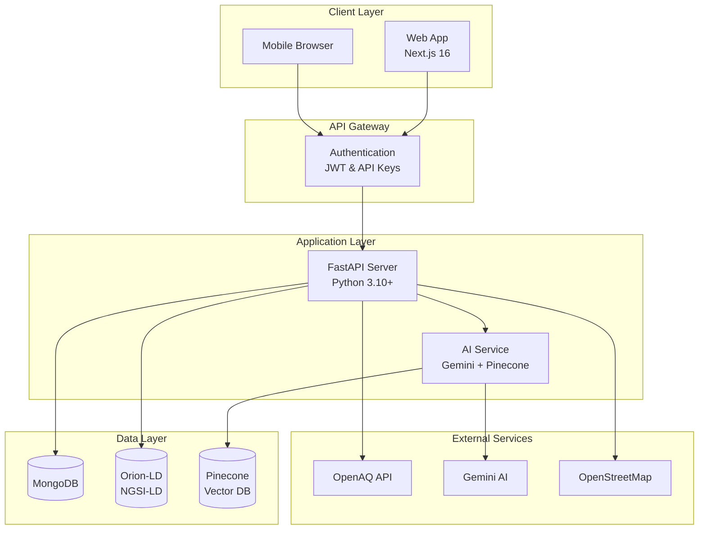

<p align="center">
	
</p>

<h1 align="center">UrbanReflex</h1>

<p align="center">
	A smart city intelligence platform that bridges fragmented urban data sources into a unified NGSI-LD ecosystem, empowering communities and city managers with real-time infrastructure insights and open data access
</p>

<p align="center">
  <a href="https://minhe51805.github.io/UrbanReflex/" rel="dofollow" target="blank"><strong>Explore the docs »</strong></a>
	<br/>
	<br/>
	<a href="https://github.com/minhe51805/UrbanReflex/issues/new?template=bug_report.yml">🐛 Report Bug</a>
	|
	<a href="https://github.com/minhe51805/UrbanReflex/issues/new?template=feature_request.yml">✨ Request Feature</a>
	|
	<a href="https://github.com/minhe51805/UrbanReflex/discussions">💬 Join Discussion</a>
	|
	<a href="./docs/">📚 Documentation</a>
</p>

<p align="center">
	<a href="https://github.com/minhe51805/UrbanReflex/releases" target="blank">
		
	</a>
	<a href="https://github.com/minhe51805/UrbanReflex/releases" target="blank">
		
	</a>
	<a href="https://github.com/minhe51805/UrbanReflex/issues" target="blank">
		
	</a>
	<a href="https://github.com/minhe51805/UrbanReflex/blob/main/LICENSE" target="blank">
		
	</a>
	<a href="https://fastapi.tiangolo.com/" target="blank">
		
	</a>
	<a href="https://nextjs.org/" target="blank">
		
	</a>
	<a href="https://www.etsi.org/deliver/etsi_gs/CIM/001_099/009/01.08.01_60/gs_CIM009v010801p.pdf" target="blank">
		
	</a>
</p>


---

## ✨ Highlights

- 🌍 **Real-time Air Quality Monitoring** from 10,000+ global stations
- 📝 **Citizen-Powered Infrastructure Reporting** with photo uploads & geolocation
- 🤖 **AI-Powered Chatbot** with Gemini 2.5 Flash & RAG system
- 🏛️ **NGSI-LD Compliant** Smart City Data Models (ETSI standard)
- 🌐 **12-Language Support** with Google Translate integration
- ⚡ **One-Command Setup** with Just task runner & UV package manager
- 🔐 **Role-Based Access Control** (Citizen, City Official, Admin)

---

## 📋 Table of Contents

<details>
<summary>Expand contents</summary>

- [What is UrbanReflex?](#what-is-urbanreflex)
- [What's New in v0.2.0](#-whats-new-in-v020)
- [Key Features](#-key-features)
- [Quick Start](#-quick-start)
- [Demo Credentials](#-demo-credentials)
- [Technology Stack](#️-technology-stack)
- [System Architecture](#-system-architecture)
- [Project Structure](#-project-structure)
- [Just Commands Reference](#-just-commands-reference)
- [Documentation](#-documentation)
- [Project Status](#-project-status)
- [Contributing](#-contributing)
- [Support and Organization](#-support-and-organization)
- [License](#-license)

</details>

---

## What is UrbanReflex?

<p align="justify">
UrbanReflex is an open-source smart city platform that addresses modern urban challenges through integrated, data-driven solutions. It combines real-time environmental monitoring with citizen engagement features to enable transparent, efficient, and responsive urban governance.
</p>

<blockquote>
	<p align="justify">
		Built on NGSI-LD standards, the platform unifies infrastructure data, air quality monitoring, and citizen reports into actionable intelligence. With open data accessibility, AI-powered analytics, and real-time insights, UrbanReflex empowers communities and city managers to make informed decisions that support sustainable development and promote transparent urban governance.
	</p>
</blockquote>

---

## 🆕 What's New in v0.2.0

This release focuses on **developer experience improvements**, **automation**, and **production readiness**.

### ⚡ One-Command Setup

- **Just Task Runner**: 16+ pre-configured recipes for all development tasks
- **UV Auto-Installation**: `just install` automatically installs UV + all dependencies
- **Dual Environment Setup**: Separate configuration for backend (`.env`) and frontend (`.env.local`)
- **Zero Configuration**: No manual dependency installation required

### 🌐 Multi-Language Support

- **12 Languages**: English, Vietnamese, Spanish, French, German, Chinese, Japanese, Korean, Arabic, Russian, Portuguese, Hindi
- **Google Translate Integration**: Real-time UI translation without page reload
- **Language Persistence**: Selected preference stored in browser

### 🔧 Developer Experience

- **Updated Dependencies**: Next.js 16.0.7, Prettier 3.2.5
- **Code Quality Tools**: Black, Flake8, isort, ESLint, Prettier pre-configured
- **Pre-commit Hooks**: Automatic code quality checks with Husky
- **Comprehensive Documentation**: Complete setup guide with troubleshooting

### 🐛 Bug Fixes

- Fixed `ModuleNotFoundError` for backend models package
- Fixed Just command PowerShell syntax errors on Windows
- Fixed frontend environment file location

See [CHANGELOG.md](./CHANGELOG.md) for full release notes.

---

## ✨ Key Features

### 🌍 Air Quality Intelligence

- Real-time AQI from 10,000+ global monitoring stations
- Interactive map with heatmaps and clustering
- Health advisories based on pollution levels
- Historical trend analysis (12-month data)
- Location-based search for any city or region

### 📝 Citizen Engagement

- Report urban issues (streetlights, potholes, waste, traffic)
- Photo uploads with automatic GPS geolocation
- Real-time status tracking (Open → In Progress → Resolved)
- Community voting for prioritization
- Automated severity classification with AI

### 🤖 AI Intelligence

- Natural language chatbot powered by Gemini 2.5 Flash
- Semantic vector search using Pinecone
- RAG (Retrieval-Augmented Generation) system
- Context-aware responses with data citations
- Intelligent report classification with NLP

### 🏛️ Smart City Infrastructure

- NGSI-LD compliant data models (ETSI standard)
- Orion Context Broker for real-time context management
- Road segment & streetlight monitoring
- Open data export (GeoJSON, NDJSON)

### 🔐 Role-Based Access Control

| Role              | Permissions                                       |
| ----------------- | ------------------------------------------------- |
| **Citizen**       | Submit reports, view air quality, access chatbot  |
| **City Official** | Manage reports, assign tasks, analytics dashboard |
| **Admin**         | Full system access, user management               |
| **Developer**     | REST API with OpenAPI documentation               |

---

## 🚀 Quick Start

### Prerequisites

```bash
# Required
✅ Just task runner         # https://just.systems/
✅ Git                       # Version control
✅ 8GB RAM minimum
✅ 10GB free disk space

# Auto-installed by `just install`
📦 UV package manager
📦 Node.js 18+
📦 Python 3.10+
```

### ⚡ 3-Command Setup

```bash
# 1. Clone repository
git clone https://github.com/minhe51805/UrbanReflex.git
cd UrbanReflex

# 2. Install everything (UV + backend + frontend)
just install
# Automatically:
# - Installs UV package manager (if not present)
# - Installs 175 Python packages
# - Installs 632 npm packages

# 3. Setup environment files
just setup-env
# Creates:
# - .env (backend configuration)
# - src/frontend/.env.local (frontend configuration)

# 4. Start development servers
just dev
# Starts:
# - Backend API (http://localhost:8000)
# - Frontend App (http://localhost:3000)
# - MongoDB + Orion-LD (via Docker Compose)
```

### 🔧 Environment Configuration

After running `just setup-env`, edit the created files:

<details>
<summary><b>.env (Backend)</b></summary>

```bash
# Database
MONGODB_URL="mongodb://localhost:27017"
DATABASE_NAME="urbanreflex"

# Authentication
SECRET_KEY="your-secret-key-here"  # Generate: openssl rand -hex 32
ACCESS_TOKEN_EXPIRE_MINUTES=30

# AI Services (Optional - features disabled without these)
GEMINI_API_KEY="your-gemini-key"           # Required for chatbot
PINECONE_API_KEY="your-pinecone-key"       # Required for vector search
PINECONE_INDEX_NAME="urbanreflex-index"

# External APIs (Optional - falls back to mock data)
OPENAQ_API_KEY="your-openaq-key"
OWM_API_KEY="your-openweathermap-key"
```

</details>

<details>
<summary><b>src/frontend/.env.local (Frontend)</b></summary>

```bash
NEXT_PUBLIC_API_URL=http://localhost:8000
NEXT_PUBLIC_OPENAQ_API_KEY=your-openaq-key
NEXT_PUBLIC_NGSI_LD_URL=http://localhost:1026
```

</details>

### ✅ Verify Installation

```bash
# Check backend health
curl http://localhost:8000/health
# Expected: {"service":"UrbanReflex","status":"running","version":"0.2.0"}

# Check all services info
just info

# Check frontend
open http://localhost:3000
```

---

## 🔐 Demo Credentials

### Pre-configured Test Accounts

| Role              | Email                    | Password        | Permissions        |
| ----------------- | ------------------------ | --------------- | ------------------ |
| **Admin**         | admin@urbanreflex.dev    | Admin@123456    | Full system access |
| **City Official** | official@urbanreflex.dev | Official@123456 | Report management  |
| **Citizen**       | citizen@urbanreflex.dev  | Citizen@123456  | Standard user      |

### Service URLs

| Service                     | URL                         |
| --------------------------- | --------------------------- |
| Frontend Application        | http://localhost:3000       |
| Backend API                 | http://localhost:8000       |
| API Documentation (Swagger) | http://localhost:8000/docs  |
| API Documentation (ReDoc)   | http://localhost:8000/redoc |
| Orion Context Broker        | http://localhost:1026       |
| MongoDB                     | localhost:27017             |

---

## 🛠️ Technology Stack

### Backend

| Technology       | Purpose                                 |
| ---------------- | --------------------------------------- |
| **FastAPI**      | High-performance async API framework    |
| **Python 3.10+** | Backend runtime                         |
| **MongoDB**      | Document database for users and reports |
| **Orion-LD**     | NGSI-LD compliant context broker        |
| **Redis**        | In-memory caching and sessions          |
| **Gemini AI**    | Natural language understanding          |
| **Pinecone**     | Vector search for semantic similarity   |

### Frontend

| Technology        | Purpose                         |
| ----------------- | ------------------------------- |
| **Next.js 16**    | React framework with App Router |
| **TypeScript**    | Type-safe development           |
| **Tailwind CSS**  | Utility-first styling           |
| **MapLibre GL**   | Interactive WebGL mapping       |
| **Chart.js**      | Data visualization              |
| **Framer Motion** | Smooth UI animations            |

### Infrastructure

| Technology         | Purpose                     |
| ------------------ | --------------------------- |
| **Docker Compose** | Multi-service orchestration |
| **Just**           | Task automation             |
| **UV**             | Fast Python package manager |
| **Husky**          | Git hooks for code quality  |

---

## 📊 System Architecture


```mermaid
graph TB
    subgraph "Client Layer"
        WEB[Web App<br/>Next.js 16]
        MOBILE[Mobile Browser]
    end

    subgraph "API Gateway"
        AUTH[Authentication<br/>JWT & API Keys]
    end

    subgraph "Application Layer"
        BACKEND[FastAPI Server<br/>Python 3.10+]
        AI[AI Service<br/>Gemini + Pinecone]
    end

    subgraph "Data Layer"
        MONGO[(MongoDB)]
        ORION[(Orion-LD<br/>NGSI-LD)]
        PINECONE[(Pinecone<br/>Vector DB)]
    end

    subgraph "External Services"
        OPENAQ[OpenAQ API]
        GEMINI[Gemini AI]
        OSM[OpenStreetMap]
    end

    WEB --> AUTH
    MOBILE --> AUTH
    AUTH --> BACKEND
    BACKEND --> AI
    BACKEND --> MONGO
    BACKEND --> ORION
    AI --> PINECONE
    AI --> GEMINI
    BACKEND --> OPENAQ
    BACKEND --> OSM
```

---

## 📦 Project Structure

```
UrbanReflex/
├── src/
│   ├── backend/              # FastAPI Backend
│   │   ├── app.py            # Main application entry
│   │   ├── routers/          # API endpoint definitions
│   │   ├── models/           # Database models
│   │   ├── schemas/          # Pydantic validation schemas
│   │   ├── ai_service/       # Gemini AI & Pinecone integration
│   │   └── utils/            # Utility functions
│   └── frontend/             # Next.js 16 Frontend
│       ├── app/              # App Router pages
│       ├── components/       # React components
│       ├── contexts/         # State management
│       ├── lib/              # API clients & utilities
│       └── types/            # TypeScript definitions
├── scripts/                  # Data fetching & processing scripts
├── docs/                     # Project documentation
├── open_data/                # Open datasets (GeoJSON, NDJSON)
├── schemas/                  # JSON schemas for data validation
├── .justfile                 # Just task automation recipes
├── pyproject.toml            # Python dependencies (PEP 518)
├── docker-compose.yml        # Container orchestration
└── LICENSE                   # GPL-3.0 license
```

---

## 📜 Just Commands Reference

### Installation & Setup

```bash
just install          # Install UV + backend deps + frontend deps
just setup-env        # Create .env and .env.local from examples
just backend-install  # Install only backend dependencies
just frontend-install # Install only frontend dependencies
```

### Development

```bash
just dev             # Start backend + frontend + databases
just backend-dev     # Start backend only (port 8000)
just frontend-dev    # Start frontend only (port 3000)
```

### Code Quality

```bash
just format          # Format all code (Black + Prettier)
just lint            # Run linters (Flake8 + ESLint)
just test            # Run all tests
```

### Utilities

```bash
just info            # Show project info (ports, services)
just health          # Check backend health endpoint
just clean           # Clean build artifacts
```

---

## 📖 Documentation

| Document                                         | Description                     |
| ------------------------------------------------ | ------------------------------- |
| [API Reference](./docs/API_REFERENCE.md)         | Complete REST API documentation |
| [Architecture](./docs/ARCHITECTURE.md)           | System design and components    |
| [Development Setup](./docs/DEVELOPMENT_SETUP.md) | Local development guide         |
| [Data Model](./docs/DATA_MODEL_AND_ENTITIES.md)  | NGSI-LD entity definitions      |
| [User Guide](./docs/USER_GUIDE.md)               | End-user manual                 |
| [Code Style Guide](./docs/CODE_STYLE_GUIDE.md)   | Coding conventions              |

---

## 📈 Project Status

**Current Version**: v0.2.0 (Stable)  
**Development Status**: Production Ready  
**Target Competition**: Vietnam Open Source Software Competition 2025

### ✅ Completed Features

- [x] Air quality monitoring (10,000+ stations)
- [x] Citizen reporting with photo uploads
- [x] AI chatbot with Gemini integration
- [x] Administrative dashboard
- [x] NGSI-LD compliance
- [x] JWT authentication with RBAC
- [x] 12-language support
- [x] One-command setup automation
- [x] Docker Compose deployment
- [x] Comprehensive documentation

### 🔮 Planned Features (v1.0)

- [ ] Real-time push notifications (WebSocket)
- [ ] Native mobile applications (iOS/Android)
- [ ] Email and SMS alert system
- [ ] Predictive analytics with ML models
- [ ] Kubernetes deployment manifests

---

## 🌟 Use Cases

### For Citizens

- Monitor air quality before outdoor activities
- Report infrastructure issues with photo documentation
- Track resolution status of submitted reports
- Access AI-powered health recommendations

### For City Officials

- Real-time monitoring of citizen-reported issues
- Data-driven prioritization of maintenance tasks
- Analysis of pollution patterns across districts
- Export capabilities for urban planning reports

### For Developers

- Access to open air quality data via REST API
- Integration with NGSI-LD compliant systems
- Custom dashboard development using provided APIs
- Contribution to open-source smart city initiatives

---

## 🤝 Contributing

We welcome contributions! Please read our guidelines before submitting.

### Quick Contribution Guide

```bash
# 1. Fork and clone
git clone https://github.com/YOUR_USERNAME/UrbanReflex.git
cd UrbanReflex

# 2. Create feature branch
git checkout -b feature/your-feature-name

# 3. Install and develop
just install
just dev

# 4. Make changes and test
just format
just lint
just test

# 5. Commit with conventional commits
git commit -m "feat: add new feature"
# Types: feat, fix, docs, style, refactor, test, chore

# 6. Push and create PR
git push origin feature/your-feature-name
```

### Code Quality Standards

All code must pass:

- ✅ `just format` (Black + Prettier)
- ✅ `just lint` (Flake8 + ESLint)
- ✅ `just test` (pytest + Jest)
- ✅ Pre-commit hooks

Read our [Contributing Guidelines](./CONTRIBUTING.md) for detailed information.

---

## 🏫 Support and Organization

<p align="center">
	<a href="https://hutech.edu.vn/" target="_blank">
		
	</a>
	&nbsp;&nbsp;&nbsp;
	<a href="https://vfossa.vn/" target="_blank">
		
	</a>
	&nbsp;&nbsp;&nbsp;
	<a href="https://www.olp.vn/" target="_blank">
		
	</a>
</p>

---

## 📈 Project Stats

<div align="center">

| Metric               | Badge                                                                                                                                                                                                       |
| -------------------- | ----------------------------------------------------------------------------------------------------------------------------------------------------------------------------------------------------------- |
| 🌟 **Stars**         |                                                                                                                     |
| 🍴 **Forks**         |                                                                                                                     |
| 👁️ **Watchers**      |                                                                                                               |
| 👥 **Contributors**  |                                                                                                                    |
| 📝 **Commits**       |                                                                                                            |
| 🐛 **Issues**        |                       |
| 🎯 **Pull Requests** |   |
| 📅 **Last Commit**   |                                                                                                                      |
| 📦 **Code Size**     |                                                                                                                |
| 📜 **License**       |                                                                                                                              |

</div>

---

## 📄 License

This project is licensed under the **GNU General Public License v3.0** - see the [LICENSE](LICENSE) file for details.

**Key Points:**

- ✅ Free to use, modify, and distribute
- ✅ Source code must be made available
- ✅ Modifications must use same GPL-3.0 license
- 📖 Full license: https://www.gnu.org/licenses/gpl-3.0.html

---

<div align="center">

**UrbanReflex v0.2.0** — Smart City Intelligence Platform

Built with ❤️ for Vietnam Open Source Software Competition 2025

[🏠 Homepage](https://minhe51805.github.io/UrbanReflex/) • [📚 Documentation](./docs/) • [🐛 Report Bug](https://github.com/minhe51805/UrbanReflex/issues) • [💬 Discussions](https://github.com/minhe51805/UrbanReflex/discussions)

</div>
