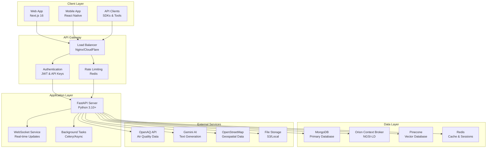
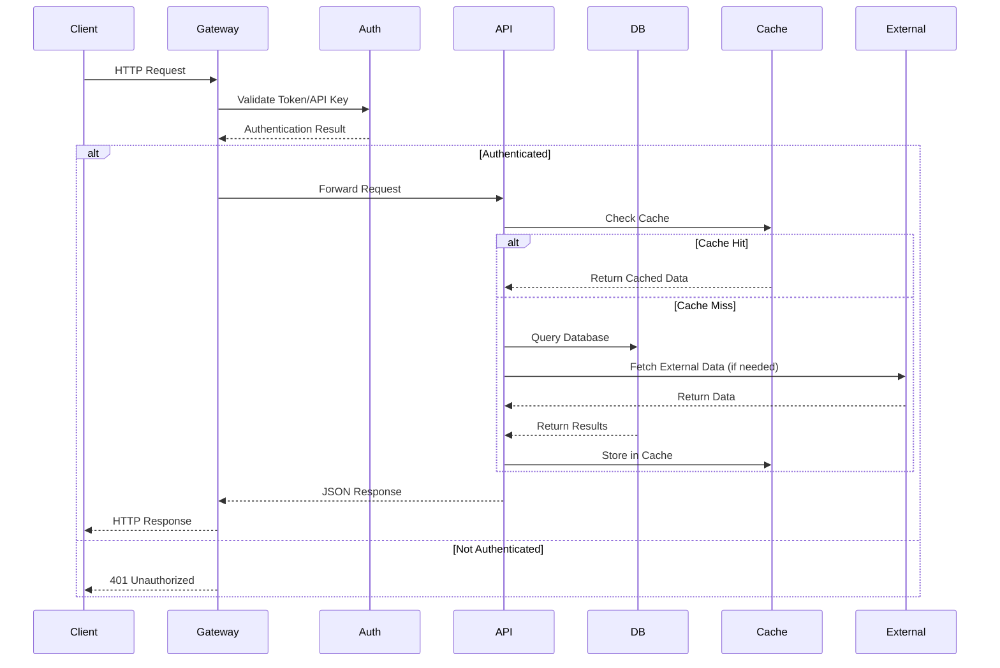
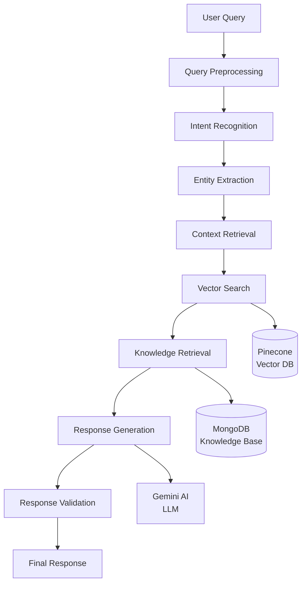
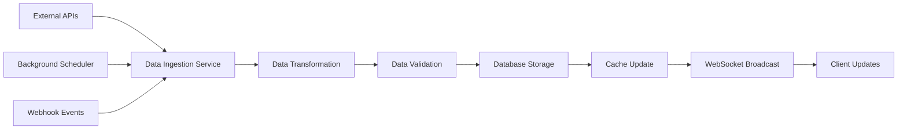
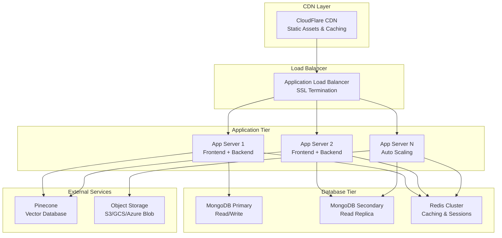
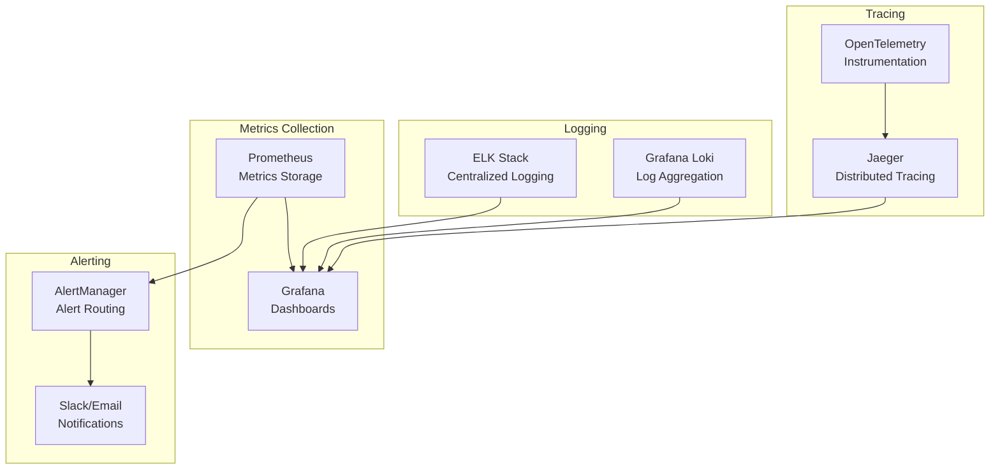
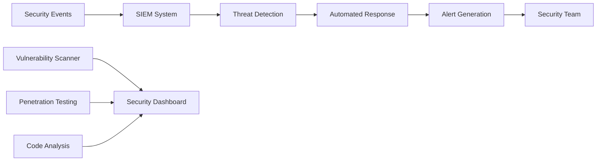

# 🏗️ System Architecture

UrbanReflex is built with a modern microservices architecture designed for scalability, maintainability, and developer experience.

## 🎯 High-Level Overview



## 🏛️ Architecture Principles

### 📦 Microservices Design

- **Separation of Concerns** - Each service handles specific domain logic
- **API-First** - All functionality exposed through well-defined APIs
- **Database per Service** - Each service owns its data
- **Independent Deployment** - Services can be deployed independently

### 🚀 Scalability

- **Horizontal Scaling** - Add more instances as needed
- **Stateless Services** - No server-side session state
- **Caching Strategy** - Multiple layers of caching (Redis, CDN)
- **Async Processing** - Background tasks for heavy operations

### 🔒 Security by Design

- **Zero Trust** - All requests authenticated and authorized
- **Encryption** - Data encrypted at rest and in transit
- **Input Validation** - All inputs validated at API boundary
- **Rate Limiting** - Protect against abuse and DDoS

## 🔧 Technology Stack Deep Dive

### 🎨 Frontend Architecture (Next.js)

```
website/
├── app/                    # Next.js 14 App Router
│   ├── (dashboard)/       # Route groups
│   ├── api/              # API routes (proxy to backend)
│   ├── globals.css       # Global styles
│   └── layout.tsx        # Root layout
├── components/           # React components
│   ├── ui/              # Reusable UI components
│   ├── forms/           # Form components
│   └── charts/          # Data visualization
├── lib/                 # Utilities and services
│   ├── api/            # API client functions
│   ├── auth/           # Authentication utilities
│   └── utils.ts        # Helper functions
├── types/              # TypeScript definitions
└── public/             # Static assets
```

**Key Technologies:**

- **Next.js 16** - React framework with App Router
- **React 19** - Latest React with concurrent features
- **TypeScript 5** - Type safety and better DX
- **Tailwind CSS** - Utility-first styling
- **Framer Motion** - Smooth animations
- **React Hook Form** - Form handling
- **TanStack Query** - Server state management
- **Zustand** - Client state management

### 🐍 Backend Architecture (FastAPI)

```
app/
├── app.py              # FastAPI application setup
├── dependencies.py     # Dependency injection
├── routers/           # API endpoint routers
│   ├── auth.py        # Authentication endpoints
│   ├── users.py       # User management
│   ├── chatbot.py     # AI chatbot service
│   ├── citizen_reports.py # Reporting system
│   └── items.py       # Generic CRUD operations
├── models/            # Database models
│   ├── user.py        # User model
│   └── chat_history.py # Chat history model
├── schemas/           # Pydantic schemas
│   └── user.py        # User validation schemas
├── utils/             # Utility modules
│   ├── auth.py        # Authentication utilities
│   └── db.py          # Database utilities
└── ai_service/        # AI and ML services
    ├── chatbot/       # Chatbot implementation
    └── classifier_report/ # Report classification
```

**Key Technologies:**

- **FastAPI** - High-performance async web framework
- **Pydantic v2** - Data validation and serialization
- **SQLAlchemy 2.0** - ORM for relational data
- **Motor** - Async MongoDB driver
- **Python-JOSE** - JWT token handling
- **Passlib** - Password hashing
- **Celery** - Distributed task queue
- **Uvicorn** - ASGI server

### 🗄️ Database Architecture

#### Primary Database (MongoDB)

```javascript
// User Collection
{
  _id: ObjectId,
  email: String,
  hashed_password: String,
  full_name: String,
  role: String, // "citizen", "admin", "city_official"
  is_active: Boolean,
  created_at: Date,
  api_keys: [
    {
      key_id: String,
      name: String,
      key_hash: String,
      created_at: Date,
      last_used: Date
    }
  ]
}

// Citizen Reports Collection
{
  _id: ObjectId,
  title: String,
  description: String,
  category: String, // "streetlight", "road", "waste", etc.
  priority: String, // "low", "medium", "high", "critical"
  status: String,   // "open", "in_progress", "resolved", "closed"
  location: {
    type: "Point",
    coordinates: [longitude, latitude]
  },
  photos: [String], // URLs to stored images
  votes: Number,
  created_by: ObjectId,
  created_at: Date,
  updated_at: Date,
  assigned_to: ObjectId, // City official
  resolution_notes: String,
  resolved_at: Date
}

// Chat History Collection
{
  _id: ObjectId,
  user_id: ObjectId,
  session_id: String,
  messages: [
    {
      role: String,    // "user", "assistant"
      content: String,
      timestamp: Date,
      metadata: Object // Additional context
    }
  ],
  created_at: Date,
  updated_at: Date
}
```

#### NGSI-LD Context Broker (Orion)

```json
// Road Segment Entity
{
  "id": "urn:ngsi-ld:RoadSegment:001",
  "type": "RoadSegment",
  "name": {
    "type": "Property",
    "value": "Nguyen Hue Boulevard"
  },
  "location": {
    "type": "GeoProperty",
    "value": {
      "type": "LineString",
      "coordinates": [[106.6951, 10.7769], [106.6955, 10.7773]]
    }
  },
  "roadClass": {
    "type": "Property",
    "value": "primary"
  },
  "trafficFlow": {
    "type": "Property",
    "value": "heavy",
    "observedAt": "2025-12-04T10:00:00Z"
  }
}

// Streetlight Entity
{
  "id": "urn:ngsi-ld:Streetlight:001",
  "type": "Streetlight",
  "location": {
    "type": "GeoProperty",
    "value": {
      "type": "Point",
      "coordinates": [106.6951, 10.7769]
    }
  },
  "status": {
    "type": "Property",
    "value": "on",
    "observedAt": "2025-12-04T10:00:00Z"
  },
  "powerConsumption": {
    "type": "Property",
    "value": 25.5,
    "unitCode": "WTT"
  }
}
```

#### Vector Database (Pinecone)

```python
# Vector embeddings for semantic search
{
  "id": "report_123",
  "values": [0.1, 0.2, -0.3, ...],  # 1536-dimensional vector
  "metadata": {
    "type": "citizen_report",
    "title": "Broken streetlight on Main Street",
    "category": "streetlight",
    "location": "District 1",
    "created_at": "2025-12-04T10:00:00Z"
  }
}
```

## 🔄 Data Flow Architecture

### 📊 Request Processing Flow



### 🤖 AI Processing Flow



### 📡 Real-time Data Flow



## 🚀 Deployment Architecture

### 🐳 Containerization

```yaml
# docker-compose.yml structure
services:
  backend:
    build: .
    ports: ["8000:8000"]
    depends_on: [mongodb, redis]

  frontend:
    build: ./website
    ports: ["3000:3000"]
    depends_on: [backend]

  mongodb:
    image: mongo:7.0
    volumes: ["mongodb_data:/data/db"]

  orion:
    image: fiware/orion-ld
    depends_on: [mongodb]

  redis:
    image: redis:7-alpine
    volumes: ["redis_data:/data"]

  nginx:
    image: nginx:alpine
    ports: ["80:80", "443:443"]
    depends_on: [frontend, backend]
```

### ☁️ Cloud Infrastructure



## 📈 Performance & Scalability

### 🚀 Performance Optimizations

1. **Database Optimization**

   - Proper indexing on frequently queried fields
   - Read replicas for scaling read operations
   - Connection pooling for efficient database connections

2. **Caching Strategy**

   ```python
   # Multi-level caching
   L1: Application Memory Cache (FastAPI)
   L2: Redis Cache (Shared across instances)
   L3: CDN Cache (Static assets)
   ```

3. **API Optimization**

   - Async/await for non-blocking operations
   - Request/response compression
   - Pagination for large datasets
   - Field selection to minimize payload size

4. **Frontend Optimization**
   - Code splitting and lazy loading
   - Image optimization and WebP format
   - Service Worker for offline functionality
   - Bundle analysis and tree shaking

### 📊 Monitoring & Observability



## 🔒 Security Architecture

### 🛡️ Security Layers

1. **Network Security**

   - HTTPS/TLS encryption for all traffic
   - WAF (Web Application Firewall)
   - DDoS protection via CloudFlare
   - VPC with private subnets for databases

2. **Authentication & Authorization**

   ```python
   # JWT Token Structure
   {
     "sub": "user123",           # User ID
     "role": "citizen",          # User role
     "exp": 1701691200,         # Expiration time
     "iat": 1701604800,         # Issued at
     "permissions": ["read", "write"] # Granular permissions
   }
   ```

3. **Data Protection**

   - Encryption at rest (AES-256)
   - Encryption in transit (TLS 1.3)
   - Password hashing (bcrypt with salt)
   - PII data anonymization

4. **API Security**
   - Rate limiting per user/API key
   - Input validation and sanitization
   - SQL injection prevention
   - CORS configuration
   - Request size limits

### 🔍 Security Monitoring



## 🔄 Integration Patterns

### 🌐 API Integration

1. **RESTful APIs** - Standard HTTP methods for CRUD operations
2. **GraphQL** - Flexible data querying (planned)
3. **WebSockets** - Real-time bidirectional communication
4. **Webhooks** - Event-driven notifications to external systems

### 📊 Data Integration

1. **ETL Pipelines** - Extract, Transform, Load data from external sources
2. **Message Queues** - Async processing with Celery/Redis
3. **Event Streaming** - Real-time data processing
4. **Batch Processing** - Scheduled data synchronization

---

<div align="center">

**Understanding the architecture?** Check out our [Development Setup Guide](./DEVELOPMENT_SETUP.md) to start building!

[🏠 Back to Main Documentation](../README.md) • [📚 Documentation Index](./INDEX.md)

</div>
