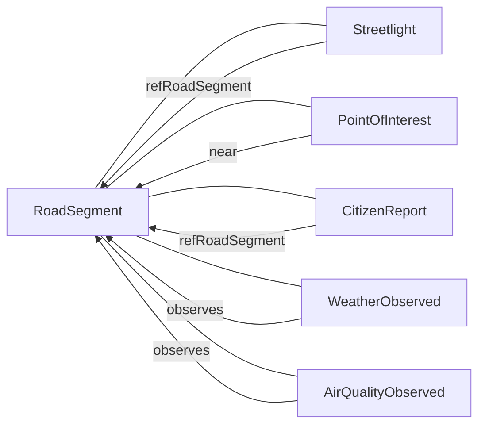

## NGSI-LD data model and entities

This document describes the main NGSI-LD entity types used in the UrbanReflex data platform for Ho Chi Minh City and how they relate to each other.

---

## Core entities

| Entity type         | Description                                                                                   | Source model                               |
|---------------------|-----------------------------------------------------------------------------------------------|--------------------------------------------|
| `RoadSegment`       | Logical segments of the road network in HCMC, used as the backbone for linking other data    | FiWARE `dataModel.Transportation/RoadSegment` |
| `Streetlight`       | Street lighting infrastructure located along road segments                                    | FiWARE `dataModel.Streetlighting/Streetlight` |
| `WeatherObserved`   | Weather observations (temperature, humidity, rain, etc.) for locations in the city           | FiWARE `dataModel.Weather/WeatherObserved` |
| `AirQualityObserved`| Air quality measurements (PM2.5, NO₂, etc.) for locations in the city                         | FiWARE `dataModel.Environment/AirQualityObserved` |
| `PointOfInterest`   | Points of interest such as schools, hospitals, parks and public facilities                   | FiWARE `dataModel.PointOfInterest/PointOfInterest` |
| `CitizenReport`     | Reports created by citizens about infrastructure or environmental issues                      | Based on NGSI-LD core + project-specific fields |

All entities follow the NGSI-LD core specification and, where applicable, reuse SOSA/SSN concepts for observations.

---

## Relationship diagram

The platform is organised around `RoadSegment` as the central link between different kinds of data.

- `RoadSegment` is the primary key for building a “digital profile” of each road.  
- `Streetlight` entities reference the road where they are installed.  
- `CitizenReport` entities are attached to a road (for example via `refRoadSegment`) and a location.  
- `WeatherObserved` and `AirQualityObserved` can be linked to a road segment by proximity or by explicit reference.  
- `PointOfInterest` entities (schools, hospitals, etc.) can be related to nearby road segments.

---

## Spatial properties

All spatial entities use NGSI-LD compatible GeoJSON geometries, typically in a property named `location`:

- `RoadSegment.location` – `LineString` geometry for the road segment
- `Streetlight.location` – `Point` geometry for the lamp position
- `PointOfInterest.location` – `Point` geometry for the facility
- `WeatherObserved.location` and `AirQualityObserved.location` – `Point` geometry for the observation location
- `CitizenReport.location` – `Point` for the report position

This allows:

- Proximity queries in Orion-LD (for example, entities near a given coordinate)
- Visualisation in mapping tools and frontends
- Deriving relationships between entities based on distance to a road segment

---

## Temporal aspects

Observation entities (`WeatherObserved`, `AirQualityObserved`) and dynamic entities such as `CitizenReport` include temporal attributes, typically:

- `dateObserved` or `dateTime` properties for measurements
- `createdAt`, `modifiedAt` metadata managed by Orion-LD

These timestamps can be used to:

- Build time series outside of Orion-LD (for example in a data lake or analytics system)
- Filter entities by time window when exporting open data

---

## Using the data model

- To see concrete examples of each entity type, inspect the JSON files in the `examples/` directory.  
- To validate entities before seeding them into Orion-LD, use the JSON Schemas in `schemas/` together with the validation scripts under `scripts/`.

