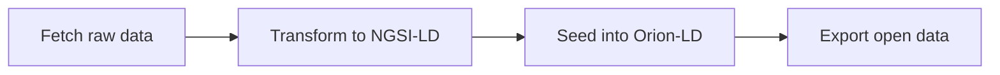

## Running the NGSI-LD data platform

This guide explains how to start the platform and run the data pipeline.

---

## Prerequisites

- Docker and docker-compose installed
- Python 3.10+ with `pip`
- API keys for external data sources (OpenWeatherMap, OpenAQ) if you plan to fetch live data

---

## Quick setup

### 1. Configure environment

```bash
cp .env.example .env
```

Set required variables in `.env`:
- `ORION_LD_URL` – Orion-LD endpoint (default: `http://localhost:1026`)
- `OPENWEATHERMAP_API_KEY` – for weather data (optional)
- `OPENAQ_API_KEY` – for air quality data (optional)

### 2. Start services

```bash
docker compose up -d
```

This starts Orion-LD and MongoDB. Verify with:

```bash
curl http://localhost:1026/version
```

### 3. Install dependencies

```bash
pip install -r requirements.txt
```

---

## Data pipeline

The pipeline follows three stages:



### Example: Load roads and streetlights

```bash
# 1. Fetch road data from OpenStreetMap
python scripts/fetch_osm_roads.py

# 2. Transform to NGSI-LD RoadSegment entities
python scripts/transform_roads.py

# 3. Generate synthetic streetlights
python scripts/generate_synthetic_streetlights.py

# 4. Seed entities into Orion-LD
python scripts/seed_data.py --types RoadSegment Streetlight --mode create
```

### Example: Load weather and air quality

```bash
# Fetch and transform weather
python scripts/fetch_weather_owm.py
python scripts/transform_weather.py

# Fetch and transform air quality
python scripts/fetch_aqi_openaq.py
python scripts/transform_aqi.py

# Seed environment entities
python scripts/seed_data.py --types WeatherObserved AirQualityObserved --mode upsert
```

### Export open data

```bash
python scripts/export_open_data.py
```

This exports all entity types to `open_data/` in CSV, NDJSON, and GeoJSON formats.

---

## Troubleshooting

**Connection errors**: Verify Orion-LD is running (`curl http://localhost:1026/version`) and `ORION_LD_URL` in `.env` is correct.

**API key errors**: Check that API keys in `.env` are valid and have sufficient quota.

**Entity not found**: Ensure transform scripts have been run before seeding. Use `--mode upsert` if entities might already exist.

**Docker issues**: Check container logs with `docker compose logs orion-ld` and ensure ports 1026 and 27017 are available.

---

## Next steps

- For entity details and relationships: `docs/DATA_MODEL_AND_ENTITIES.md`
- For script documentation: `scripts/README.md`
