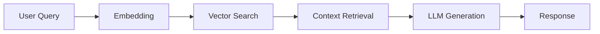

# AI Services

UrbanReflex tích hợp các dịch vụ AI để cung cấp trải nghiệm thông minh cho người dùng.

---

## Overview

| Service | Description | Technology |
|---------|-------------|------------|
| RAG Chatbot | Trợ lý AI với kiến thức về thành phố | Gemini + Pinecone |
| Report Classification | Phân loại báo cáo công dân | NLP + ML |
| Vector Search | Tìm kiếm ngữ nghĩa | Sentence Transformers |
| Natural Language Queries | Truy vấn bằng ngôn ngữ tự nhiên | Intent Recognition |

---

## RAG Chatbot

Retrieval-Augmented Generation chatbot sử dụng Gemini AI và Pinecone vector database.

### How It Works



### API Usage

```bash
POST /ai-service/chatbot/chat
```

**Request:**

```json
{
  "message": "Chất lượng không khí ở Quận 1 hôm nay thế nào?",
  "session_id": "session_123",
  "context": {
    "location": {
      "latitude": 10.7769,
      "longitude": 106.6951
    }
  }
}
```

**Response:**

```json
{
  "response": "Dựa trên dữ liệu mới nhất, Quận 1 hiện có chất lượng không khí ở mức trung bình với PM2.5 là 25.5 µg/m³. Chỉ số AQI là 80 - an toàn cho hầu hết mọi người.",
  "sources": [
    {
      "type": "aqi_station",
      "id": 12345,
      "data": {
        "pm25": 25.5,
        "aqi": 80
      }
    }
  ],
  "suggestions": [
    "Xem dự báo theo giờ",
    "Tìm trạm đo gần đây",
    "Đặt cảnh báo chất lượng không khí"
  ],
  "session_id": "session_123"
}
```

### Python Example

```python
import httpx

async def chat_with_assistant(message: str, session_id: str = None):
    async with httpx.AsyncClient() as client:
        response = await client.post(
            "http://localhost:8000/ai-service/chatbot/chat",
            headers={"Authorization": f"Bearer {token}"},
            json={
                "message": message,
                "session_id": session_id
            }
        )
        return response.json()

# Usage
result = await chat_with_assistant(
    "Có bao nhiêu đèn đường bị hỏng trong tuần này?"
)
print(result["response"])
```

---

## Report Classification

Tự động phân loại báo cáo của công dân dựa trên nội dung.

### Categories

| Category | Description |
|----------|-------------|
| `streetlight` | Đèn đường hỏng, không sáng |
| `road` | Ổ gà, đường hư hỏng |
| `waste` | Rác thải, vệ sinh môi trường |
| `traffic` | Giao thông, biển báo |
| `flooding` | Ngập lụt, thoát nước |
| `noise` | Tiếng ồn, ô nhiễm âm thanh |
| `other` | Các vấn đề khác |

### API Usage

```bash
POST /api/v1/citizen-reports/classify
```

**Request:**

```json
{
  "title": "Đèn đường không sáng",
  "description": "Đèn đường ở góc đường Nguyễn Huệ và Lê Lợi đã tắt 3 ngày rồi, rất nguy hiểm vào ban đêm."
}
```

**Response:**

```json
{
  "category": "streetlight",
  "confidence": 0.95,
  "priority_suggestion": "medium",
  "keywords": ["đèn đường", "không sáng", "tắt", "ban đêm"],
  "similar_reports": [
    {
      "id": "report_456",
      "similarity": 0.87,
      "status": "resolved"
    }
  ]
}
```

### Priority Algorithm

```python
def calculate_priority(
    category: str,
    confidence: float,
    location_importance: float,
    similar_reports_count: int
) -> str:
    score = 0.0
    
    # Category weight
    category_weights = {
        "flooding": 0.9,
        "road": 0.7,
        "streetlight": 0.6,
        "traffic": 0.5,
        "waste": 0.4,
        "noise": 0.3,
        "other": 0.2
    }
    score += category_weights.get(category, 0.2) * 0.4
    
    # Location importance (near POIs)
    score += location_importance * 0.3
    
    # Similar reports (indicates recurring issue)
    if similar_reports_count > 5:
        score += 0.3
    elif similar_reports_count > 2:
        score += 0.2
    
    # Determine priority
    if score >= 0.7:
        return "critical"
    elif score >= 0.5:
        return "high"
    elif score >= 0.3:
        return "medium"
    return "low"
```

---

## Vector Search

Tìm kiếm ngữ nghĩa sử dụng vector embeddings.

### Embedding Model

```python
from sentence_transformers import SentenceTransformer

# Multilingual model (supports Vietnamese)
model = SentenceTransformer('paraphrase-multilingual-MiniLM-L12-v2')

# Generate embedding
text = "Đèn đường không hoạt động"
embedding = model.encode(text)  # 384-dimensional vector
```

### Search API

```bash
POST /ai/search
```

**Request:**

```json
{
  "query": "Tìm tất cả báo cáo về đèn đường hỏng ở Quận 1",
  "filters": {
    "type": "citizen_report",
    "date_range": "2025-12-01/2025-12-31"
  },
  "limit": 10
}
```

**Response:**

```json
{
  "results": [
    {
      "id": "report_123",
      "type": "citizen_report",
      "relevance_score": 0.95,
      "data": {
        "title": "Đèn đường tắt",
        "category": "streetlight",
        "location": "Quận 1"
      }
    }
  ],
  "interpretation": {
    "intent": "search_reports",
    "entities": {
      "category": "streetlight",
      "location": "Quận 1"
    }
  }
}
```

---

## Configuration

### Required Environment Variables

```bash
# Gemini AI
GEMINI_API_KEY="your-gemini-api-key"

# Pinecone Vector Database
PINECONE_API_KEY="your-pinecone-api-key"
PINECONE_INDEX_NAME="urbanreflex-index"
PINECONE_ENVIRONMENT="gcp-starter"
```

### Optional Settings

```bash
# Model settings
EMBEDDING_MODEL="paraphrase-multilingual-MiniLM-L12-v2"
LLM_TEMPERATURE=0.7
MAX_CONTEXT_LENGTH=4096

# Rate limiting
AI_REQUESTS_PER_MINUTE=60
```

---

## Architecture

```
app/ai_service/
├── chatbot/
│   ├── rag.py              # RAG implementation
│   ├── embedding.py        # Vector embeddings
│   ├── crawler.py          # Web crawler for indexing
│   └── pinecone_adapter.py # Pinecone client
│
└── classifier_report/
    ├── nlp_classifier.py   # NLP-based classification
    └── prioritizer.py      # Priority calculation
```

---

## Best Practices

### 1. Session Management

```python
# Always use session_id for conversation context
response = await chat(
    message="Cho tôi biết thêm chi tiết",
    session_id="session_123"  # Maintains context
)
```

### 2. Error Handling

```python
try:
    result = await classify_report(title, description)
except AIServiceError as e:
    # Fallback to manual classification
    result = {"category": "other", "confidence": 0.0}
    logger.warning(f"AI classification failed: {e}")
```

### 3. Rate Limiting

```python
# Use exponential backoff for API calls
from tenacity import retry, wait_exponential

@retry(wait=wait_exponential(multiplier=1, min=4, max=10))
async def call_ai_service(data):
    return await ai_client.post("/chat", json=data)
```

---

<div align="center">

**[← Data Models](./data-models.md)** | **[Authentication →](./authentication.md)**

</div>
