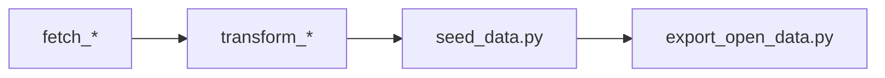

## scripts/ – data pipeline tools

This directory contains the Python scripts used to build and operate the NGSI-LD data platform for UrbanReflex in this branch.

The scripts follow a simple pattern:



- `fetch_*` scripts download or generate raw data
- `transform_*` scripts convert raw data to NGSI-LD entities
- `seed_data.py` sends entities to Orion-LD
- `export_open_data.py` exports selected entities as open datasets under `open_data/`

---

## Script groups

### 1. Data collection

Scripts that fetch or generate raw data and store it under `raw_data/`:

- `fetch_osm_roads.py` – download road network data from OpenStreetMap for the target area
- `fetch_osm_pois.py` – download points of interest (for example schools, hospitals, parks)
- `fetch_weather_owm.py` – fetch weather data from OpenWeatherMap
- `fetch_aqi_openaq.py` – fetch air quality data from OpenAQ
- `generate_synthetic_streetlights.py` – generate synthetic streetlight locations along the road network

These scripts are typically the first step in the pipeline.

### 2. Transformation to NGSI-LD

Scripts that read raw data and produce NGSI-LD entities using FiWARE Smart Data Models:

- `transform_roads.py` – create `RoadSegment` entities from OSM road data
- `transform_streetlights.py` – create `Streetlight` entities
- `transform_pois.py` – create `PointOfInterest` entities
- `transform_weather.py` – create `WeatherObserved` entities
- `transform_aqi.py` – create `AirQualityObserved` entities

The transformed entities are usually written to the `ngsi_ld_entities/` directory or sent directly to the seeding step.

### 3. Seeding entities into Orion-LD

- `seed_data.py` – generic seeding script for NGSI-LD entities

Typical usage:

```bash
python scripts/seed_data.py --types RoadSegment Streetlight --mode create
```

Options such as `--types` and `--mode` control which entities are sent and how existing entities are handled.

Additional helper scripts:

- `validate_entities.py` – validate entities against JSON Schemas from `schemas/`
- `count_entities_snapshot.py` – inspect how many entities of each type are present

### 4. Open data export

- `export_open_data.py` – export selected NGSI-LD entities from Orion-LD into the `open_data/` directory

It supports:

- Multiple formats: NDJSON, CSV, GeoJSON
- Multiple entity types in a single run
- Basic anonymisation for `CitizenReport` entities (for example, removing direct contact fields)

For details on how to run this script and interpret the output, see the root `README.md` and `docs/RUNNING_NGSI_LD_PLATFORM.md`.

### 5. Operational utilities

- `download_schemas.py` – download or refresh JSON Schemas used for validation
- `check_roads_snapshot.py`, `debug_roads_detailed.py`, `test_latest_api.py` – inspection and debugging helpers used during development

These utilities are optional but useful when verifying that the data platform is correctly populated and configured.

---

## How to run scripts

- All scripts are intended to be run from the project root:

```bash
cd UrbanReflex
python scripts/<script_name>.py [options]
```

- Make sure:
  - Python dependencies are installed (`pip install -r requirements.txt`)
  - Required environment variables are set (for example `ORION_LD_URL` if overriding the default)
  - Core services (Orion-LD, MongoDB) are running via `docker compose up -d`

For an end-to-end example that ties multiple scripts together, refer to `docs/RUNNING_NGSI_LD_PLATFORM.md`.


