# Admin Dashboard Documentation

<div align="center">

**Comprehensive Management Interface for UrbanReflex Platform**

[](#access)
[](#)

[Features](#-features) • [API Reference](#-api-endpoints) • [Workflow](#-report-workflow)

</div>

---

## 📋 Table of Contents

- [Overview](#-overview)
- [Features](#-features)
- [Access](#-access)
- [Report Types](#-report-types)
- [Report Workflow](#-report-workflow)
- [Priority Levels](#-priority-levels)
- [API Endpoints](#-api-endpoints)
- [Components](#️-components)
- [Future Enhancements](#-future-enhancements)
- [Security](#-security-considerations)
- [Troubleshooting](#-troubleshooting)

---

## 🎯 Overview

The Admin Dashboard is a comprehensive management interface designed for handling user reports, monitoring platform issues, and managing data quality concerns. Built with the same design system as the main platform, it provides a seamless administrative experience with real-time statistics and advanced filtering capabilities.

> [!IMPORTANT]
> **Production Deployment Required**: The current implementation uses mock data (localStorage). For production, integrate with PostgreSQL database and implement authentication.

### Key Capabilities

```mermaid
graph TD
    A[Admin Dashboard] --> B[📊 Statistics]
    A --> C[📋 Reports Management]
    A --> D[🔍 Advanced Filtering]
    A --> E[👥 User Management]
    
    B --> B1[Real-time Metrics]
    B --> B2[Trend Analysis]
    
    C --> C1[View Reports]
    C --> C2[Update Status]
    C --> C3[Assign Tasks]
    
    D --> D1[By Status]
    D --> D2[By Type]
    D --> D3[By Priority]
    
    E --> E1[Track Reporters]
    E --> E2[Email Notifications]
    
    style A fill:#33a3a1,color:#fff
    style B fill:#4a90e2,color:#fff
    style C fill:#50c878,color:#fff
    style D fill:#f5a623,color:#fff
    style E fill:#9b59b6,color:#fff
```



---

## ✨ Features

### 📊 Dashboard Overview

<details open>
<summary><b>Real-time Statistics</b></summary>

The dashboard provides at-a-glance metrics:

| Metric | Description | Update Frequency |
|--------|-------------|------------------|
| **Total Reports** | All-time report count | Real-time |
| **Pending Issues** | Reports awaiting review | Real-time |
| **In Progress** | Currently being handled | Real-time |
| **Resolved** | Successfully addressed | Real-time |

**Trend Indicators:**
- 📈 Increase from previous period
- 📉 Decrease from previous period
- ➡️ No change

</details>

### 🔍 Advanced Filtering

<details>
<summary><b>Multi-dimensional Filtering</b></summary>

**Filter Options:**

| Filter Type | Options | Purpose |
|-------------|---------|---------|
| **Status** | Pending, In Progress, Resolved, Rejected | Filter by workflow stage |
| **Type** | Data Issue, Missing Data, Bug, Feature Request, Other | Filter by category |
| **Priority** | Low, Medium, High | Quick priority filtering |
| **Search** | Full-text search | Find specific reports |

**Combine filters** for precise results:

```javascript
// Example: High priority bugs that are pending
filters = {
  status: 'pending',
  type: 'bug',
  priority: 'high'
}
```

</details>

### 📋 Reports Table

<details>
<summary><b>Comprehensive Report List</b></summary>

**Table Features:**
- ✅ Color-coded status badges
- ✅ Priority indicators (Low/Medium/High)
- ✅ Location information
- ✅ Reporter details
- ✅ Timestamp display
- ✅ Quick action buttons (View, Edit, Delete)

**Status Color Coding:**

| Status | Color | Badge |
|--------|-------|-------|
| Pending | Blue | 🔵 |
| In Progress | Yellow | 🟡 |
| Resolved | Green | 🟢 |
| Rejected | Red | 🔴 |

</details>

### 📝 Report Detail Modal

<details>
<summary><b>Full Report Management</b></summary>

**Available Actions:**


**Features:**
- Complete report information (title, description, location)
- Status management dropdown
- Priority level controls
- Team member assignment
- Internal notes system
- Activity timeline
- Delete functionality with confirmation

</details>

### 📨 User Report Submission

Public-facing form for users to submit reports:

**Form Fields:**

| Field | Type | Required | Description |
|-------|------|----------|-------------|
| **Type** | Dropdown | Yes | Report category |
| **Title** | Text | Yes | Brief description |
| **Description** | Textarea | Yes | Detailed information |
| **Priority** | Select | Yes | Urgency level |
| **Location** | Autocomplete | Optional | Affected location |
| **Email** | Email | Yes | Contact for follow-up |

---

## 🔓 Access

### URLs

| Interface | URL | Access Level |
|-----------|-----|--------------|
| **Admin Dashboard** | `http://localhost:3000/admin` | Admin only |
| **Report Issue (Public)** | `http://localhost:3000/report-issue` | Public |

### Navigation

- **Footer Link**: "Admin" (bottom of page)
- **Direct URL**: Navigate directly to `/admin`
- **Header Quick Access**: Admin users only (future)

> [!WARNING]
> **Authentication Required**: In production, implement role-based access control to protect the admin dashboard.

---

## 📑 Report Types

### Type Definitions

```mermaid
graph TD
    A[Report Types] --> B[🔍 Data Issue]
    A --> C[📉 Missing Data]
    A --> D[🐛 Bug]
    A --> E[💡 Feature Request]
    A --> F[📝 Other]
    
    B --> B1[Incorrect readings<br/>Anomalous values<br/>Data inconsistencies]
    C --> C1[Station offline<br/>No recent updates<br/>Data gaps]
    D --> D1[UI/UX problems<br/>Functionality errors<br/>Performance issues]
    E --> E1[Enhancement requests<br/>New functionality<br/>Improvements]
    F --> F1[General feedback<br/>Uncategorized issues]
    
    style A fill:#33a3a1,color:#fff
    style B fill:#f39c12,color:#fff
    style C fill:#e74c3c,color:#fff
    style D fill:#c0392b,color:#fff
    style E fill:#27ae60,color:#fff
    style F fill:#95a5a6,color:#fff
```



### 1. 🔍 Data Issue

**Issues with data accuracy or quality**

Examples:
- Incorrect sensor readings
- Anomalous PM2.5 values
- Data inconsistencies between sources
- Calibration problems

**Priority:** Usually Medium to High

---

### 2. 📉 Missing Data

**Reports of missing or unavailable data**

Examples:
- Monitoring station offline
- No recent data updates
- Historical data gaps
- Missing parameters

**Priority:** Usually Medium

---

### 3. 🐛 Bug

**Technical issues with the platform**

Examples:
- UI/UX rendering problems
- Functionality not working as expected
- Performance degradation
- Error messages

**Priority:** Usually High

---

### 4. 💡 Feature Request

**Suggestions for new features**

Examples:
- Enhancement requests
- New data visualization
- Additional API endpoints
- User interface improvements

**Priority:** Usually Low to Medium

---

### 5. 📝 Other

**General feedback or uncategorized issues**

Examples:
- General questions
- Documentation feedback
- Unclear categories
- Multiple issue types

**Priority:** Variable

---

## 🔄 Report Workflow

### Status Flow Diagram


### Status Definitions

| Status | Description | Next Actions | SLA |
|--------|-------------|--------------|-----|
| **🔵 Pending** | New report awaiting review | Review & triage | 24 hours |
| **🟡 In Progress** | Report is being actively worked on | Investigate & resolve | 3-5 days |
| **🟢 Resolved** | Issue has been fixed or addressed | Close & notify user | - |
| **🔴 Rejected** | Report was invalid or duplicate | Document reason | - |

---

## ⚡ Priority Levels

### Priority Matrix

| Priority | Response Time | Resolution Time | Examples |
|----------|---------------|-----------------|----------|
| **🔴 High** | < 2 hours | < 24 hours | Critical bugs, data corruption, security issues |
| **🟡 Medium** | < 24 hours | < 7 days | Moderate bugs, missing data, UX improvements |
| **🟢 Low** | < 72 hours | < 30 days | Minor issues, feature requests, enhancements |

### Priority Guidelines

<details>
<summary><b>🔴 High Priority</b></summary>

**Criteria:**
- Affects many users (>100)
- Critical functionality broken
- Security vulnerability
- Data integrity issues
- Revenue impact

**Response:** Immediate attention required

</details>

<details>
<summary><b>🟡 Medium Priority</b></summary>

**Criteria:**
- Affects some users (10-100)
- Moderate feature impact
- Workaround available
- Data quality concerns

**Response:** Address within business week

</details>

<details>
<summary><b>🟢 Low Priority</b></summary>

**Criteria:**
- Affects few users (<10)
- Minor inconvenience
- Feature requests
- Nice-to-have improvements

**Response:** Schedule for upcoming sprint

</details>

---

## 🔌 API Endpoints

### Base URL

```
http://localhost:3000/api/admin
```

### Endpoints Overview

| Method | Endpoint | Purpose | Auth |
|--------|----------|---------|------|
| GET | `/reports` | List all reports | Required |
| GET | `/reports/:id` | Get single report | Required |
| POST | `/reports` | Create new report | Optional* |
| PATCH | `/reports/:id` | Update report | Required |
| DELETE | `/reports/:id` | Delete report | Required |
| POST | `/reports/:id/notes` | Add note | Required |

**\*Public submission endpoint doesn't require auth**

---

### GET /api/admin/reports

**Retrieve all reports with optional filtering**

**Query Parameters:**

| Parameter | Type | Options | Description |
|-----------|------|---------|-------------|
| `status` | string | `pending`, `in_progress`, `resolved`, `rejected` | Filter by status |
| `type` | string | `data_issue`, `missing_data`, `bug`, `feature_request`, `other` | Filter by type |
| `priority` | string | `low`, `medium`, `high` | Filter by priority |
| `search` | string | Any text | Search term |

**Example Request:**

```bash
curl -X GET "http://localhost:3000/api/admin/reports?status=pending&priority=high" \
  -H "Authorization: Bearer YOUR_TOKEN"
```

**Example Response:**

```json
{
  "success": true,
  "data": [
    {
      "id": "1",
      "type": "data_issue",
      "title": "Incorrect PM2.5 reading in Bangkok",
      "description": "The PM2.5 values seem unusually high...",
      "status": "pending",
      "priority": "high",
      "locationId": "2178",
      "locationName": "Bangkok, Thailand",
      "reportedBy": "user@example.com",
      "reportedAt": "2025-11-21T10:30:00Z",
      "assignedTo": null,
      "resolvedAt": null,
      "notes": []
    }
  ],
  "meta": {
    "total": 5,
    "pending": 2,
    "in_progress": 2,
    "resolved": 1,
    "rejected": 0
  }
}
```

---

### GET /api/admin/reports/:id

**Get details of a single report**

**Example Request:**

```bash
curl -X GET "http://localhost:3000/api/admin/reports/1" \
  -H "Authorization: Bearer YOUR_TOKEN"
```

---

### POST /api/admin/reports

**Create a new report**

**Request Body:**

```json
{
  "type": "data_issue",
  "title": "Incorrect sensor reading",
  "description": "Detailed description of the issue...",
  "priority": "medium",
  "locationId": "2178",
  "locationName": "Bangkok, Thailand",
  "reportedBy": "user@example.com"
}
```

**Validation Rules:**

| Field | Rules |
|-------|-------|
| `type` | Required, must be valid type |
| `title` | Required, 10-200 characters |
| `description` | Required, minimum 50 characters |
| `priority` | Required, must be low/medium/high |
| `reportedBy` | Required, valid email format |

---

### PATCH /api/admin/reports/:id

**Update report status, priority, or assignment**

**Request Body:**

```json
{
  "status": "in_progress",
  "priority": "high",
  "assignedTo": "admin@urbanreflex.org"
}
```

**Updatable Fields:**

- `status` - Change workflow state
- `priority` - Adjust urgency
- `assignedTo` - Assign team member

---

### DELETE /api/admin/reports/:id

**Permanently delete a report**

> [!CAUTION]
> **Irreversible Action**: Deleted reports cannot be recovered. Consider archiving instead.

**Example Request:**

```bash
curl -X DELETE "http://localhost:3000/api/admin/reports/1" \
  -H "Authorization: Bearer YOUR_TOKEN"
```

---

### POST /api/admin/reports/:id/notes

**Add internal note to a report**

**Request Body:**

```json
{
  "author": "admin@urbanreflex.org",
  "content": "Investigating the issue. Initial findings suggest sensor calibration problem."
}
```

**Notes Features:**
- Internal communication only
- Timestamped automatically
- Auditable trail
- Support markdown formatting

---

## 🏗️ Components

### Component Architecture


### AdminHeader

**Navigation header for admin dashboard**

Features:
- Logo and branding
- Navigation links
- Notifications badge (future)
- Settings dropdown
- Logout button

---

### StatsCard

**Display statistics with trends**

Props:
- `title`: Card title
- `value`: Numeric value
- `icon`: Icon component
- `color`: Theme color
- `trend`: Trend indicator (+/-)

**Example:**

```jsx
<StatsCard
  title="Total Reports"
  value={45}
  icon={FileText}
  color="blue"
  trend={+5}
/>
```

---

### ReportFilters

**Advanced filtering interface**

Features:
- Full-text search input
- Status dropdown (multi-select)
- Type dropdown (multi-select)
- Priority quick buttons
- Clear filters button

---

### ReportsTable

**Main reports listing table**

Features:
- Sortable columns
- Status badges with colors
- Priority indicators
- Responsive design
- Action buttons (View/Edit/Delete)
- Pagination (future)

---

### ReportModal

**Detailed report view and editing**

Features:
- Full report information display
- Status dropdown for updates  
- Priority controls
- Assignment management
- Internal notes system with timeline
- Delete functionality with confirmation

---

## 🎨 Styling

The admin dashboard uses the UrbanReflex design system:

### Color Palette

| Color | Hex | Usage |
|-------|-----|-------|
| **Primary** | #33a3a1 | Headers, buttons, accents |
| **Secondary** | #2a8280 | Hover states |
| **Success** | #50c878 | Resolved status |
| **Warning** | #f5a623 | In progress status |
| **Danger** | #e74c3c | High priority, delete |
| **Info** | #4a90e2 | Pending status |

### Typography

- **Font Family**: Space Grotesk
- **Headings**: 600 weight
- **Body**: 400 weight
- **Monospace**: For code and IDs

### Components

- Consistent border radius (8px)
- Shadow elevations for depth
- Smooth transitions (200ms)
- Hover effects on interactive elements
- Responsive breakpoints (mobile-first)

---

## 🚀 Future Enhancements

### Roadmap


### Phase 1 (✅ Current - Complete)

- [x] Basic dashboard with statistics
- [x] Report management (CRUD)
- [x] Advanced filtering and search
- [x] Status updates and workflow
- [x] Internal notes system

### Phase 2 (🚧 Planned - Q2 2025)

- [ ] User authentication (JWT/OAuth)
- [ ] Role-based access control
- [ ] Email notifications for new reports
- [ ] Report analytics dashboard
- [ ] Export functionality (CSV/PDF)
- [ ] Batch operations

### Phase 3 (📅 Future - H2 2025)

- [ ] Real-time updates via WebSocket
- [ ] Advanced analytics and metrics
- [ ] Automated report categorization (AI)
- [ ] Integration with ticketing systems
- [ ] Mobile app for admins
- [ ] SLA tracking and alerts

---

## 🔒 Security Considerations

### Current Implementation (Development)

> [!WARNING]
> **Development Only**: The following features are not production-ready

- ⚠️ Mock data storage (localStorage)
- ⚠️ No authentication required
- ⚠️ Client-side filtering only
- ⚠️ No audit logging

### Production Requirements

> [!IMPORTANT]
> **Required for Production Deployment:**

**Authentication & Authorization:**
- [ ] Implement JWT or OAuth authentication
- [ ] Add role-based access control (RBAC)
- [ ] Admin role verification
- [ ] Session management
- [ ] Password policies

**Data Security:**
- [ ] PostgreSQL database integration
- [ ] Encrypted database connections
- [ ] Input sanitization
- [ ] SQL injection prevention
- [ ] XSS protection

**API Security:**
- [ ] API rate limiting
- [ ] Request validation
- [ ] CORS configuration
- [ ] CSRF protection
- [ ] Security headers

**Monitoring & Logging:**
- [ ] Audit trail for all actions
- [ ] Failed login attempt tracking
- [ ] Suspicious activity alerts
- [ ] Log retention policy
- [ ] GDPR compliance

**See:** [Security Best Practices](./Security-Best-Practices.md)

---

## 🛠️ Troubleshooting

### Common Issues

<details>
<summary><b>Reports not loading</b></summary>

**Possible Causes:**
- API endpoint not running
- Network connectivity issues
- CORS configuration problems

**Solutions:**
1. Check API server status
2. Verify network requests in browser console
3. Review CORS settings in `next.config.ts`
4. Clear browser cache and localStorage

</details>

<details>
<summary><b>Filters not working</b></summary>

**Possible Causes:**
- Query parameters not applied
- API response format mismatch
- Client-side filtering logic error

**Solutions:**
1. Clear all filters and try again
2. Check browser console for errors
3. Verify API response format
4. Test with different browsers

</details>

<details>
<summary><b>Modal not opening</b></summary>

**Possible Causes:**
- JavaScript errors
- Report data structure mismatch
- State management issues

**Solutions:**
1. Check browser console for errors
2. Verify report data structure
3. Clear browser cache
4. Test with different browsers

</details>

<details>
<summary><b>Status update not persisting</b></summary>

**Possible Causes:**
- localStorage quota exceeded
- API endpoint not saving
- State not updating properly

**Solutions:**
1. Clear localStorage
2. Verify API response
3. Check React state updates
4. Review component lifecycle

</details>

---

## 📚 Best Practices

### For Administrators

1. **📋 Review Regularly** - Check pending reports daily
2. **⚡ Update Promptly** - Change status as work progresses
3. **💬 Add Context** - Use notes to document decisions
4. **👥 Assign Appropriately** - Match reports to team expertise
5. **✅ Close Completed** - Resolve reports when addressed

### For Developers

1. **🧪 Test CRUD** - Verify all operations work
2. **✅ Validate Inputs** - Both client and server-side
3. **🎨 Maintain Consistency** - Follow design system
4. **📝 Document Changes** - Update docs with features
5. **🔒 Implement Security** - Never skip auth in production

---

## 🆘 Support

### Get Help

| Issue Type | Contact Method | Response Time |
|------------|----------------|---------------|
| 🐛 **Bug Report** | [GitHub Issues](https://github.com/minhe51805/UrbanReflex/issues) | 1-2 days |
| 💡 **Feature Request** | [GitHub Discussions](https://github.com/minhe51805/UrbanReflex/discussions) | 3-5 days |
| 📧 **Admin Questions** | admin@urbanreflex.org | 1-3 days |
| 📚 **Documentation** | [Full Docs](./README.md) | Self-service |

---

## 📄 Related Documentation

- [📚 Documentation Home](./README.md)
- [🔐 API Authentication](./API-Authentication.md)
- [📍 API Endpoints](./API-Endpoints.md)
- [🔒 Security Best Practices](./Security-Best-Practices.md)

---

<div align="center">

**Last Updated:** 2025-11-21  
**Version:** 1.1.0  
**Maintained by:** [@minhe51805](https://github.com/minhe51805)

[⬆ Back to Top](#admin-dashboard-documentation)

</div>
