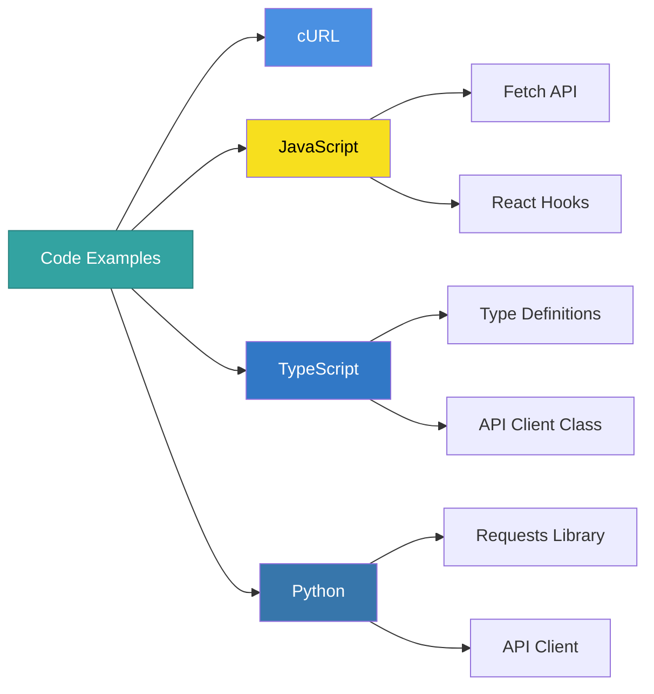
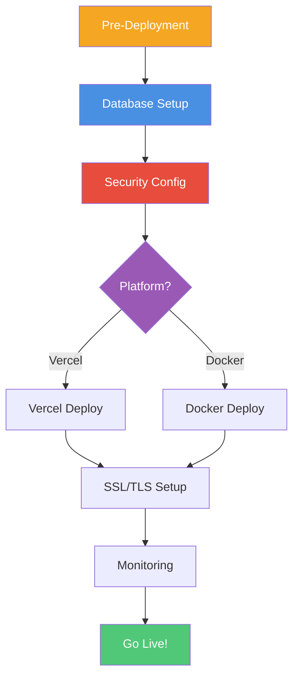
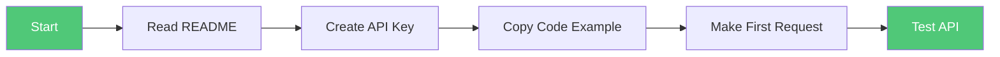

# Documentation Index

<div align="center">

**Complete Navigation Guide for UrbanReflex Documentation**

[📚 Main Docs](./README.md) • [🏗️ Architecture](./ARCHITECTURE.md) • [🚀 Quick Start](./README.md#-quick-start-guide)

</div>

---

## 🗂️ Table of Contents

- [Core Documentation](#-core-documentation)
- [API Documentation](#-api-documentation)
- [Development Guides](#-development-guides)
- [Quick Navigation](#-quick-navigation)
- [Learning Paths](#-learning-paths)
- [Bookmarks](#-bookmarks)

---

## 📖 Core Documentation

### [Documentation Overview](./README.md)
**Main entry point for all documentation**

> [!TIP]
> Start here if you're new to UrbanReflex

**Key Sections:**
- Quick Start Guide
- Documentation Structure
- Common Use Cases
- Troubleshooting
- Version History

[📄 Read More](./README.md) • Est. Reading: 15 min

---

### [System Architecture](./ARCHITECTURE.md)
**Technical architecture and system design**

**Contents:**
- System Architecture Diagram
- Request Flow Diagrams
- Component Architecture
- Database Schema
- Security Layers
- Deployment Architecture

[📄 Read More](./ARCHITECTURE.md) • Est. Reading: 25 min

---

### [Development Checklist](./CHECKLIST.md)
**Complete checklists for all stages**

**Categories:**
- Development Checklist
- Documentation Checklist
- Testing Checklist
- Security Checklist
- Deployment Checklist
- Maintenance Checklist

[📄 Read More](./CHECKLIST.md) • Est. Reading: 10 min

---

## 🔐 API Documentation

### [API Key Management](./API-Key-Management.md)
**Complete guide to API key management**

**Topics Covered:**

| Topic | Link | Description |
|-------|------|-------------|
| **Create API Key** | [§1](./API-Key-Management.md#1-tạo-api-key-mới) | Generate new API keys |
| **View Keys List** | [§2](./API-Key-Management.md#2-xem-danh-sách-api-keys) | Manage existing keys |
| **Toggle Visibility** | [§3](./API-Key-Management.md#3-ẩnhiện-api-key) | Show/hide key values |
| **Copy to Clipboard** | [§4](./API-Key-Management.md#4-copy-api-key) | Copy key functionality |
| **Delete API Key** | [§5](./API-Key-Management.md#5-xóa-api-key) | Remove keys |
| **Data Storage** | [§9](./API-Key-Management.md#-data-storage) | localStorage implementation |
| **Security** | [§14](./API-Key-Management.md#-security-considerations) | Security best practices |

[📄 Read More](./API-Key-Management.md) • Est. Reading: 15 min

---

### [API Authentication](./API-Authentication.md)
**Authentication system and implementation**

**Topics Covered:**

| Topic | Link | Description |
|-------|------|-------------|
| **Authentication Flow** | [§2](./API-Authentication.md#-authentication-flow) | How auth works |
| **Using API Keys** | [§3](./API-Authentication.md#-cách-sử-dụng) | Integration guide |
| **API Key Format** | [§5](./API-Authentication.md#-api-key-format) | Key structure |
| **Error Responses** | [§6](./API-Authentication.md#️-error-responses) | Error handling |
| **Security Practices** | [§7](./API-Authentication.md#-security-best-practices) | Security tips |
| **Rate Limiting** | [§8](./API-Authentication.md#-rate-limiting-future) | Rate limits |
| **Key Hashing** | [§10](./API-Authentication.md#-key-hashing-production) | Production security |

[📄 Read More](./API-Authentication.md) • Est. Reading: 15 min

---

### [API Endpoints](./API-Endpoints.md)
**Complete API reference**

**Available Endpoints:**

| Method | Endpoint | Purpose | Link |
|--------|----------|---------|------|
| **GET** | `/api/v1/locations` | Retrieve locations | [§2](./API-Endpoints.md#-get-apiv1locations) |
| **POST** | `/api/v1/locations` | Create location | [§3](./API-Endpoints.md#-post-apiv1locations) |
| **GET** | `/api/v1/measurements` | Get measurements | [§4](./API-Endpoints.md#-get-apiv1measurements) |
| **POST** | `/api/v1/measurements` | Submit measurement | [§5](./API-Endpoints.md#-post-apiv1measurements) |
| **POST** | `/api/v1/validate-key` | Validate API key | [§6](./API-Endpoints.md#-post-apiv1validate-key) |

**Additional Topics:**
- [Pagination](./API-Endpoints.md#-pagination)
- [Error Responses](./API-Endpoints.md#️-error-responses)
- [Query Parameters](./API-Endpoints.md)

[📄 Read More](./API-Endpoints.md) • Est. Reading: 20 min

---

### [Code Examples](./Code-Examples.md)
**Ready-to-use code in multiple languages**

**Languages Covered:**



**Quick Links:**
- [cURL Examples](./Code-Examples.md#-curl-examples)
- [JavaScript Examples](./Code-Examples.md#-javascript-fetch-api)
- [TypeScript Examples](./Code-Examples.md#-typescript)
- [Python Examples](./Code-Examples.md#-python)

[📄 Read More](./Code-Examples.md) • Est. Reading: 15 min

---

## 🛠️ Development Guides

### [Testing Guide](./Testing-Guide.md)
**Comprehensive testing documentation**

**Testing Types:**

| Type | Coverage | Link |
|------|----------|------|
| **Unit Tests** | API key generation, validation, masking | [§2](./Testing-Guide.md#-unit-tests) |
| **Integration Tests** | API endpoints, authentication flow | [§3](./Testing-Guide.md#-integration-tests) |
| **Manual Testing** | UI testing, user flows | [§4](./Testing-Guide.md#-manual-testing-checklist) |
| **Postman Collection** | API testing suite | [§5](./Testing-Guide.md#-postman-testing) |
| **Performance Tests** | Load testing, benchmarks | [§7](./Testing-Guide.md#-performance-testing) |

[📄 Read More](./Testing-Guide.md) • Est. Reading: 20 min

---

### [Deployment Guide](./Deployment-Guide.md)
**Production deployment instructions**

**Deployment Steps:**



**Quick Links:**
- [Pre-Deployment Checklist](./Deployment-Guide.md#-pre-deployment-checklist)
- [Database Setup](./Deployment-Guide.md#️-database-setup)
- [Security Implementation](./Deployment-Guide.md#-security-implementation)
- [Vercel Deployment](./Deployment-Guide.md#vercel-deployment)
- [Docker Deployment](./Deployment-Guide.md#docker-deployment)
- [Monitoring Setup](./Deployment-Guide.md#-monitoring)

[📄 Read More](./Deployment-Guide.md) • Est. Reading: 30 min

---

### [Security Best Practices](./Security-Best-Practices.md)
**Security guidelines and compliance**

> [!WARNING]
> **Critical Reading** - Security is essential for production deployments

**Security Domains:**

| Domain | Topics | Priority |
|--------|--------|----------|
| **API Key Security** | Never expose, key rotation, scopes | 🔴 High |
| **Authentication** | Hashing, timing-safe comparison, rate limiting | 🔴 High |
| **Input Validation** | Schema validation, sanitization, SQL injection | 🔴 High |
| **Transport Security** | HTTPS enforcement, security headers | 🟡 Medium |
| **Logging & Monitoring** | Request logging, suspicious activity alerts | 🟡 Medium |
| **Data Protection** | Encryption, backups, audit trails | 🟢 Low |

[📄 Read More](./Security-Best-Practices.md) • Est. Reading: 25 min

---

### [Admin Dashboard](./ADMIN-DASHBOARD.md)
**Admin panel documentation**

**Features:**
- Dashboard Overview with real-time stats
- Advanced filtering and search
- Reports management system
- Status and priority controls
- User report submission

**API Endpoints:**
- `GET /api/admin/reports` - List all reports
- `POST /api/admin/reports` - Create report
- `PATCH /api/admin/reports/:id` - Update report
- `DELETE /api/admin/reports/:id` - Delete report

[📄 Read More](./ADMIN-DASHBOARD.md) • Est. Reading: 15 min

---

## 🔍 Quick Navigation

### By Topic

<details>
<summary><b>🔑 Authentication & API Keys</b></summary>

| What You Need | Where to Find It |
|---------------|------------------|
| Create API key | [API Key Management §1](./API-Key-Management.md#1-tạo-api-key-mới) |
| Use API key | [API Authentication §3](./API-Authentication.md#-cách-sử-dụng) |
| Key format | [API Authentication §5](./API-Authentication.md#-api-key-format) |
| Error codes | [API Authentication §6](./API-Authentication.md#️-error-responses) |

</details>

<details>
<summary><b>📍 API Endpoints</b></summary>

| Endpoint | Purpose | Documentation |
|----------|---------|---------------|
| GET /locations | Retrieve locations | [API Endpoints §2](./API-Endpoints.md#-get-apiv1locations) |
| POST /locations | Create location | [API Endpoints §3](./API-Endpoints.md#-post-apiv1locations) |
| GET /measurements | Get measurements | [API Endpoints §4](./API-Endpoints.md#-get-apiv1measurements) |
| POST /measurements | Submit data | [API Endpoints §5](./API-Endpoints.md#-post-apiv1measurements) |

</details>

<details>
<summary><b>💻 Code Examples</b></summary>

| Language | Quick Link | Use Case |
|----------|------------|----------|
| cURL | [Examples](./Code-Examples.md#-curl-examples) | Command line testing |
| JavaScript | [Examples](./Code-Examples.md#-javascript-fetch-api) | Web applications |
| TypeScript | [Examples](./Code-Examples.md#-typescript) | Type-safe development |
| Python | [Examples](./Code-Examples.md#-python) | Data analysis, IoT |

</details>

<details>
<summary><b>🧪 Testing</b></summary>

| Test Type | Documentation |
|-----------|---------------|
| Unit Tests | [Testing Guide §2](./Testing-Guide.md#-unit-tests) |
| Integration Tests | [Testing Guide §3](./Testing-Guide.md#-integration-tests) |
| Manual Testing | [Testing Guide §4](./Testing-Guide.md#-manual-testing-checklist) |
| Postman | [Testing Guide §5](./Testing-Guide.md#-postman-testing) |

</details>

<details>
<summary><b>🚀 Deployment</b></summary>

| Topic | Documentation |
|-------|---------------|
| Pre-deployment | [Deployment Guide §1](./Deployment-Guide.md#-pre-deployment-checklist) |
| Database | [Deployment Guide §2](./Deployment-Guide.md#️-database-setup) |
| Vercel | [Deployment Guide §4](./Deployment-Guide.md#vercel-deployment) |
| Docker | [Deployment Guide §4](./Deployment-Guide.md#docker-deployment) |
| SSL/TLS | [Deployment Guide §5](./Deployment-Guide.md#-ssltls-setup) |

</details>

<details>
<summary><b>🔒 Security</b></summary>

| Security Topic | Documentation |
|----------------|---------------|
| API Key Security | [Security §1](./Security-Best-Practices.md#-api-key-security) |
| Input Validation | [Security §3](./Security-Best-Practices.md#️-input-validation) |
| HTTPS | [Security §4](./Security-Best-Practices.md#-https-and-transport-security) |
| Monitoring | [Security §5](./Security-Best-Practices.md#-logging-and-monitoring) |

</details>

[↑ Back to Top](#documentation-index)

---

## 🎯 Learning Paths

### Path 1: Beginner Developer



**Steps:**
1. [Documentation Overview](./README.md) - Understand the platform (15 min)
2. [API Key Management](./API-Key-Management.md) - Create your key (5 min)
3. [Code Examples](./Code-Examples.md) - Copy starter code (10 min)
4. [Testing Guide](./Testing-Guide.md) - Verify integration (10 min)

**Total Time:** ~40 minutes

---

### Path 2: Experienced Developer


**Steps:**
1. [API Endpoints](./API-Endpoints.md) - Study available routes (20 min)
2. [API Authentication](./API-Authentication.md) - Implement auth (15 min)
3. [Code Examples](./Code-Examples.md) - Advanced patterns (15 min)
4. [Testing Guide](./Testing-Guide.md) - Write tests (20 min)

**Total Time:** ~70 minutes

---

### Path 3: DevOps Engineer


**Steps:**
1. [System Architecture](./ARCHITECTURE.md) - Understand design (25 min)
2. [Deployment Guide](./Deployment-Guide.md) - Setup infrastructure (30 min)
3. [Security Best Practices](./Security-Best-Practices.md) - Secure system (25 min)
4. [Testing Guide - Performance](./Testing-Guide.md#-performance-testing) - Load testing (15 min)

**Total Time:** ~95 minutes

---

### Path 4: Security Engineer


**Steps:**
1. [Security Best Practices](./Security-Best-Practices.md) - Complete review (25 min)
2. [API Authentication](./API-Authentication.md) - Auth security (15 min)
3. [Deployment Guide - Security](./Deployment-Guide.md#-security-implementation) - Production security (20 min)
4. [Security Checklist](./Security-Best-Practices.md#-security-checklist) - Audit (15 min)

**Total Time:** ~75 minutes

---

## 🔖 Bookmarks

### Most Used Pages

| Page | Purpose | Quick Link |
|------|---------|------------|
| 📖 **README** | Documentation home | [View](./README.md) |
| 💻 **Code Examples** | Copy-paste code | [View](./Code-Examples.md) |
| 📍 **API Endpoints** | API reference | [View](./API-Endpoints.md) |
| 🧪 **Testing Guide** | Testing checklists | [View](./Testing-Guide.md) |

### Quick Reference Cards

| Reference | Link |
|-----------|------|
| API Key Format | [Format Spec](./API-Authentication.md#-api-key-format) |
| Error Codes | [Error Reference](./API-Endpoints.md#️-error-responses) |
| Rate Limits | [Limit Info](./API-Authentication.md#-rate-limiting-future) |
| Security Checklist | [Checklist](./Security-Best-Practices.md#-security-checklist) |

[↑ Back to Top](#documentation-index)

---

## 📝 Documentation Map

```
docs/
├── 📖 README.md                          ← Start here
├── 📑 INDEX.md                           ← This file
├── 📝 DOCUMENTATION-SUMMARY.md           ← Doc guide
│
├── 🏗️ ARCHITECTURE.md                    ← System design
├── ✅ CHECKLIST.md                        ← Development checklists
│
├── 🔐 API Documentation/
│   ├── API-Key-Management.md            ← Key management
│   ├── API-Authentication.md            ← Authentication
│   ├── API-Endpoints.md                 ← Endpoints reference
│   └── Code-Examples.md                 ← Code samples
│
├── 🛠️ Development Guides/
│   ├── Testing-Guide.md                 ← Testing docs
│   ├── Deployment-Guide.md              ← Deployment
│   └── Security-Best-Practices.md       ← Security
│
└── 👨‍💼 Admin/
    └── ADMIN-DASHBOARD.md               ← Admin panel
```

---

## 📊 Documentation Statistics

| Metric | Count |
|--------|-------|
| **Total Documents** | 13 files |
| **Total Sections** | ~70 sections |
| **Code Examples** | ~50+ examples |
| **Languages Covered** | 5 (cURL, JS, TS, Python, PHP) |
| **Diagrams** | Multiple mermaid diagrams |
| **Est. Total Reading Time** | ~4 hours |

---

## 📞 Need Help?

> [!TIP]
> **Can't find what you're looking for?**
> 
> 1. Try GitHub search within `/docs`
> 2. Check the [Quick Navigation](#-quick-navigation) section
> 3. Browse [Learning Paths](#-learning-paths) for your role
> 4. Contact us at docs@urbanreflex.org

---

<div align="center">

**Last Updated:** 2025-11-21  
**Version:** 1.1.0  
**Maintainer:** [@minhe51805](https://github.com/minhe51805)

[⬆ Back to Top](#documentation-index) • [📚 Documentation Home](./README.md)

</div>
 
