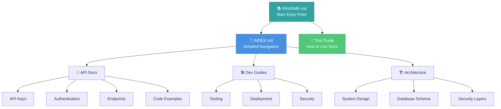
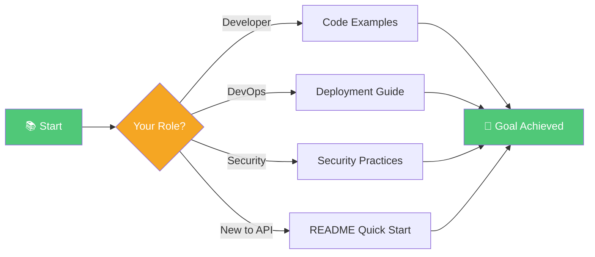
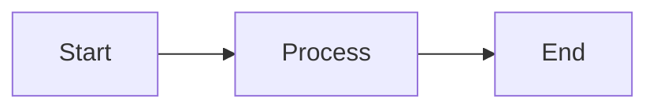
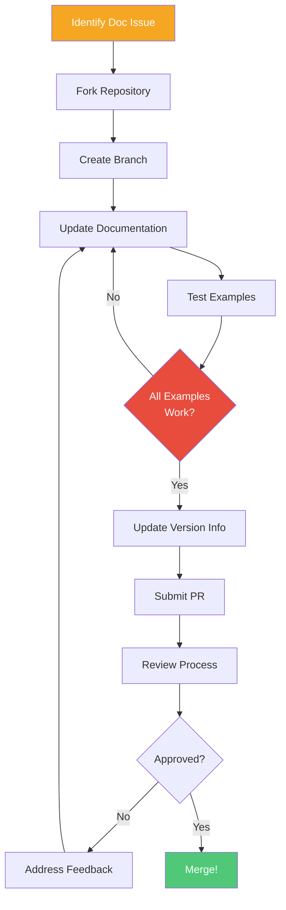

# Documentation Guide

<div align="center">

**How to Navigate and Contribute to UrbanReflex Documentation**

[📚 Main Docs](./README.md) • [📑 Index](./INDEX.md) • [🏗️ Architecture](./ARCHITECTURE.md)

</div>

---

## 📚 Overview

This guide explains how to effectively use, navigate, and contribute to the UrbanReflex documentation. Whether you're reading the docs or contributing improvements, this guide will help you understand our documentation structure and standards.

> [!NOTE]
> **Looking for API documentation?** Go to [README.md](./README.md) for the main documentation hub.

---

## 🗺️ Documentation Structure

### Three-Tier Navigation System



### File Organization

| File | Purpose | Target Audience |
|------|---------|-----------------|
| **README.md** | Main documentation hub with quick start guides | All users |
| **INDEX.md** | Comprehensive table of contents and navigation | Users seeking specific topics |
| **DOCUMENTATION-SUMMARY.md** | Documentation usage guide (this file) | Contributors, maintainers |
| **ARCHITECTURE.md** | System architecture and design | Technical leads, architects |
| **CHECKLIST.md** | Development and deployment checklists | Developers, DevOps |

---

## 🎯 How to Use This Documentation

### For First-Time Users



**Step-by-Step:**

1. **Start at** [README.md](./README.md)
   - Read "Quick Start Guide" for your role
   - Get familiar with available documentation

2. **Navigate with** [INDEX.md](./INDEX.md)
   - Use "Learning Paths" to find your reading order
   - Browse "Quick Navigation" for specific topics

3. **Deep Dive into Specific Topics**
   - Follow links from INDEX to detailed documentation
   - Use internal cross-references

4. **Reference as Needed**
   - Bookmark frequently used pages
   - Use GitHub search for specific terms

---

### By User Role

<details open>
<summary><b>👨‍💻 Developers</b></summary>

**Recommended Reading Order:**

1. [README - Quick Start](./README.md#-quick-start-guide) (5 min)
2. [API Endpoints](./API-Endpoints.md) (20 min)
3. [Code Examples](./Code-Examples.md) (15 min)
4. [Testing Guide](./Testing-Guide.md) (20 min)

**Bookmark These:**
- [Code Examples](./Code-Examples.md) - Copy-paste ready code
- [API Endpoints](./API-Endpoints.md) - API reference
- [Testing Guide](./Testing-Guide.md) - Testing strategies

</details>

<details>
<summary><b>👨‍💼 DevOps Engineers</b></summary>

**Recommended Reading Order:**

1. [System Architecture](./ARCHITECTURE.md) (25 min)
2. [Deployment Guide](./Deployment-Guide.md) (30 min)
3. [Security Best Practices](./Security-Best-Practices.md) (25 min)

**Bookmark These:**
- [Deployment Checklist](./Deployment-Guide.md#-pre-deployment-checklist)
- [Security Checklist](./Security-Best-Practices.md#-security-checklist)
- [Architecture Diagrams](./ARCHITECTURE.md)

</details>

<details>
<summary><b>🔒 Security Engineers</b></summary>

**Recommended Reading Order:**

1. [Security Best Practices](./Security-Best-Practices.md) (25 min)
2. [API Authentication](./API-Authentication.md) (15 min)
3. [Deployment - Security](./Deployment-Guide.md#-security-implementation) (15 min)

**Bookmark These:**
- [Security Checklist](./Security-Best-Practices.md#-security-checklist)
- [Authentication Security](./API-Authentication.md#-security-best-practices)
- [Security Layers](./ARCHITECTURE.md#-security-layers)

</details>

---

## 📖 Documentation Conventions

### Formatting Standards

Our documentation uses consistent formatting for better readability:

#### Headings Hierarchy

```markdown
# Document Title (H1 - One per file)
## Major Section (H2)
### Subsection (H3)
#### Detail Level (H4)
```

#### GitHub Alerts

We use GitHub-flavored alerts for important information:

> [!NOTE]
> **Blue Alert** - Additional information, tips, references

> [!TIP]
> **Green Alert** - Best practices, helpful suggestions

> [!IMPORTANT]
> **Purple Alert** - Critical information users must know

> [!WARNING]
> **Orange Alert** - Potential issues, things to watch out for

> [!CAUTION]
> **Red Alert** - Dangerous operations, security risks

#### Code Blocks

All code blocks specify language for proper syntax highlighting:

````markdown
```javascript
// Always specify language
const example = "like this";
```

```bash
# Shell commands
npm install
```

```json
{
  "format": "JSON with proper highlighting"
}
```
````

#### Tables

We use tables for structured data:

| Column 1 | Column 2 | Column 3 |
|----------|----------|----------|
| Data     | Data     | Data     |

#### Mermaid Diagrams

Visual diagrams using mermaid syntax:

````markdown

````

---

## ✍️ Contributing to Documentation

### When to Update Documentation

| Scenario | Action | Files to Update |
|----------|--------|-----------------|
| New feature added | Document feature | Feature-specific file + README |
| API endpoint changed | Update API docs | API-Endpoints.md + Code-Examples.md |
| Security practice updated | Update security docs | Security-Best-Practices.md |
| Deployment process changed | Update deployment | Deployment-Guide.md |
| Bug fix | Update if it affects usage | Relevant documentation file |

### Contribution Workflow



**Steps:**

1. **Identify Issue**
   - Missing information
   - Outdated content
   - Broken examples
   - Unclear explanations

2. **Make Changes**
   - Follow formatting standards
   - Test all code examples
   - Update version information
   - Add cross-references

3. **Quality Checks**
   - ✅ All code examples tested and working
   - ✅ Links verified (no 404s)
   - ✅ Consistent formatting
   - ✅ Proper grammar and spelling
   - ✅ Mermaid diagrams render correctly

4. **Submit**
   - Create descriptive PR title
   - Explain changes in PR description
   - Link related issues

---

## 📝 Writing Guidelines

### Voice and Tone

- ✅ **Clear and concise** - Get to the point quickly
- ✅ **Professional yet friendly** - Approachable but authoritative
- ✅ **Action-oriented** - Tell users what to do
- ✅ **Example-driven** - Show, don't just tell

### Do's and Don'ts

| ✅ Do | ❌ Don't |
|-------|----------|
| Use active voice | Use passive constructions |
| Provide working examples | Show untested code |
| Link to related docs | Leave readers guessing |
| Explain *why* not just *how* | Assume knowledge |
| Use consistent terminology | Mix terms for same concept |
| Test all code snippets | Copy-paste without testing |

### Code Example Standards

All code examples must:

1. **Be Tested** - Actually run and work
2. **Be Complete** - Include necessary imports/setup
3. **Be Realistic** - Show real-world usage
4. **Be Commented** - Explain complex parts
5. **Specify Language** - For syntax highlighting

**Example:**

```javascript
// ✅ Good Example
// Fetch air quality data with error handling
async function getAirQuality(city) {
  try {
    const response = await fetch(
      `/api/v1/measurements?city=${city}`,
      { headers: { 'X-API-Key': process.env.API_KEY } }
    );
    
    if (!response.ok) {
      throw new Error(`HTTP ${response.status}`);
    }
    
    return await response.json();
  } catch (error) {
    console.error('Failed to fetch data:', error);
    throw error;
  }
}
```

```javascript
// ❌ Bad Example
fetch('/api').then(r => r.json())
// No context, no error handling, incomplete
```

---

## 🔄 Documentation Maintenance

### Update Schedule

| Frequency | Tasks | Responsible |
|-----------|-------|-------------|
| **Weekly** | Fix typos, broken links | Contributors |
| **Monthly** | Update code examples, version numbers | Maintainers |
| **Quarterly** | Review security practices, architecture | Tech leads |
| **Yearly** | Major version updates, restructuring | Core team |

### Version Control

Each major documentation update should:

1. Update version number in:
   - [README.md](./README.md) footer
   - [INDEX.md](./INDEX.md) footer
   - Individual file footers

2. Update "Last Updated" date

3. Add entry to version history section

4. Document changes in changelog (if major)

---

## 📊 Documentation Metrics

### Current Status

| Metric | Count | Status |
|--------|-------|--------|
| **Total Files** | 13 | ✅ Complete |
| **Total Sections** | ~70 | ✅ Complete |
| **Code Examples** | 50+ | ✅ Tested |
| **Languages Covered** | 5 | ✅ Current |
| **Mermaid Diagrams** | Multiple | ✅ Updated |
| **GitHub Alerts** | Throughout | ✅ Implemented |

### Coverage Checklist

- ✅ All API endpoints documented
- ✅ All features explained
- ✅ All code examples tested
- ✅ All security practices covered
- ✅ All deployment scenarios addressed
- ✅ Cross-references complete
- ✅ Visual aids added
- ✅ Professional formatting applied

---

## 🎓 Documentation Best Practices

### For Readers

1. **Start with README** - Don't skip the introduction
2. **Follow Learning Paths** - Structured learning is faster
3. **Test Examples** - Actually run the code
4. **Bookmark Frequently Used Pages** - Save time
5. **Use GitHub Search** - Find specific information quickly

### For Contributors

1. **Read existing docs first** - Understand the style
2. **Test everything** - All code must work
3. **Link related content** - Help readers discover more
4. **Use visuals** - Diagrams explain better than words
5. **Get feedback** - Have someone review your changes

### For Maintainers

1. **Keep docs in sync with code** - Update together
2. **Review PRs thoroughly** - Quality over speed
3. **Monitor feedback** - Track what confuses users
4. **Regular audits** - Quarterly documentation reviews
5. **Version consistently** - Track all major changes

---

## 📞 Documentation Support

### Report Issues

| Issue Type | Where to Report |
|------------|-----------------|
| 🐛 **Broken Link** | [GitHub Issue](https://github.com/minhe51805/UrbanReflex/issues) |
| 📝 **Typo/Grammar** | [GitHub Issue](https://github.com/minhe51805/UrbanReflex/issues) |
| 💡 **Missing Info** | [GitHub Discussion](https://github.com/minhe51805/UrbanReflex/discussions) |
| ❓ **Unclear Section** | docs@urbanreflex.org |
| 🔒 **Security Concern** | security@urbanreflex.org |

### Get Help

> [!TIP]
> **Can't find what you need?**
> 
> 1. Check [INDEX.md](./INDEX.md) - Comprehensive navigation
> 2. Use GitHub search in `/docs` folder
> 3. Ask in [Discussions](https://github.com/minhe51805/UrbanReflex/discussions)
> 4. Email docs@urbanreflex.org

---

## 📋 Documentation Checklist

Use this checklist when creating or updating documentation:

### Content Quality

- [ ] Information is accurate and up-to-date
- [ ] Code examples are tested and working
- [ ] All links are valid (no 404s)
- [ ] Cross-references are bidirectional
- [ ] Related docs are linked

### Formatting

- [ ] Headings follow hierarchy (H1 > H2 > H3)
- [ ] Code blocks specify language
- [ ] Tables are properly formatted
- [ ] GitHub alerts used appropriately
- [ ] Mermaid diagrams render correctly

### Completeness

- [ ] Introduction explains purpose
- [ ] Examples cover common use cases
- [ ] Edge cases addressed
- [ ] Error handling explained
- [ ] Next steps provided

### Metadata

- [ ] Version number updated
- [ ] Last updated date current
- [ ] Maintainer listed
- [ ] License information included

---

## 🔗 Related Resources

### Internal Documentation

- [README.md](./README.md) - Main documentation hub
- [INDEX.md](./INDEX.md) - Navigation guide
- [ARCHITECTURE.md](./ARCHITECTURE.md) - System design
- [CHECKLIST.md](./CHECKLIST.md) - Development checklists

### External Resources

- [Markdown Guide](https://www.markdownguide.org/) - Markdown syntax
- [Mermaid Documentation](https://mermaid.js.org/) - Diagram syntax
- [GitHub Alerts](https://github.com/orgs/community/discussions/16925) - Alert syntax
- [Write the Docs](https://www.writethedocs.org/) - Documentation best practices

---

<div align="center">

**Last Updated:** 2025-11-21  
**Version:** 1.1.0  
**Maintained by:** [@minhe51805](https://github.com/minhe51805)

[⬆ Back to Top](#documentation-guide) • [📚 Documentation Home](./README.md) • [📑 Index](./INDEX.md)

</div>
