# UrbanReflex API Documentation

<div align="center">

**Comprehensive documentation for the UrbanReflex Air Quality Monitoring Platform**

[](./README.md)
[](./API-Endpoints.md)
[](../LICENSE)

[Quick Start](#-quick-start-guide) • [API Reference](./API-Endpoints.md) • [Code Examples](./Code-Examples.md) • [Index](./INDEX.md)

</div>

---

## 📚 Overview

Welcome to the complete documentation for the UrbanReflex API System. This documentation provides comprehensive guides, API references, code examples, and best practices for integrating with the UrbanReflex platform.

> [!NOTE] > **New to UrbanReflex?** Start with our [Quick Start Guide](#-quick-start-guide) or browse the [Documentation Index](./INDEX.md) to find specific topics.

---

## 📖 Documentation Structure

```mermaid
graph TD
    A[📚 Documentation Home] --> B[🔑 API Guides]
    A --> C[💻 Development]
    A --> D[🚀 Deployment]
    A --> E[🔒 Security]

    B --> B1[API Key Management]
    B --> B2[Authentication]
    B --> B3[Endpoints Reference]

    C --> C1[Code Examples]
    C --> C2[Testing Guide]
    C --> C3[Architecture]

    D --> D1[Deployment Guide]
    D --> D2[Database Setup]

    E --> E1[Security Best Practices]
    E --> E2[Compliance]

    style A fill:#33a3a1,stroke:#2a8280,color:#fff
    style B fill:#4a90e2,stroke:#3a7bc2,color:#fff
    style C fill:#50c878,stroke:#40a868,color:#fff
    style D fill:#f5a623,stroke:#d58613,color:#fff
    style E fill:#e74c3c,stroke:#c23c2c,color:#fff
```



---

## 📑 Core Documentation

| Document                                          | Description                                       | Audience   | Est. Reading Time |
| ------------------------------------------------- | ------------------------------------------------- | ---------- | ----------------- |
| **[API Key Management](./API-Key-Management.md)** | Complete guide to creating and managing API keys  | All users  | 10 min            |
| **[API Authentication](./API-Authentication.md)** | Authentication system and security implementation | Developers | 15 min            |
| **[API Endpoints](./API-Endpoints.md)**           | Complete API reference with all endpoints         | Developers | 20 min            |
| **[Code Examples](./Code-Examples.md)**           | Ready-to-use code in multiple languages           | Developers | 15 min            |
| **[System Architecture](./ARCHITECTURE.md)**      | System design and architecture diagrams           | Tech Leads | 25 min            |

---

## 🔧 Development Guides

| Document                                                    | Description                                    | Audience       | Est. Reading Time |
| ----------------------------------------------------------- | ---------------------------------------------- | -------------- | ----------------- |
| **[Testing Guide](./Testing-Guide.md)**                     | Comprehensive testing strategies and examples  | QA/Developers  | 20 min            |
| **[Deployment Guide](./Deployment-Guide.md)**               | Step-by-step deployment instructions           | DevOps         | 30 min            |
| **[Security Best Practices](./Security-Best-Practices.md)** | Security guidelines and compliance             | Security Team  | 25 min            |
| **[Admin Dashboard](./ADMIN-DASHBOARD.md)**                 | Admin panel features and usage                 | Administrators | 15 min            |
| **[Development Checklist](./CHECKLIST.md)**                 | Complete development and deployment checklists | All            | 10 min            |

---

## 🚀 Quick Start Guide

> [!TIP] > **Choose your path based on your role:**

### 👨‍💻 For Developers

<details open>
<summary><b>Getting Started (5 minutes)</b></summary>

1. **Create an API Key**

   - Visit `/api-keys` page
   - Click "Create New Key"
   - Copy and save your key securely

2. **Make Your First Request**

   ```bash
   curl -X GET "http://localhost:3000/api/v1/locations?limit=5" \
     -H "X-API-Key: your_api_key_here"
   ```

3. **Explore Code Examples**

   - Check [Code Examples](./Code-Examples.md) for your language
   - Review [API Endpoints](./API-Endpoints.md) for available routes

4. **Set Up Your Project**
   ```javascript
   // Example: JavaScript/TypeScript
   const apiKey = process.env.URBANREFLEX_API_KEY;
   const response = await fetch("/api/v1/measurements", {
     headers: { "X-API-Key": apiKey },
   });
   ```

**Next Steps:** [API Authentication Guide](./API-Authentication.md) → [Testing Guide](./Testing-Guide.md)

</details>

### 👨‍💼 For DevOps/SysAdmin

<details>
<summary><b>Deployment Setup (30 minutes)</b></summary>

1. **Pre-Deployment**

   - Review [Pre-Deployment Checklist](./Deployment-Guide.md#-pre-deployment-checklist)
   - Set up environment variables
   - Configure database

2. **Database Setup**

   - Install PostgreSQL
   - Run migration scripts
   - Set up backups

3. **Deploy**

   - Choose platform: [Vercel](./Deployment-Guide.md#vercel-deployment) or [Docker](./Deployment-Guide.md#docker-deployment)
   - Configure SSL/TLS
   - Set up monitoring

4. **Post-Deployment**
   - Verify all endpoints
   - Test authentication
   - Monitor logs

**Next Steps:** [Security Best Practices](./Security-Best-Practices.md) → [Monitoring Setup](./Deployment-Guide.md#-monitoring)

</details>

### 🔒 For Security Engineers

<details>
<summary><b>Security Review (20 minutes)</b></summary>

1. **Review Security Practices**

   - [API Key Security](./Security-Best-Practices.md#-api-key-security)
   - [Authentication Security](./Security-Best-Practices.md#-authentication-security)
   - [Input Validation](./Security-Best-Practices.md#️-input-validation)

2. **Audit Checklist**

   - HTTPS enforcement
   - Rate limiting configuration
   - Security headers
   - Logging and monitoring

3. **Compliance**
   - Data protection measures
   - Audit trail implementation
   - Incident response plan

**Next Steps:** [Security Checklist](./Security-Best-Practices.md#-security-checklist)

</details>

---

## 🎯 Common Use Cases

### Web Application Integration

Build a real-time air quality dashboard:

```javascript
// Fetch current air quality data
async function getAirQuality(city) {
  const response = await fetch(
    `/api/v1/measurements?city=${city}&parameter=pm25&limit=100`,
    { headers: { "X-API-Key": process.env.API_KEY } }
  );
  return await response.json();
}
```

**Learn more:** [Code Examples - JavaScript](./Code-Examples.md#-javascript-fetch-api)

### IoT Device Data Submission

Submit sensor readings from IoT devices:

```bash
curl -X POST "https://api.urbanreflex.com/api/v1/measurements" \
  -H "X-API-Key: $API_KEY" \
  -H "Content-Type: application/json" \
  -d '{
    "locationId": 1,
    "parameter": "pm25",
    "value": 45.2,
    "unit": "µg/m³"
  }'
```

**Learn more:** [API Endpoints - POST Measurements](./API-Endpoints.md#-post-apiv1measurements)

### Data Analysis & Research

Export historical data for analysis:

```python
import pandas as pd
from urbanreflex import UrbanReflexAPI

api = UrbanReflexAPI(api_key=YOUR_API_KEY)
data = api.get_measurements(
    city='Hanoi',
    date_from='2025-01-01',
    date_to='2025-11-21',
    limit=10000
)
df = pd.DataFrame(data['results'])
```

**Learn more:** [Code Examples - Python](./Code-Examples.md#-python)

---

## 🔧 Technical Stack

### Current Implementation

| Layer         | Technology              | Purpose                                |
| ------------- | ----------------------- | -------------------------------------- |
| **Frontend**  | Next.js 16 + TypeScript | Modern React framework with App Router |
| **Styling**   | Tailwind CSS            | Utility-first CSS framework            |
| **Animation** | Framer Motion           | React animation library                |
| **API**       | Next.js API Routes      | Serverless API endpoints               |
| **Storage**   | localStorage            | Development data persistence           |
| **Icons**     | Lucide React            | Modern icon library                    |

### Production Stack

| Layer          | Technology       | Purpose                    |
| -------------- | ---------------- | -------------------------- |
| **Database**   | PostgreSQL       | Relational database        |
| **Cache**      | Redis            | In-memory data store       |
| **Auth**       | API Key + JWT    | Authentication system      |
| **Monitoring** | Sentry + Winston | Error tracking and logging |
| **Deployment** | Vercel / Docker  | Platform deployment        |

**Learn more:** [System Architecture](./ARCHITECTURE.md)

---

## 📊 API Response Format

All API endpoints return responses in a standardized format:

```json
{
  "meta": {
    "name": "openaq-api",
    "license": "CC BY 4.0",
    "website": "https://urbanreflex.org",
    "page": 1,
    "limit": 100,
    "found": 150
  },
  "results": [
    // Array of data objects
  ]
}
```

> [!NOTE]
> This format ensures consistency across all endpoints and simplifies client-side data handling.

**Learn more:** [API Endpoints Documentation](./API-Endpoints.md)

---

## ⚠️ Troubleshooting

### Common Issues and Solutions

<details>
<summary><b>401 Unauthorized Error</b></summary>

**Cause:** Missing or invalid API key

**Solution:**

- Verify API key is included in `X-API-Key` header
- Check key format: `urx_xxxxx_xxxxx`
- Ensure key is active and not expired

**See:** [API Authentication - Error Responses](./API-Authentication.md#️-error-responses)

</details>

<details>
<summary><b>CORS Error in Browser</b></summary>

**Cause:** Frontend domain not whitelisted

**Solution:**

- Configure CORS in production environment
- Use proxy for development
- Check `next.config.ts` CORS settings

**See:** [Deployment Guide - CORS Configuration](./Deployment-Guide.md#3-cors-configuration)

</details>

<details>
<summary><b>Rate Limit Exceeded</b></summary>

**Cause:** Too many requests in short timeframe

**Solution:**

- Implement client-side caching
- Add request throttling
- Consider upgrading API tier

**See:** [API Authentication - Rate Limiting](./API-Authentication.md#-rate-limiting-future)

</details>

---

## 🆘 Getting Help

### Documentation Resources

- **📖 Browse**: [Documentation Index](./INDEX.md) - Complete table of contents
- **🔍 Search**: Use GitHub search within the `/docs` folder
- **💡 Examples**: Check [Code Examples](./Code-Examples.md) for your language

### Support Channels

| Issue Type               | Contact                                                                     | Response Time     |
| ------------------------ | --------------------------------------------------------------------------- | ----------------- |
| 🐛 **Bug Reports**       | [GitHub Issues](https://github.com/minhe51805/UrbanReflex/issues)           | 1-2 business days |
| 💡 **Feature Requests**  | [GitHub Discussions](https://github.com/minhe51805/UrbanReflex/discussions) | 3-5 business days |
| 📧 **General Questions** | docs@urbanreflex.org                                                        | 1-3 business days |
| 🔒 **Security Issues**   | security@urbanreflex.org                                                    | 24 hours          |

> [!WARNING] > **Security Vulnerabilities:** Do NOT create public issues for security vulnerabilities. Email security@urbanreflex.org directly.

---

## 🤝 Contributing

We welcome contributions to improve our documentation!

### How to Contribute

1. **Fork** the repository
2. **Create** a feature branch
3. **Update** documentation
4. **Test** all code examples
5. **Submit** a pull request

### Documentation Standards

- ✅ Clear, concise writing
- ✅ Tested code examples
- ✅ Consistent formatting
- ✅ Updated version information
- ✅ Cross-reference related docs

**See:** [Documentation Summary](./DOCUMENTATION-SUMMARY.md) for contribution guidelines

---

## 📅 Version History

### Current Version: v1.1.0 (2025-11-21)

**Major Updates:**

- ✅ Enhanced documentation structure
- ✅ Added mermaid diagrams
- ✅ Improved navigation and cross-linking
- ✅ Professional formatting with GitHub alerts
- ✅ Comprehensive quick start guides

### Previous Versions

<details>
<summary>v1.0.0 (2025-11-18)</summary>

- ✅ Initial release
- ✅ API Key Management
- ✅ Basic Authentication
- ✅ Locations & Measurements endpoints
- ✅ Complete documentation

</details>

### Upcoming Features

- [ ] v1.2.0: Database integration and persistence
- [ ] v1.3.0: Advanced rate limiting
- [ ] v1.4.0: User authentication system
- [ ] v2.0.0: GraphQL endpoint

---

## 📚 External Resources

### Related Technologies

- [Next.js Documentation](https://nextjs.org/docs) - Official Next.js guides
- [PostgreSQL Documentation](https://www.postgresql.org/docs/) - Database reference
- [Redis Documentation](https://redis.io/documentation) - Cache documentation
- [OpenAQ API](https://docs.openaq.org/) - Original inspiration

### Learning Resources

- [REST API Best Practices](https://restfulapi.net/) - RESTful API design
- [API Security Checklist](https://github.com/shieldfy/API-Security-Checklist) - Security guidelines
- [HTTP Status Codes](https://httpstatuses.com/) - Complete HTTP reference
- [JSON Schema](https://json-schema.org/) - JSON validation

---

## 📄 License & Attribution

### Licensing

- **API Data**: CC BY 4.0
- **Source Code**: Apache License 2.0
- **Documentation**: CC BY 4.0

### Attribution

Built with ❤️ by the UrbanReflex Team

**Special Thanks:**

- OpenAQ for inspiration and data standards
- Next.js team for the excellent framework
- Open source community for amazing tools

---

## 📞 Quick Links

| Resource                   | Link                                                       |
| -------------------------- | ---------------------------------------------------------- |
| 📑 **Documentation Index** | [INDEX.md](./INDEX.md)                                     |
| 🏗️ **System Architecture** | [ARCHITECTURE.md](./ARCHITECTURE.md)                       |
| 🔐 **API Authentication**  | [API-Authentication.md](./API-Authentication.md)           |
| 📍 **API Endpoints**       | [API-Endpoints.md](./API-Endpoints.md)                     |
| 💻 **Code Examples**       | [Code-Examples.md](./Code-Examples.md)                     |
| 🧪 **Testing Guide**       | [Testing-Guide.md](./Testing-Guide.md)                     |
| 🚀 **Deployment**          | [Deployment-Guide.md](./Deployment-Guide.md)               |
| 🔒 **Security**            | [Security-Best-Practices.md](./Security-Best-Practices.md) |

---

<div align="center">

**Last Updated:** 2025-11-21  
**Version:** 1.1.0  
**Maintained by:** Trương Dương Bảo Minh ([@minhe51805](https://github.com/minhe51805))

[⬆ Back to Top](#urbanreflex-api-documentation)

</div>
